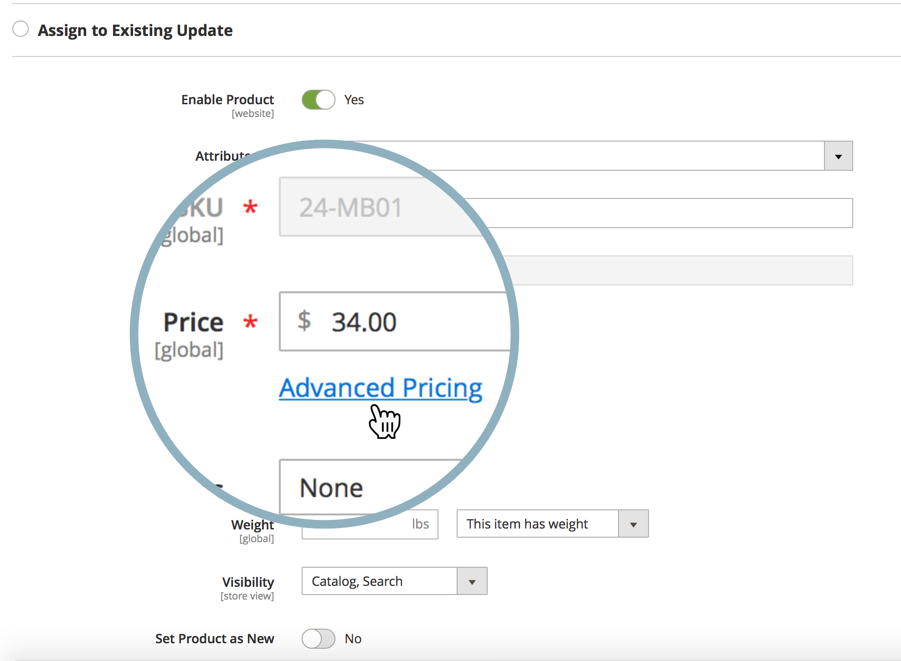
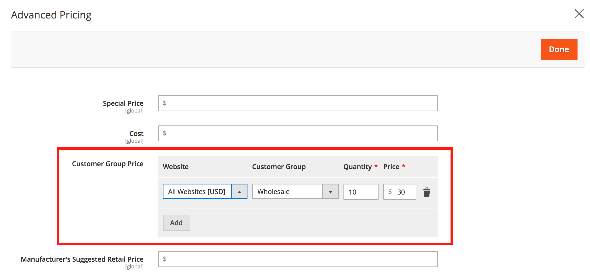

# Puis-je planifier des mises à jour d’évaluation de contenu pour les prix dans un catalogue partagé ?

Adobe Commerce ne permet pas de planifier une mise à jour de prix ([évaluation de contenu](https://experienceleague.adobe.com/docs/commerce-admin/content-design/staging/content-staging.html?lang=fr)) pour un ou plusieurs produits d’un catalogue partagé.

Cela signifie que vous ne pouvez pas planifier une telle mise à jour des prix directement à partir du menu **Définir la tarification et la structure** du panneau d’administration de Commerce (ce menu ne contient pas de bouton **Planifier une nouvelle mise à jour**).

Néanmoins, vous pouvez utiliser d&#39;autres méthodes et planifier une mise à jour de prix pour :

* un groupe de clients
* prix de base du produit

## Planifier la mise à jour des prix pour un groupe de clients

1. Commencez [planification d’une nouvelle mise à jour du produit](https://experienceleague.adobe.com/docs/commerce-admin/content-design/staging/content-staging-scheduled-update.html?lang=fr).
1. Faites défiler jusqu’au champ **Prix** et cliquez sur **Tarification avancée**.

   {width="600"}

1. Dans la section **Prix du groupe client**, sélectionnez le groupe client nécessaire et définissez le prix mis à jour.

   {width="700"}

1. Terminez la planification de la mise à jour comme d’habitude.

Dans ce workflow, vous ne pouvez mettre à jour le prix que d’un seul produit ; la mise à jour du prix en masse n’est pas disponible.

Rappel : les catalogues partagés exploitent la tarification du groupe de clients.

**Documentation connexe**

* [Planification d’une mise à jour (évaluation du contenu)](https://experienceleague.adobe.com/docs/commerce-admin/content-design/staging/content-staging-scheduled-update.html?lang=fr) dans notre guide de l’utilisateur.
* [Tarification avancée](https://experienceleague.adobe.com/docs/commerce-admin/catalog/products/pricing/pricing-advanced.html?lang=fr) dans notre guide de l&#39;utilisateur.

## Planifier la mise à jour des prix pour le prix de base

Voir l’article connexe : [Comment la modification du prix de base affecte-t-elle le prix catalogue partagé ?](/help/faq/general/base-price-change-affect-on-shared-catalog-price.md) dans notre base de connaissances de support.
