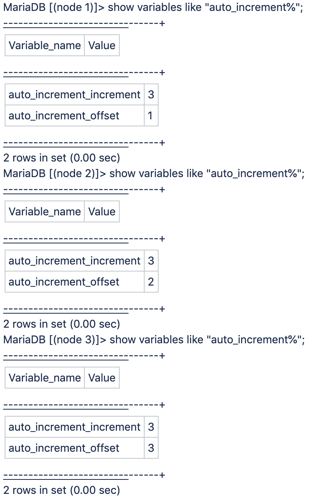

# Variable d’incrémentation auto_increment de la base de données définie sur « 3 » Adobe Commerce sur notre architecture cloud pro

Il s’agit du comportement attendu d’Adobe Commerce sur les infrastructures cloud. Pro planifie les solutions d’architecture en raison de l’architecture à 3 nœuds et ne peut pas être modifié.

Le cluster de base de données Galera est utilisé. Il s’agit d’un cluster de base de données avec une base de données MariaDB MySQL par nœud, avec un paramètre d’incrémentation automatique de trois pour les identifiants uniques dans chaque base de données.

<u>Pourquoi l&#39;ID d&#39;incrément utilisé sur les clusters Pro n&#39;est-il pas toujours séparé/incrémenté de 3 ?</u>

L’ID d’incrément utilisé sur les clusters n’est pas toujours séparé/incrémenté de 3 en raison du fonctionnement de Galera.

Chacun des trois serveurs gère son propre espace d’identification. L’incrément utilisé dépend du serveur de base de données principal MySQL (en fonction de la charge relative), d’où les écarts variables.
Si vous utilisez le protocole SSH pour chaque nœud et que vous vous connectez à l’instance MySQL locale s’exécutant sur ce nœud à l’aide du port 3307 (au lieu d’être connecté par proxy à la « principale » sur le port standard 3306), l’image suivante s’affiche :

Par exemple, si la principale sélectionnée est le nœud 1 où `auto_increment_offset = 1`, l’ID est incrémenté de 1. Ensuite, si un nouveau nœud principal est sélectionné ultérieurement (par exemple, le nœud 3 où `auto_increment_offset = 3`), il est incrémenté de 3 à la place.

## Liens utiles

Voir dans notre documentation destinée aux développeurs :

* [Cloud for Adobe Commerce > Architecture Pro > Sauvegarde et reprise après sinistre](https://experienceleague.adobe.com/fr/docs/commerce-cloud-service/user-guide/architecture/pro-architecture#backup-and-disaster-recovery)
* [Cloud for Adobe Commerce > Conditions préalables à l’installation : base de données](https://experienceleague.adobe.com/fr/docs/commerce-cloud-service/user-guide/develop/overview)
