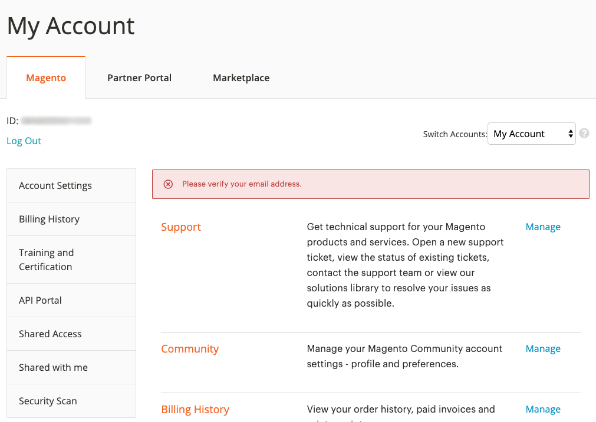

# Guide de l’utilisateur du centre d’aide Adobe Commerce

Dans ce guide, découvrez comment envoyer un ticket d’assistance au [Centre d’aide Adobe Commerce](https://support.magento.com/hc/en-us) et fournir un accès partagé aux comptes du Magento.

>[!NOTE]
>
>La partie Base de connaissances du centre d’aide Adobe Commerce a été migrée vers le portail Adobe Experience League. Lorsque vous créez un ticket d’assistance, les articles connexes de la base de connaissances vous seront proposés, ainsi que d’autres documents Adobe Commerce pertinents provenant de Adobe Experience League.

**Mise à jour majeure :** 14 octobre 2022

**[QU’EST-CE QUE LE CENTRE D’AIDE D’ADOBE COMMERCE ?](#what-is)**

**[TICKETS DE PRISE EN CHARGE](#support-tickets)**

* [Connexion au centre d’aide](#login)
* [Envoyer un ticket d’assistance](#submit-ticket)

   * [Page de début du centre d’aide](#submit-ticket-help-center-start-page)
   * [Page Compte Magento](#submit-ticket-magento-account-page)
   * [Cloud Console](#submit-ticket-magento-cloud-account-page)
   * [Informations sur votre ticket d’assistance](#info-in-support-ticket)
   * [Le lien &quot;Envoyer un ticket&quot; ne s’affiche pas sur la page de démarrage du centre d’aide Adobe Commerce](#no-submit-link)
   * [*&quot;Veuillez vérifier votre adresse électronique&quot;*](#verify-email-address)
   * [Formulaire d’envoi de ticket : le marchand ne s’affiche pas dans la liste déroulante Organisation .](#merchant-not-displayed)

* [Suivi des tickets](#track-tickets)
* [hotline Adobe Commerce P1 (connexion requise)](#P1-hotline)
* [Modèle opérationnel de responsabilité partagée Adobe Commerce (connexion requise)](#shared-responsibility-operational-model)
* [Explication des champs de ticket de support](#ticket-fields-explained)
* [État du ticket : traitement de vos requêtes](#ticket-status)
* [Conversation dans votre ticket](#conversation-in-ticket)
* [Résoudre votre ticket](#resolve-ticket)
* [Ouvrir un ticket de relance](#follow-up)

**[ACCÈS PARTAGÉ : OCTROYEZ DES DROITS À D’AUTRES UTILISATEURS POUR ACCÉDER À VOTRE COMPTE.](#shared-access)**

* [Qui peut fournir un accès partagé](#who-can-provide-shared-access)
* [Fournir un accès partagé](#provide-shared-access)
* [Révoquer (supprimer) l’accès partagé](#revoke-shared-access)

   * [Comment supprimer les utilisateurs auxquels un accès partagé a été accordé via un projet Cloud ?](#remove-cloud-shared-access-users)

* [Accès au compte partagé (changer de compte)](#switch-accounts)
* [Résolution des problèmes d’accès partagé](#troubleshooting-shared-access)

**[FAQ SUR LA FACTURATION POUR ADOBE COMMERCE](#billing-faq)**

**[MAGENTO U FAIT DÉSORMAIS PARTIE DES SERVICES D’APPRENTISSAGE NUMÉRIQUE ADOBE](#magento-u)**

## QU’EST-CE QUE LE CENTRE D’AIDE ADOBE COMMERCE ? {#what-is}

La variable [Centre d’aide Adobe Commerce](https://support.magento.com/hc/en-us) est un portail d’assistance pour Adobe Commerce, où les clients admissibles peuvent envoyer et gérer des tickets d’assistance. C’est également là que vous pouvez consulter les articles de dépannage.

## TICKETS DE PRISE EN CHARGE {#support-tickets}

Adobe Commerce Ticketing System permet de travailler avec des tickets d’assistance pour résoudre les problèmes spécifiques que vous rencontrez lorsque vous travaillez avec Adobe Commerce, pour tous les produits Adobe Commerce.

## CONNEXION AU CENTRE D’AIDE {#login}

La connexion vous permet d’envoyer des agents sur des tickets d’assistance, de les mettre à jour et de répondre à leurs questions.

Pour vous connecter au centre d’aide Adobe Commerce, procédez comme suit :

1. Accédez au centre d’aide à l’adresse <https://support.magento.com>.
1. Cliquez sur **Connexion** dans le coin supérieur droit.

Utilisez les informations d’identification de votre compte de Magento pour vous connecter. Pour plus d’informations, voir [Votre compte de Magento](https://experienceleague.adobe.com/docs/commerce-admin/start/commerce-account/commerce-account-create.html) dans notre guide d’utilisation.

### <strong>Envoyer un ticket d’assistance</strong> {#submit-ticket}

Une fois connecté, vous pouvez envoyer un ticket d’assistance à l’aide de la page de démarrage du centre d’aide, de la page Compte du Magento et de la page Compte Cloud du Magento.

* Si vous êtes la variable **Propriétaire du compte** suivez les étapes ci-dessous.
* Si vous êtes un **Utilisateur d’accès partagé, vous devez d’abord changer de compte.** [Accès au compte partagé (changer de compte)](#switch-accounts), puis vous pouvez passer aux étapes ci-dessous.

#### Page de début du centre d’aide {#submit-ticket-help-center-start-page}

Pour envoyer un nouveau ticket d’assistance à l’aide de la page de début du centre d’aide Adobe Commerce, procédez comme suit :

1. Accédez à [Centre d’aide Adobe Commerce](https://support.magento.com/hc/en-us).
1. Cliquez sur **Envoyer un ticket** dans le coin supérieur droit.

   {width="800"}

1. Renseignez les champs.
1. Cliquez sur **Envoyer**.

You **doit se connecter** au centre d’aide à l’aide de votre compte de Magento afin d’envoyer un ticket d’assistance. Jusqu’à ce que vous soyez connecté, [la valeur **Envoyer un ticket** ne s’affiche pas.](#no-submit-link).

#### Page Compte Magento {#submit-ticket-magento-account-page}

Pour envoyer un nouveau ticket d’assistance à l’aide de la page Compte de Magento , procédez comme suit :

1. Connectez-vous à votre compte de Magento. Voir [instructions détaillées](https://experienceleague.adobe.com/docs/commerce-admin/start/commerce-account/commerce-account-create.html?lang=en#create-a-commerce-account) dans notre guide d’utilisation.
1. Cliquez sur le bouton **Assistance** .

   {width="800"}

1. La page de démarrage du centre d’aide se charge.
1. Cliquez sur **Envoyer un ticket** dans le coin supérieur droit.
1. Renseignez les champs.
1. Cliquez sur **Envoyer**.

#### Cloud Console {#submit-ticket-magento-cloud-account-page}

Pour envoyer un nouveau ticket d’assistance à l’aide de Cloud Console, procédez comme suit :

1. Connectez-vous au [Cloud Console](https://console.adobecommerce.com).
1. Sélectionner **[!UICONTROL Support]** dans le menu utilisateur.
1. La variable **[!UICONTROL My Tickets]** charge la page.
1. Cliquez sur **[!UICONTROL Submit a ticket]** dans le coin supérieur droit.
1. Renseignez les champs.
1. Cliquez sur **Envoyer**.
1. Cliquez sur **[!UICONTROL Submit]**.

#### Informations sur votre ticket d’assistance {#info-in-support-ticket}

Les champs, marqués d’un astérisque rouge ( **\*** ), sont requis et doivent être remplis. Si vous laissez l’un de ces champs vide, vous ne pourrez pas envoyer votre ticket.

Voir [Explication des champs de ticket](#ticket-fields-explained) ci-dessous pour plus d’informations.

### Le lien &quot;Envoyer un ticket&quot; ne s’affiche pas sur la page de démarrage du centre d’aide Adobe Commerce {#no-submit-link}

#### Problème

Vous accédez au Centre d’aide Adobe Commerce et souhaitez envoyer une demande d’assistance, mais le **Envoyer un ticket** ne s’affiche pas sur la page de démarrage du centre d’aide.

#### Cause

L’une des causes possibles est la suivante :

* Vous n’êtes pas connecté au centre d’aide.
* Si vous utilisez l’accès partagé pour la première fois, vous n’avez pas exécuté les étapes requises pour vous assurer que le centre d’aide Adobe Commerce est correctement configuré via l’appel SSO de Magento.com.
* Votre compte n’est pas autorisé pour l’assistance d’Adobe Commerce (par exemple, vous n’êtes pas un client Commerce payant ou vous êtes un client Open Source).

#### Solution

[Connexion au centre d’aide](/help/help-center-guide/help-center/magento-help-center-user-guide.md#provide-shared-access).

La variable **Envoyer un ticket** ne s&#39;affichera que pour les clients ayant un email lié à un contrat de support valide.

#### Utilisation d’un compte d’accès partagé

Pour pouvoir utiliser le compte d’accès partagé afin d’envoyer des tickets d’assistance, vous devez effectuer les opérations suivantes (cette opération ne doit être effectuée qu’une seule fois) :

1. Après réception [accès partagé](https://support.magento.com/hc/en-us/articles/360052444712#who-can-provide-shared-access), connectez-vous à [Compte Magento sur le site magento.com](https://account.magento.com/).
1. Dans le **Changement de compte** dans le coin supérieur droit, sélectionnez le compte d’accès partagé.
1. Cliquez sur le bouton **Assistance** dans le panneau de gauche. Cela permet de s’assurer que le centre d’aide Adobe Commerce est correctement configuré via l’appel SSO de Magento.com vers le centre d’aide Adobe Commerce.

#### Je ne vois toujours pas le **Envoyer un ticket** link

Si vous n’avez pas **Comptes partagés** sous le **Changement de compte** liste déroulante, mais que vous travaillez pour un client disposant d’une licence Adobe Commerce, demandez-lui de vous accorder l’accès partagé. Pour plus d’informations, voir [Fournir un accès partagé au compte Magento](/help/help-center-guide/help-center/magento-help-center-user-guide.md#provide-shared-access).

Si vous êtes propriétaire d’une licence Adobe Commerce, vérifiez que vous ne disposez pas d’une facture comportant la variable **En attente de paiement** statut. Les prestations d’assistance sont automatiquement accordées ou révoquées en fonction de l’état du paiement de la facture.

Comment vérifier votre état de paiement:

1. Connexion à [magento.com](https://support.magento.com/).
1. Cliquez sur **Historique de facturation** sur la gauche.
1. Si vous **do** avoir une facture avec **En attente de paiement** status, **contactez votre équipe de compte d’Adobe.** pour résoudre le problème de paiement.

Nous ne prenons en charge que les propriétaires de licence Adobe Commerce et les comptes disposant d’un accès partagé à un compte avec une licence Adobe Commerce. Si vous avez besoin d’aide pour l’édition du Magento Open Source, veuillez utiliser ces ressources techniques d’aide autonome :

* [Centre d’aide Adobe Commerce](https://support.magento.com/)
* [Documentation destinée aux développeurs Adobe Commerce](https://developer.adobe.com/commerce/docs/)
* [Ressources de documentation Adobe Commerce](https://experienceleague.adobe.com/docs/commerce.html)
* [Forums des Magento](https://community.magento.com/?_ga=2.99592990.1084044056.1559046120-720752292.1551793747)

Si vous rencontrez des problèmes lors de la connexion à votre compte ou si vous pensez que l’accès partagé a été configuré correctement, mais que vous ne pouvez toujours pas voir **Envoyer un ticket** bouton, veuillez envoyer un email [Problèmes de connexion au centre d’aide](mailto:grp-magento-helpcenterloginissues@adobe.com)et nous passerons en revue vos paramètres de compte et vos droits de prise en charge.

>[!NOTE]
>
>N’envoyez pas d’e-mail si vous avez la possibilité d’envoyer un ticket, mais que vous rencontrez un problème lors de l’accès à votre projet cloud. Veuillez envoyer le ticket pour ce problème via les canaux standard.

### Erreur &quot;Veuillez vérifier votre adresse électronique&quot; sur la page Compte du Magento. {#verify-email-address}

Vous ne pourrez pas envoyer de ticket d’assistance si vous recevez le *Vérifiez votre adresse électronique.* similaire à celle ci-dessous sur la [Page Compte Magento](https://account.magento.com/).

{width="800"}

La solution consiste à valider votre adresse électronique :

1. Cliquez sur le bouton **Valider le courrier électronique** sous le champ Email de la [Modifier les informations du compte](https://account.magento.com/customer/account/edit/) similaire à celle ci-dessous.

   {width="800"}

1. Cliquez sur le bouton **Valider le courrier électronique** envoie un courrier électronique à l’adresse électronique enregistrée pour ce compte de Magento avec un lien pour valider l’adresse électronique.
1. Cliquez sur le lien de validation d’email pour valider votre email et résoudre ce problème.
1. Si vous ne recevez pas de courrier électronique contenant un lien de validation de courrier électronique, veuillez le faire par courrier électronique. [Problèmes de connexion au centre d’aide](mailto:grp-magento-helpcenterloginissues@adobe.com) et indiquer que vous ne pouvez pas valider votre adresse électronique.

>[!NOTE]
>
>Cela s’applique uniquement au lien de validation d’email provenant de https://account.magento.com (page Compte de Magento).

### Formulaire d’envoi de ticket : le marchand ne s’affiche pas dans la liste déroulante Organisation . {#merchant-not-displayed}

#### Problème

Conditions préalables: vous disposez d’un compte d’accès partagé accordé par un commerçant.

Étapes à reproduire:

1. Connectez-vous au centre d’aide à l’aide de votre compte partagé.
1. Cliquez sur le bouton **Envoyer un ticket** lien. Le formulaire d’envoi du ticket s’ouvre.
1. Développez l’objet **Organisation** pour sélectionner le marchand.

Résultat attendu:

Le commerçant correspondant au compte partagé est répertorié dans la variable **Organisation** options.

Résultat réel:

Le commerçant correspondant au compte partagé utilisé n’est pas disponible dans la variable **Organisation** options.

#### Solution

Après avoir obtenu l’accès partagé du commerçant, vous devez effectuer les étapes suivantes (une seule fois) :

1. Connectez-vous à [Compte Magento sur le site magento.com](https://account.magento.com/).
1. Dans le **Changement de compte** , sélectionnez le compte d’accès partagé.
1. Cliquez sur le bouton **Assistance** dans le panneau de gauche. Cela permet de s’assurer que le centre d’aide Adobe Commerce est correctement configuré via l’appel SSO de Magento.com vers le centre d’aide Adobe Commerce.

### Suivi des tickets {#track-tickets}

Vos billets sont ceux que vous avez :

* ont été envoyés personnellement
* ont été ajoutés à en tant qu’observateur via un CC (copie carbone).

#### Afficher vos tickets

Pour répertorier tous vos tickets, cliquez sur le menu de votre profil (dans le coin supérieur droit) sur la page d’accueil du centre d’aide, puis sélectionnez **Mes billets**.

{width-&quot;800&quot;}

Pour basculer entre vos tickets et ceux sur lesquels vous avez été connecté, cliquez sur l’onglet correspondant :

* **Mes billets**
* **Billets en licence CC**
* **Billets d’organisation** (disponible si votre compte est associé à plusieurs organisations)

Pour trier les tickets, cliquez sur **Créé** ou **Dernière activité** en-têtes de colonne.

#### Recherche de tickets

Pour rechercher des tickets, entrez votre requête dans la variable **Rechercher des tickets** champ et appuyez sur *Entrée* sur votre clavier. Sélectionner [un état](#ticket-status) pour un filtrage supplémentaire.

#### Suivez les billets d’organisation

Vous pouvez suivre les tickets d&#39;assistance envoyés par les membres de votre organisation.

Lorsque vous suivez les billets de votre société, vous :

* peut afficher les tickets dans la variable **Billets d’organisation** tab
* recevoir des notifications par e-mail lorsque les nouveaux tickets sont envoyés ou que les tickets existants sont modifiés ;

Pour suivre/ne plus suivre les tickets d’une organisation :

1. Accédez à **Mes billets** > **Billets d’organisation** .
1. Sélectionnez une organisation dans le menu, puis cliquez sur **Suivre/Ne plus suivre**.

### hotline Adobe Commerce P1 {#P1-hotline}

**La connexion est requise** pour accéder au [hotline Adobe Commerce P1](https://experienceleague.adobe.com/docs/commerce-knowledge-base/kb/how-to/adobe-commerce-p1-notification-hotline.html) Article qui fournit les numéros de hotline P1 pour Adobe Commerce lors de la recherche d&#39;aide lors d&#39;un incident P1 et explique quelles informations fournir.

### Modèle opérationnel de responsabilité partagée Adobe Commerce {#shared-responsibility-operational-model}

**La connexion est requise** pour accéder au [Modèle opérationnel de responsabilité partagée Adobe Commerce](https://support.magento.com/hc/en-us/articles/4407700678669) Cet article vise à clarifier les responsabilités opérationnelles autour d’Adobe Commerce sur notre offre d’infrastructure pro uniquement.

### Explication des champs de ticket de support {#ticket-fields-explained}

#### URL affectée

Lien vers l’environnement dans lequel l’équipe d’assistance d’Adobe Commerce peut voir votre problème. Veillez à démarrer l’URL avec &quot;http://&quot; ou &quot;https://&quot;.

#### Pièces jointes

Joignez des journaux, des captures d’écran, des enregistrements vidéo ou tout autre média qui peut mieux illustrer votre problème.

#### URL du back-office (MOM uniquement)

L’URL doit commencer par &quot;https://&quot;. Il sera généralement au format suivant : nom du commerçant +&quot;.mcom.magento.com/admin/login&quot;, exemple, &quot;https://luma.mcom.magento.com/admin/login&quot;.

Vous pouvez également placer le lien direct associé à votre problème.

#### CC

Emails des personnes que vous souhaitez suivre votre ticket (par exemple, *first@e.mail*).

Vous pouvez ajouter les emails des personnes qui n&#39;ont pas de compte Magento ou de compte Zendesk ; ces personnes peuvent encore contribuer à la conversation dans votre ticket.

Pour ajouter plusieurs emails à CC :

>[!NOTE]
>
>L&#39;utilisateur en CC : doit disposer d&#39;un compte existant à l&#39;adresse https://account.magento.com. Dans le cas contraire, ils doivent d’abord en créer un à l’adresse https://account.adobe.com et se connecter à https://account.magento.com avec ce compte.

1. Saisissez l&#39;email.
1. Presse *Espace* sur votre clavier pour enregistrer l’email saisi. L&#39;email apparaît dans un cadre gris.\
   
1. Commencez à saisir l’e-mail suivant.
1. Enregistrer tous les autres emails en appuyant sur *Espace*.

Pour supprimer des emails de CC, cliquez sur **x** dans un email encadré.

#### Produit

Sélectionnez le type de produit Adobe Commerce que vous utilisez :

* Adobe Commerce : la variable **[!UICONTROL Implementation Type]** s’affiche une fois que vous avez sélectionné cette option (voir ci-dessous pour plus de détails).
* Magento Order Management
* Création de rapports Adobe Commerce : à ne pas inclure [Création de rapports avancés](https://experienceleague.adobe.com/docs/commerce-admin/config/general/advanced-reporting.html)
* Adobe Commerce [Services de paiement](https://experienceleague.adobe.com/docs/commerce-merchant-services/payment-services/overview.html)
* Services Adobe Commerce : [Gestionnaire de canaux](https://experienceleague.adobe.com/docs/commerce-channels/channel-manager/guide-overview.html) only

#### Type d’implémentation

Ce champ n’apparaîtra qu’après avoir sélectionné **[!UICONTROL Product]** = *Adobe Commerce*

Indiquez votre méthode de déploiement :

* Cloud : choisissez cette option uniquement si vous utilisez Adobe Commerce sur l’infrastructure cloud
* Sur site : *Toutes les instances auto-hébergées ainsi que [AWS] hébergement en mode cloud* (exclut Adobe Commerce on Cloud)

#### URL du projet cloud

Indiquez l’URL du projet Cloud Console, par exemple : `https://console.adobecommerce.com/<owner-user-name>/<project-ID>`.

Une autre méthode pour obtenir l’URL du projet est la suivante :

1. Connectez-vous au [Cloud Console](https://console.adobecommerce.com).
1. Cliquez sur le projet approprié.
1. Copiez l’URL.

#### Raison du contact

Les raisons de contact varient selon le produit. Choisissez la raison de contact qui convient le mieux aux symptômes que vous rencontrez. Voir [Descriptions du motif de contact du ticket d’assistance](/help/faq/general/support-ticket-contact-reason-descriptions.md) article pour en savoir plus sur la raison de contact que vous devez choisir.

#### Identifiant d’environnement Adobe Commerce

Ce champ n’apparaîtra qu’après avoir sélectionné **[!UICONTROL Contact Reason]** = *Application Adobe Commerce Cloud*, suivie de **Raison de contact de l’application Adobe Commerce** = *[!DNL Live Search]*.
Accédez à **[!UICONTROL System]** > **[!UICONTROL Services]** > **[!UICONTROL Commerce Services Connector]** > **[!UICONTROL SaaS Identifier]**, et fournissez la variable *[!UICONTROL Data Space ID]*.

#### (Données) Type d’intégration (rapport Adobe Commerce uniquement)

Sélectionnez le type d’intégration dont vous disposez dans les rapports Adobe Commerce. Cela aidera nos ingénieurs à résoudre plus efficacement votre problème.

#### Description

Incluez un aperçu de votre problème avec autant de détails que possible.

Veuillez fournir des détails précis, des étapes à reproduire (à l’exception d’Adobe Commerce sur site et de l’infrastructure cloud, où il existe une [Étapes à reproduire](#steps) ) et les symptômes de votre problème ou de votre demande. Veillez à inclure les SKU affectés, les points de données pertinents et tout autre lien pertinent.

#### Environnement (Adobe Commerce sur l’infrastructure cloud, Adobe Commerce sur site, rapports et expédition Adobe Commerce uniquement)

Sélectionnez la variable **type d&#39;environnement** sur laquelle vous êtes confronté au problème :

* Développement (**Branches d’intégration**)
* Évaluation
* Production

En savoir plus sur Adobe Commerce sur les environnements d’infrastructure cloud dans [Architecture Pro](https://experienceleague.adobe.com/docs/commerce-cloud-service/user-guide/architecture/pro-architecture.html) dans notre guide d’utilisation.

#### Nombre de commandes affectées (MOM uniquement)

Sélectionnez la plage de commandes affectées.

Il s’agit d’une liste déroulante qui s’applique uniquement au produit Gestion des commandes.

#### Organisation

Indiquez l’organisation à laquelle vous souhaitez associer votre ticket, au cas où vous travailleriez avec plusieurs organisations.

Ce champ s’affiche lorsque votre compte est associé à plusieurs organisations.

>[!WARNING]
>
>Vous devez vous assurer que vous avez sélectionné la bonne organisation. Si vous sélectionnez la mauvaise organisation, une tierce partie qui n’est pas liée à l’organisation peut afficher des informations potentiellement sensibles et confidentielles.

>[!NOTE]
>
>L’organisation peut être modifiée après l’envoi du ticket. Pour modifier l’organisation, procédez comme suit.
>
>1. Accédez à la colonne de droite du ticket.
>1. Recherchez la liste déroulante pour les organisations disponibles.
>1. Sélectionnez l’organisation appropriée.
>
>

En outre, cela nous permettrait de croiser rapidement les références aux tickets similaires/dupliqués/associés envoyés par le passé pour cette organisation et d’identifier les indices qui pourraient aider à rechercher et résoudre le ticket actuel.

Si vous disposez d’un accès partagé à plusieurs organisations mais que ce champ n’est pas disponible, reportez-vous à la section [Formulaire d’envoi de ticket : le marchand ne s’affiche pas dans la liste déroulante Organisation .](https://experienceleague.adobe.com/docs/commerce-knowledge-base/kb/help-center-guide/magento-help-center-user-guide.html#merchant-not-displayed)

#### Nom du partenaire (nom du commerçant)

Pour les commerçants : **Nom du partenaire** est le nom de l’organisation de développement (Adobe Commerce) [Partenaire technologique](https://partners.magento.com/portal/directory/?&amp;partner_type=6) ou [Partenaire en solutions](https://partners.magento.com/portal/directory/?&amp;partner_type=1)) qui participent au développement de votre boutique Adobe Commerce.

Pour les partenaires : **Nom du marchand** est le nom de votre client.

#### URL du projet (Commerce Cloud uniquement)

Lien vers le [Cloud Console](https://experienceleague.adobe.com/docs/commerce-cloud-service/user-guide/project/overview.html).

#### Étapes à reproduire (Adobe Commerce sur site et Adobe Commerce sur l’infrastructure cloud uniquement)

Donnez des instructions détaillées exactes pour reproduire votre problème, notamment :

* Procédure de réplication
* Résultat attendu
* Résultat réel

*Recommandation :* Supposons que vous écriviez ces étapes pour quelqu&#39;un qui sait **rien** À propos d’Adobe Commerce :

* Mentionnez chaque étape, même si elle semble simple et évidente.
* Ne vous fiez pas à l&#39;hypothèse que votre lecteur sait ce que vous voulez dire

Écrivez dans un langage simple, avec des phrases courtes.

#### Objet

Incluez un bref aperçu de votre problème (par exemple, *Erreur 404 sur toutes les pages* ).

**Articles suggérés :** Lorsque vous saisissez le terme de recherche, une liste des articles de documentation Commerce d’Adobe qui peuvent être liés à votre problème s’affiche. Cliquez sur un article de la liste pour l’ouvrir.

*Recommandation :* Examinez attentivement les articles proposés, ils peuvent contenir la solution que vous attendez de l’équipe d’assistance d’Adobe Commerce.

#### Version (Adobe Commerce on-premise, Adobe Commerce on cloud infrastructure et livraison uniquement)

Sélectionnez la version d’Adobe Commerce avec laquelle vous demandez de l’aide. Toutes les versions prises en charge d’Adobe Commerce sont répertoriées en haut de l’écran. Les versions non prises en charge sont répertoriées en bas avec des parenthèses. Si vous êtes en cours de migration, sélectionnez la dernière version pour vous assurer que vous êtes pris en charge.

Pour trouver la version de votre Adobe Commerce (infrastructure cloud), faites défiler la page vers le bas. [Cloud Console](https://experienceleague.adobe.com/docs/commerce-cloud-service/user-guide/project/overview.html) et vérifiez le milieu inférieur de la fenêtre.

Si vous utilisez [Elasticsearch](https://experienceleague.adobe.com/docs/commerce-operations/installation-guide/prerequisites/search-engine/overview.html) ou [OpenSearch](https://experienceleague.adobe.com/docs/commerce-operations/installation-guide/prerequisites/search-engine/aws-opensearch.html), ne sélectionnez pas cette option.

Pour obtenir ces informations, dans l’administrateur Adobe Commerce, accédez à **Marketing** > **Recherche en direct** > **GraphQL Playground**, faites défiler la page vers le bas, puis cliquez sur **EN-TÊTES HTTP**.

### État du ticket : traitement des tickets {#ticket-status}

Votre ticket peut avoir l’un de ces trois statuts.

#### **1. Ouvrir**

Votre ticket n’est pas résolu et est en cours de traitement par l’équipe d’assistance d’Adobe Commerce. Lorsque vous avez fourni toutes les informations attendues de votre part à une étape particulière de la conversation et que l’étape suivante doit être franchie par l’assistance Adobe Commerce, votre ticket comporte la variable **Ouvrir** statut.

#### **2. En attente de votre réponse**

La prise en charge d’Adobe Commerce attend des informations de votre part.

Dans votre réponse, vous pouvez spécifier des détails techniques supplémentaires sur votre problème, fournir des détails de réaffectation ou indiquer si la solution, proposée par le support Adobe Commerce, s’est avérée utile pour votre problème. Veillez à fournir vos réponses dès que possible, puisque le support Adobe Commerce ne peut pas continuer à traiter votre ticket tant qu’il se trouve dans la variable **En attente de votre réponse** statut.

Référencez la variable [Mise à jour de la stratégie de cycle de vie des tickets d’assistance Adobe Commerce](/help/help-center-guide/help-center/magento-support-ticket-lifecycle-policy-update.md) article pour plus d’informations sur la synchronisation et la stratégie de notification.

#### **3. Résolu**

La prise en charge d’Adobe Commerce a fourni une solution à votre problème et vous avez convenu qu’elle a été utile. C&#39;est vous qui marquez le ticket comme **Résolu**. Si le problème résolu se produit à nouveau, vous pouvez rouvrir le ticket, en définissant son état sur . **Ouvrir**.

### Conversation dans votre ticket {#conversation-in-ticket}

La conversation dans votre ticket unit tous les commentaires écrits par vous ou par l’équipe d’assistance d’Adobe Commerce. Les commentaires sont affichés du plus récent (en haut) au plus ancien (en bas).

Pour ajouter un commentaire à la conversation, procédez comme suit :

1. Faites défiler jusqu’au bas de votre ticket.
1. Cliquez sur le bouton **Ajouter à la conversation** pour commencer l’écriture.

   

1. Pour ajouter une personne à votre commentaire, indiquez l’adresse électronique dans le champ **CC** du champ commentaire.
   >[!NOTE]
   >
   >L&#39;utilisateur en CC : doit disposer d&#39;un compte existant à l&#39;adresse https://account.magento.com. Dans le cas contraire, ils doivent d’abord en créer un à l’adresse https://account.adobe.com et se connecter à https://account.magento.com avec ce compte.

   

1. Une fois le commentaire terminé, cliquez sur **Envoyer**.

### Résoudre votre ticket {#resolve-ticket}

Pour résoudre votre ticket, cliquez sur **Marquer comme résolu** au bas de votre ticket.

### Ouvrir un ticket de relance {#follow-up}

L’ouverture d’un ticket de relance garantit que le problème d’origine est lié au ticket de relance pour la continuité.

Pour ouvrir un ticket de relance, cliquez sur le *créer un suivi*&quot; au bas du ticket, à partir duquel vous souhaitez créer un suivi.

## ACCÈS PARTAGÉ : OCTROYEZ DES DROITS À D’AUTRES UTILISATEURS POUR ACCÉDER À VOTRE COMPTE. {#shared-access}

Vous pouvez accorder un accès limité à votre compte à d’autres titulaires de compte Magento. En particulier, l’utilisation de la variable **accès partagé** , vous pouvez accorder des privilèges aux employés et aux prestataires de services de confiance pour qu’ils puissent utiliser votre compte du centre d’aide afin qu’ils puissent travailler avec vos tickets d’assistance.

Vous pouvez fournir et gérer l’accès partagé à l’aide de votre page de compte Magento à l’adresse [https://account.magento.com](https://account.magento.com/).

### Qui peut fournir un accès partagé {#who-can-provide-shared-access}

Seul le propriétaire du compte (titulaire du compte de Principal) disposant des privilèges appropriés peut fournir un accès partagé aux autres utilisateurs.

La gestion des utilisateurs et de leur accès est de la responsabilité du client, en particulier dans la perspective d’accès partagé. Par conséquent, l’équipe d’assistance d’Adobe Commerce ne peut pas fournir un accès partagé à un compte de Magento pour le compte d’un client. Les clients sont encouragés à ajouter eux-mêmes des utilisateurs avec un accès partagé, à l’aide de la variable [Page Compte Magento](https://account.magento.com/).

Les utilisateurs disposant d’un accès partagé ne peuvent pas le transférer ni l’accorder à d’autres utilisateurs.

### Fournir un accès partagé {#provide-shared-access}

Voir [Partage de votre compte](https://experienceleague.adobe.com/docs/commerce-admin/start/commerce-account/commerce-account-share.html) de la section du Guide de l’utilisateur d’Adobe Commerce pour obtenir des instructions détaillées sur la configuration d’un compte partagé.

Après avoir fourni un accès partagé à un nouvel utilisateur, les informations connexes sont disponibles dans **Accès partagé** > **Gestion des autorisations** de votre page Compte de Magento.

{width="800"}

### Révoquer (supprimer) l’accès partagé {#revoke-shared-access}

1. Connectez-vous à votre compte Magento à l’adresse [https://account.magento.com](https://account.magento.com/).
1. Dans le panneau de gauche, sous Accès partagé, sélectionnez **Gestion des autorisations.**
1. Recherchez l’utilisateur à partir duquel révoquer l’accès partagé et cliquez sur {width="25"} dans la ligne de l’utilisateur (**Actions** ).
1. Cliquez sur **Supprimer un utilisateur** pour révoquer l’accès ou X dans le coin supérieur pour annuler la révocation.

   {width="800"}

   Vous pouvez également révoquer l’accès partagé à l’aide de la variable **Modifier** menu :

1. Connectez-vous à votre compte Magento à l’adresse [https://account.magento.com](https://account.magento.com/).
1. Dans le panneau de gauche, sous Accès partagé, sélectionnez **Gestion des autorisations.**
1. Recherchez l’utilisateur à partir duquel révoquer l’accès partagé et cliquez sur **Modifier** dans la ligne de l’utilisateur (**Actions** ).
1. Cliquez sur **Supprimer cet utilisateur** au bas de la page.
1. Dans la fenêtre contextuelle de confirmation, cliquez sur **Supprimer un utilisateur** pour révoquer l’accès ou X dans le coin supérieur pour annuler la révocation.

### Comment supprimer les utilisateurs auxquels un accès partagé a été accordé via un projet Cloud ? {#remove-cloud-shared-access-users}

<u>Produits et versions concernés</u>

* Adobe Commerce Cloud (toutes versions)

<u>Cause</u>

Si vous avez/avez eu un projet Adobe Commerce Cloud et que vous avez ajouté un utilisateur au projet, un accès partagé aurait été automatiquement accordé à l’ID MAGE du propriétaire du projet. Cela serait normalement indiqué dans la variable **[!UICONTROL Share Name]** colonne, affichage *Accès partagé dans le cloud à partir de MAG[XYZ]*.

Si le lien du DELETE est manquant, cela signifie que l’accès partagé a été automatiquement accordé par Commerce Cloud.

<u>Solution</u>

Il n’est pas possible de supprimer la liste des utilisateurs d’accès partagé avec le nom du partage de *Accès partagé dans le cloud à partir de MAG[XYZ]* si l’accès partagé n’a pas été ajouté/donné sur cette page. Elles sont conservées à des fins d’information/de vérification.

Cependant, une fois que vous avez révoqué les autorisations sur ces utilisateurs d’accès partagé, ils ne disposent plus de cet accès.

1. Connectez-vous à votre compte Magento à l’adresse [https://account.magento.com](https://account.magento.com/).
1. Dans le panneau de gauche, sous *[!UICONTROL Shared Access]*, choisissez **[!UICONTROL Manage Permissions]**.
1. Recherchez l’utilisateur à partir duquel révoquer l’accès partagé et cliquez sur **[!UICONTROL Edit]** dans la ligne de l’utilisateur (*[!UICONTROL Actions]* ).
1. Décochez toutes les ressources sous *[!UICONTROL Grant Account Permissions]*.

Pour plus d’informations, reportez-vous au [Gestion de l’accès utilisateur](https://experienceleague.adobe.com/docs/commerce-cloud-service/user-guide/project/user-access.html#manage-users-from-the-project-web-interface) documentation sur notre guide Commerce on Cloud Infrastructure.

### Accès au compte partagé (changer de compte) {#switch-accounts}

Pour utiliser l’accès partagé fourni pour vous, procédez comme suit :

1. Connectez-vous à votre compte Magento à l’adresse [https://account.magento.com](https://account.magento.com/).
1. Cliquez sur le bouton **Changement de compte** et sélectionnez un compte.

   {width="800"}

Pour savoir quel compte vous utilisez actuellement (votre propre compte natif ou accès partagé), voir la section **Changement de compte** : affiche le compte actif.

### Résolution des problèmes d’accès partagé {#troubleshooting-shared-access}

Reportez-vous à [Article de dépannage de l’accès partagé](/help/troubleshooting/miscellaneous/shared-access-troubleshooting.md) dans notre base de connaissances de soutien.

## FAQ SUR LA FACTURATION POUR ADOBE COMMERCE {#billing-faq}

Les marchands paient généralement nos services par une transaction par carte de crédit (CC), et ceci : [FAQ sur la facturation pour Adobe Commerce](/help/faq/general/billing-faq-for-adobe-commerce.md) est une ressource qui vous aide lorsque vous payez votre facture.

## MAGENTO U FAIT DÉSORMAIS PARTIE DES SERVICES D’APPRENTISSAGE NUMÉRIQUE ADOBE {#magento-u}

Vous Magento a fusionné avec [Services d’apprentissage numérique Adobe (ADLS)](https://learning.adobe.com/).

Le Magento U Zendesk sera éliminé progressivement.
