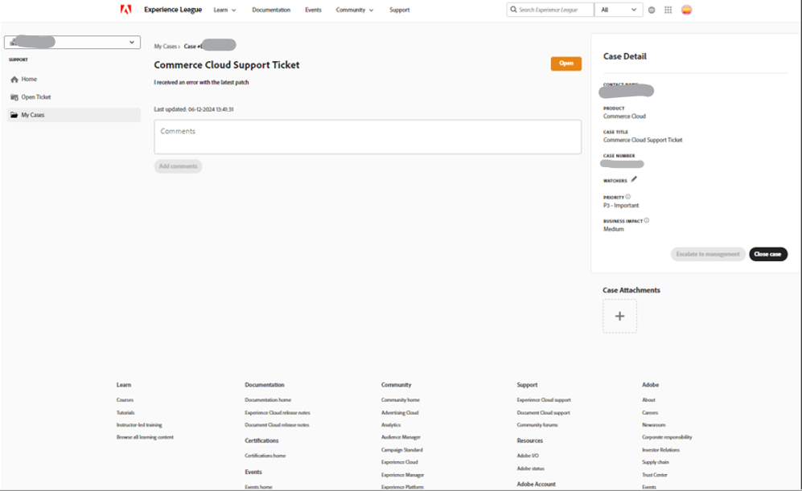
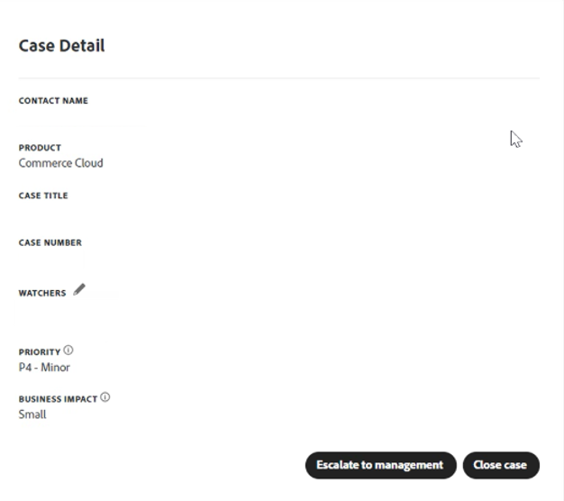

# Guide de l’utilisateur de l’assistance Experience League pour Adobe Commerce

Dans ce guide, découvrez comment envoyer un ticket d’assistance à l’[assistance Experience League](https://experienceleague.adobe.com/home#support) et fournir un accès partagé aux comptes Adobe Commerce.

>[!NOTE]
>
>La prise en charge d’Adobe Commerce a été migrée du Centre d’aide Adobe Commerce vers Experience League. Utilisez le flux de formulaire de cas Experience League décrit [ici](#what-is-experience-support) pour soumettre des cas d’assistance.

>[!NOTE]
>
>Pour consulter les dossiers précédemment soumis sur le centre d’aide d’Adobe Commerce, vous devrez vous rendre à l’adresse https://support.magento.com/hc/en-us/requests , car ces dossiers n’ont pas été migrés vers le nouveau système de tickets d’assistance. Le centre d’aide est maintenant en lecture seule ; pour continuer à recevoir l’assistance pour le problème d’origine, vous devrez envoyer un ticket de relance à l’[assistance Experience League](https://experienceleague.adobe.com/home#support).

>[!NOTE]
>
>La partie Base de connaissances du centre d’aide Adobe Commerce a été migrée vers le portail Adobe Experience League. Lorsque vous créez un ticket d’assistance, les articles connexes de la base de connaissances vous seront proposés, ainsi que d’autres documents Adobe Commerce pertinents provenant de Adobe Experience League.

**Mise à jour majeure :** 29 juillet 2024

**[QU’EST-CE QUE LA PRISE EN CHARGE DES EXPERIENCE LEAGUE ?](#what-is-experience-support)**

**[CAS DE SUPPORT](#support-cases)**

* [Connexion à l’assistance Experience League](#sign-in-experience-support)
* [Soumettre un cas d’assistance](#submit-case)

   * [Page de début Adobe Experience League](#experience-league-start-page)
   * [Page de compte Adobe Commerce](#submit-case-adobe-commerce-account-page)
   * [*Veuillez vérifier votre adresse électronique*](#verify-email-address-error)

* [Suivi des cas d’assistance](#track-support-cases)
* [Commentaires dans votre cas](#comments-in-your-case)
* [Fermez votre dossier](#close-case)
* [Réinitialiser votre dossier](#reopen-case)
* [Envoyer le ticket à l’aide de Cloud Console](#cloud-console)
* [hotline Adobe Commerce P1](#P1-hotline)
* [Modèle opérationnel de responsabilité partagée Adobe Commerce](#shared-responsibility-operational-model)

**[ACCÈS PARTAGÉ : OCTROYER DES DROITS À D’AUTRES UTILISATEURS POUR ACCÉDER À VOTRE COMPTE](#shared-access)**

* [Qui peut fournir un accès partagé](#who-can-provide-shared-access)
* [Fournir un accès partagé](#provide-shared-access)
* [Révoquer (supprimer) l’accès partagé](#revoke-shared-access)

   * [Comment supprimer les utilisateurs auxquels un accès partagé a été accordé via un projet Cloud ?](#remove-cloud-shared-access-users)

* [Accès au compte partagé (changer de compte)](#switch-accounts)
* [Résolution des problèmes d’accès partagé](#troubleshooting-shared-access)

**[FAQ SUR LA FACTURATION POUR ADOBE COMMERCE](#billing-faq)**

## QU’EST-CE QUE LA PRISE EN CHARGE DES EXPERIENCE LEAGUE ? {#what-is-experience-support}

L’assistance Experience League est un portail d’assistance pour les Adobes sur lequel les clients Adobe Commerce admissibles peuvent envoyer et gérer des tickets d’assistance. C’est également là que vous pouvez consulter les articles de dépannage.

## CAS DE PRISE EN CHARGE {#support-cases}

La gestion des cas d’assistance Adobe Experience League permet de travailler avec l’assistance par le biais de cas afin de résoudre les problèmes spécifiques rencontrés lors de l’utilisation de produits Adobe, y compris Adobe Commerce, pour tous les produits Adobe Commerce sous contrat.

## CONNEXION À LA PRISE EN CHARGE DES EXPERIENCE LEAGUE {#sign-in-experience-support}

La connexion vous permet d’envoyer des agents sur des tickets d’assistance, de les mettre à jour et de répondre à leurs questions.

Pour vous connecter à l’assistance Adobe Experience League, procédez comme suit :

1. Accédez à [experienceleague.adobe.com](https://experienceleague.adobe.com/).
1. Connectez-vous à l’aide de vos informations de connexion d’Adobe.

### Soumettre un cas d’assistance {#support-case}

Une fois connecté en tant que propriétaire du compte ou utilisateur d’accès partagé, vous pouvez soumettre un cas d’assistance à l’aide de la page d’accueil de Adobe Experience League, de votre page de compte Adobe Commerce et de votre page de compte Adobe Commerce Cloud.

>[!NOTE]
>
>Les demandes d’assistance pour l’équipe Adobe Commerce Marketplace ne peuvent pas être envoyées par le biais d’Experience League, car leur système d’assistance fonctionne sur une plateforme distincte qui n’est pas intégrée à Experience League.
>
>Vous pouvez soumettre votre cas d’assistance si les instructions suivantes sont vraies :
>
>* L’organisation en question est nommée dans la colonne de gauche et se termine par ([!DNL Commerce]). Votre problème est lié à cette organisation ou à un compte qui lui est associé.
>* Le problème est que vous ne pouvez pas vous connecter au compte Marketplace ou que vous avez une question sur le déploiement d’une extension.
>* Votre problème ne concerne pas uniquement la demande d’un remboursement pour vos achats Marketplace.
>
>Pour tout problème relatif à la publication de votre extension, aux problèmes d’achat ou à la demande d’un remboursement sur [Adobe Commerce Marketplace](https://commercemarketplace.adobe.com/), vous devez contacter directement l’équipe [!DNL Commerce Marketplace] en consultant https://commercemarketplace.adobe.com/. Accédez au bas de la page et cliquez sur **[!UICONTROL Contact Us]**, ce qui ouvre un formulaire pour envoyer un ticket d’assistance Marketplace.

#### Page de début Adobe Experience League {#experience-league-start-page}

Pour soumettre un nouveau cas d’assistance à l’aide de la page de démarrage de Adobe Experience League, procédez comme suit :

>[!INFO]
>
>1. Pour soumettre un dossier, vous devez avoir le droit de prendre en charge le produit approprié (par exemple, Adobe Commerce, Adobe Commerce Intelligence, Experience Platform, etc.). Si vous n’êtes pas autorisé à bénéficier d’une assistance, une barre apparaît en haut de la page vous informant que vous n’êtes pas un utilisateur autorisé par l’assistance au sein de l’organisation.
>1. Si vous appartenez à plusieurs organisations ou si plusieurs organisations portent des noms similaires (chacune d’elles représente les autres produits Adobe auxquels l’organisation s’abonne), vous devez d’abord sélectionner l’organisation appropriée dans la liste déroulante qui se termine par &quot;(Commerce)&quot;.
>1. Pour soumettre un dossier, vous devez avoir le droit de prendre en charge le produit approprié (par exemple, Adobe Commerce, Adobe Commerce Reporting, Adobe Commerce payment Services, Experience Platform, etc.). Si vous n’êtes pas autorisé à bénéficier d’une assistance, une barre apparaît en haut de la page vous informant que vous n’êtes pas un utilisateur autorisé par l’assistance au sein de l’organisation. Pour soumettre un dossier pour les problèmes liés à Commerce, vous devez d’abord sélectionner le nom d’organisation approprié qui se termine par *[!DNL (Commerce)]*.
>1. Si vous appartenez à plusieurs organisations ou si plusieurs organisations portent des noms similaires (chacune d’elles représente l’un des autres produits Adobe auxquels l’organisation s’abonne), vous devez d’abord sélectionner l’organisation appropriée dans la liste déroulante.
>1. Si vous ne voyez pas Adobe Commerce dans la liste déroulante [!UICONTROL Select a product], vous devez d’abord obtenir l’[accès partagé](#shared-access) auprès du propriétaire du compte Commerce. Une fois que vous avez reçu l’accès partagé, vous devrez [synchroniser votre compte](#switch-accounts) pour finaliser le processus avant de pouvoir envoyer un dossier.

>[!NOTE]
>
>Assurez-vous d’avoir sélectionné la bonne organisation avant d’envoyer le dossier et que l’organisation que vous avez sélectionnée dispose des droits appropriés pour le produit pour lequel vous demandez de l’aide. Par exemple, si votre problème est lié à Adobe Commerce, mais que vous avez sélectionné Experience Platform comme produit et que le dossier a bien été envoyé, cela peut entraîner un mauvais routage de votre cas et des délais de réponse.
>
>En outre, si la mauvaise organisation a été sélectionnée au moment de l’envoi du dossier, votre équipe ne pourra pas afficher le cas sous [!UICONTROL My Cases] pour l’organisation appropriée/correcte. L’équipe d’assistance d’Adobe Commerce n’a pas la possibilité de modifier l’organisation associée au dossier. Pour résoudre ce problème, vous devez clore le dossier existant et soumettre un nouveau dossier avec les détails appropriés fournis/sélectionnés.

1. Cliquez sur **Assistance** dans l’en-tête. Elle ouvrira la page d’accueil du service clientèle.

   

1. Pour lancer le processus d’appel à l’assistance, assurez-vous d’avoir sélectionné l’organisation appropriée dans la liste déroulante Organisation (si elle est visible). Pour soumettre un dossier pour Adobe Commerce, sélectionnez le nom de l’organisation qui se termine par *[!DNL Commerce]*.

   

1. Cliquez sur **[!UICONTROL Open Ticket]** dans le menu de gauche ou sur **[!UICONTROL Get Started]** dans la carte *[!UICONTROL Open a support ticket]*.

   

1. Sélectionnez un produit dans le menu déroulant et fournissez un titre et une description de la casse. REMARQUE : si la liste déroulante n’affiche aucun produit ou si Commerce n’est pas une option disponible, essayez de changer d’organisation dans la colonne de gauche et vérifiez à nouveau.

   

1. Adobe Experience League vous proposera des articles et des bonnes pratiques qui peuvent vous aider à résoudre votre problème. Si vous avez toujours besoin d’une assistance directe, vous devrez fournir des informations supplémentaires avant de soumettre votre dossier.

   

1. Une fois que vous avez renseigné toutes les informations requises, cliquez sur **[!UICONTROL Submit case]**.

>[!IMPORTANT]
>
>Si vous ne parvenez pas à voir votre organisation dans le menu déroulant de l’organisation lorsque vous vous connectez à experienceleague.adobe.com, vous devrez peut-être synchroniser votre profil avec accounts.magento.com avant de demander une assistance ou de gérer un cas de support existant.   
>
>1. Accédez à accounts.magento.com et connectez-vous avec le même profil (professionnel, scolaire ou personnel) que celui que vous utiliserez pour gérer les cas d’assistance dans Adobe Experience League. 
>1. Une fois que vous êtes connecté à votre profil accounts.magento.com , revenez à experienceleague.adobe.com et connectez-vous. 
>1. Sélectionnez votre organisation dans le menu déroulant de l’organisation. 
>1. Si votre entreprise n’apparaît toujours pas, contactez votre administrateur Commerce pour obtenir les droits des délégués de l’assistance. Pour plus d’informations, voir l’article d’aide [Commerce Account Share](https://experienceleague.adobe.com/en/docs/commerce-admin/start/commerce-account/commerce-account-share) . 

>[!NOTE]
>
>Pourquoi l’organisation/le produit importe
>
>**Exemple A** : vous avez un accès partagé à une seule société et cette société a des droits pour deux produits Adobes : Product1 et Product2.
>1. Puisque chaque organisation représente un produit, vous verrez deux organisations dans la liste déroulante, par exemple OrgA-Product1 et OrgB-Product2.
>1. Si vous avez sélectionné Produit = Produit1 mais que votre problème est lié à Produit2, la demande sera acheminée vers la prise en charge de Produit2 et des retards seront pris lors du transfert de la demande vers la prise en charge de Produit1.
>1. Si vous avez soumis l’affaire pour OrgA-Product1 et que vous souhaitez réviser [!UICONTROL My Cases] pour cette organisation à l’avenir, vous ne le verrez pas si vous sélectionnez OrgA-Product2 comme organisation (vous n’aurez qu’à sélectionner l’autre organisation, par rapport à l’exemple B).
>
>**Exemple B** : vous disposez d’un accès partagé à deux sociétés et chaque société n’a des droits que pour Adobe Commerce.
>1. Si vous avez soumis le dossier pour l’organisation A mais que le problème a un impact sur l’organisation B, les membres de l’organisation B ne pourront plus voir ce cas sous [!UICONTROL My Cases] à l’avenir.
>1. En outre, les membres de l’organisationA pourront voir les cas sous [!UICONTROL My Cases] qui sont réellement destinés à l’organisationB, ce qui peut entraîner des problèmes de confidentialité.

Vous devez disposer d’un compte sur https://account.adobe.com et https://account.magento.com pour vous connecter à l’Experience League afin de soumettre un cas d’assistance. Vous ne pourrez pas soumettre de demande d’assistance tant que vous n’aurez pas été connecté.

>[!NOTE]
>
>Si vous disposez déjà d’un compte à l’adresse https://account.magento.com mais que vous ne pouvez pas vous connecter, il se peut que vous ne vous soyez pas inscrit à un compte à l’adresse https://account.adobe.com, qui est obligatoire depuis août 2022.
>
>Pour résoudre ce problème :
>1. Créez un compte à l’adresse https://account.adobe.com à l’aide de la même adresse électronique que celle de votre ID MAG.
>1. Accédez à https://account.magento.com pour lier votre Adobe ID à l’identifiant MAG.

#### Page de compte Adobe Commerce {#submit-case-adobe-commerce-account-page}

Pour envoyer un nouveau ticket d’assistance à l’aide de la page de votre compte Adobe Commerce, procédez comme suit :

1. Connectez-vous à votre compte Adobe Commerce. Voir les [instructions détaillées](https://experienceleague.adobe.com/docs/commerce-admin/start/commerce-account/commerce-account-create.html?lang=en#create-a-commerce-account) dans notre guide d’utilisation.
1. Cliquez sur l’onglet **Assistance** .

   {width="800"}

1. La page de prise en charge de Adobe Experience League se charge pour vous.
1. Sélectionnez **[!UICONTROL Open Ticket]** dans le menu de gauche.
1. Renseignez les champs.
1. Cliquez sur **Submit**.

#### *Vérifiez l’erreur de votre adresse électronique* sur la page Compte Adobe Commerce. {#verify-email-address-error}

Vous ne pourrez pas envoyer de ticket d’assistance si vous recevez l’erreur Veuillez vérifier votre adresse électronique comme celle ci-dessous sur la page [Compte Adobe Commerce](https://account.magento.com/) .

### Suivi des cas d’assistance {#track-support-case}

Vos cas d’assistance sont ceux que vous avez :

* ont été soumises personnellement.
* ont été ajoutés à en tant que observateur via un CC (copie carbone).

#### Afficher vos dossiers

Vous pouvez visualiser les dossiers que vous avez envoyés personnellement en cliquant sur **[!UICONTROL My Cases]** dans le menu de gauche. Assurez-vous que vous avez sélectionné l’organisation correcte se terminant par &quot;(Commerce)&quot;.

#### Affichage de vos historiques dans le centre d’aide d’Adobe Commerce

Découvrez comment **afficher vos cas historiques** à partir du centre d’aide Adobe Commerce dans la [désactivation du centre d’aide Adobe Commerce](https://experienceleague.adobe.com/en/docs/commerce-knowledge-base/kb/announcements/news/decommissioning-of-adobe-commerce-help-center) de notre base de connaissances Adobe Commerce.

#### Affichage des cas de contrôle

Vous pouvez afficher les cas où vous avez été *ajouté à en tant que observateur* en cliquant sur **[!UICONTROL My organization's cases]** dans le menu de gauche.

<!-- TODO: Add image here -->

#### Recherche de cas

Pour rechercher des cas, entrez votre requête dans le champ *[!UICONTROL Search]* et appuyez sur *enter* sur votre clavier.

#### Réaffectation de vos dossiers

Si vous pensez qu’un cas nécessite une attention supplémentaire et que notre temps de réponse initial est écoulé, vous pouvez escalader le cas. Pour cela,

1. Cliquez sur **[!UICONTROL Escalate to management]** en bas à droite du panneau *[!UICONTROL Case Detail]* sur le côté droit de l’écran.

   

1. Après avoir cliqué, un formulaire contextuel s’affiche. Remplissez le formulaire, puis cliquez sur **[!UICONTROL Escalate]**.

   

   *Les raisons de l’escalade peuvent inclure* : Compétences en communication de l’agent, Connaissances techniques de l’agent, En attente de rappel/mise à jour, Changement de l’urgence du problème, Résolution ne répondant pas aux attentes ou Temps jusqu’à la résolution.

#### Ajout d’un observateur sur les cas de support

Vous pouvez ajouter des observateurs pour prendre en charge les cas envoyés par des membres de votre organisation. Les observateurs recevront des notifications par e-mail lorsque de nouveaux cas seront envoyés ou lorsque des cas existants seront mis à jour.

1. Pour ajouter un observateur à une casse existante, ouvrez-la, puis cliquez sur l’icône en forme de crayon située en regard de &quot;observateurs&quot; dans le panneau Détails de la casse sur le côté droit de l’écran.

   

1. Après avoir cliqué sur le crayon, vous pouvez ajouter ou supprimer des observateurs de la liste.

   

### Commentaires dans votre cas {#comments-in-your-case}

Les commentaires dans votre cas contiennent tous les commentaires écrits par vous ou par l’équipe d’assistance d’Adobe Commerce. Les commentaires sont affichés du plus récent (en haut) au plus ancien (en bas).
Pour ajouter un commentaire, procédez comme suit :

1. Faites défiler jusqu’au bas de votre ticket.
1. Rédigez votre commentaire dans le champ **[!UICONTROL Comments]** et cliquez sur **[!UICONTROL Add comments]**.

### Fermez votre dossier {#close-case}

Pour fermer votre cas, cliquez sur **[!UICONTROL Close case]** en bas à droite du panneau *[!UICONTROL Case Detail]*.

### Réinitialiser votre dossier {#reopen-case}

Pour rouvrir votre dossier, répondez au courrier électronique envoyé par notre système d’assistance concernant ce cas et demandez à l’agent de le rouvrir. Si vous procédez de la sorte dans les 14 jours suivant la clôture de l’affaire, l’agent peut rouvrir l’affaire pour vous. Cependant, s’il s’agit d’un délai de 14 jours, l’agent devra créer un nouveau cas.

### Envoyer le ticket à l’aide de Cloud Console {#cloud-console}

Pour envoyer un nouveau ticket d’assistance à l’aide de Cloud Console, procédez comme suit :

1. Connectez-vous à la [console cloud](https://console.adobecommerce.com).
1. Sélectionnez **[!UICONTROL Support]** dans le menu utilisateur.
1. La page **[!UICONTROL My Tickets]** se charge.
1. Cliquez sur **[!UICONTROL Submit a ticket]** dans le coin supérieur droit.
1. Renseignez les champs.
1. Cliquez sur **Submit**.
1. Cliquez sur **[!UICONTROL Submit]**.

### hotline Adobe Commerce P1 {#P1-hotline}

L’article [hotline Adobe Commerce P1](https://experienceleague.adobe.com/docs/commerce-knowledge-base/kb/how-to/adobe-commerce-p1-notification-hotline.html) fournit les numéros de hotline P1 pour Adobe Commerce lors de la recherche d’aide lors d’un incident P1 et explique quelles informations fournir.

### Modèle opérationnel de responsabilité partagée Adobe Commerce {#shared-responsibility-operational-model}

Voir l’article sur le [Modèle opérationnel de responsabilité partagée Adobe Commerce](https://experienceleague.adobe.com/en/docs/commerce-operations/security-and-compliance/shared-responsibility#operational-responsibilities-summary),
qui vise à clarifier les responsabilités opérationnelles de notre offre d’infrastructure Pro uniquement.

### Ouvrir un ticket de relance {#follow-up}

L’ouverture d’un ticket de relance garantit que le problème d’origine est lié au ticket de relance pour la continuité.

Pour ouvrir un ticket de relance, cliquez sur le lien &quot;*créer un suivi*&quot; au bas du ticket que vous souhaitez créer.

## ACCÈS PARTAGÉ : OCTROYEZ DES DROITS À D’AUTRES UTILISATEURS POUR ACCÉDER À VOTRE COMPTE. {#shared-access}

Vous pouvez accorder un accès limité à votre compte pour d’autres détenteurs de compte Adobe Commerce. En particulier, à l’aide de la fonctionnalité **accès partagé**, vous pouvez accorder des privilèges aux employés et aux fournisseurs de services de confiance pour qu’ils puissent utiliser votre compte du centre d’aide afin qu’ils puissent travailler avec vos tickets d’assistance.

Vous pouvez fournir et gérer l’accès partagé à l’aide de votre page de compte Adobe Commerce à l’adresse [https://account.magento.com](https://account.magento.com/).

### Qui peut fournir un accès partagé {#who-can-provide-shared-access}

Seul le propriétaire du compte (titulaire principal du compte) disposant des privilèges appropriés peut fournir un accès partagé aux autres utilisateurs.

La gestion des utilisateurs et de leur accès est de la responsabilité du client, en particulier dans la perspective d’accès partagé. Par conséquent, l’équipe d’assistance Adobe Commerce ne peut pas fournir un accès partagé à un compte Adobe Commerce pour le compte d’un client. Les clients sont encouragés à ajouter eux-mêmes des utilisateurs avec un accès partagé à l’aide de la [page de compte Adobe Commerce](https://account.magento.com/).

Les utilisateurs disposant d’un accès partagé ne peuvent pas le transférer ni l’accorder à d’autres utilisateurs.

### Fournir un accès partagé {#provide-shared-access}

Pour obtenir des instructions détaillées sur la configuration d’un compte partagé, reportez-vous à la section [Partager un compte Commerce](https://experienceleague.adobe.com/en/docs/commerce-admin/start/commerce-account/commerce-account-share) du Guide de prise en main d’Adobe Commerce.

Après avoir fourni un accès partagé à un nouvel utilisateur, les informations connexes sont disponibles dans **Accès partagé** > **Gérer les autorisations** de la page de votre compte Adobe Commerce.

### Révoquer (supprimer) l’accès partagé {#revoke-shared-access}

1. Connectez-vous à votre compte Adobe Commerce à l’adresse [https://account.magento.com](https://account.magento.com/).
1. Dans le panneau de gauche, sous Accès partagé, sélectionnez **Gérer les autorisations.**
1. Recherchez l’utilisateur à qui révoquer l’accès partagé et cliquez sur {width="25"} dans la ligne de l’utilisateur (**colonne Actions**).
1. Cliquez sur **Supprimer l’utilisateur** pour révoquer l’accès ou sur X dans le coin supérieur pour annuler la révocation.

   {width="800"}

   Vous pouvez également révoquer l’accès partagé à l’aide du menu **Edit** :

1. Connectez-vous à votre compte Adobe Commerce à l’adresse [https://account.magento.com](https://account.magento.com/).
1. Dans le panneau de gauche, sous Accès partagé, sélectionnez **Gérer les autorisations.**
1. Recherchez l’utilisateur à qui révoquer l’accès partagé et cliquez sur **Modifier** dans la ligne de l’utilisateur (**Colonne Actions**).
1. Cliquez sur **Supprimer cet utilisateur** au bas de la page.
1. Dans la fenêtre contextuelle de confirmation, cliquez sur **Supprimer l’utilisateur** pour révoquer l’accès ou sur X dans le coin supérieur pour annuler la révocation.

### Comment supprimer les utilisateurs auxquels un accès partagé a été accordé via un projet Cloud ? {#remove-cloud-shared-access-users}

<u> Produits et versions concernés</u>

* Adobe Commerce Cloud (toutes versions)

<u>Cause</u>

Si vous avez/avez eu un projet Adobe Commerce Cloud et que vous avez ajouté un utilisateur au projet, un accès partagé aurait été automatiquement accordé à l’ID MAGE du propriétaire du projet. Cela serait normalement indiqué dans la colonne **[!UICONTROL Share Name]**, affichant *Cloud Shared Access from MAG[XYZ]*.

Si le lien du DELETE est manquant, cela signifie que l’accès partagé a été automatiquement accordé par Commerce Cloud.

<u>Solution</u>

Il n’est pas possible de supprimer la liste des utilisateurs d’accès partagé avec le nom de partage *Cloud Shared Access de MAG[XYZ]* si l’accès partagé n’a pas été ajouté/donné sur cette page. Elles sont conservées à des fins d’information/de vérification.

Cependant, une fois que vous avez révoqué les autorisations sur ces utilisateurs d’accès partagé, ils ne disposent plus de cet accès.

1. Connectez-vous à votre compte Adobe Commerce à l’adresse [https://account.magento.com](https://account.magento.com/).
1. Dans le panneau de gauche, sous *[!UICONTROL Shared Access]*, choisissez **[!UICONTROL Manage Permissions]**.
1. Recherchez l’utilisateur à partir duquel révoquer l’accès partagé et cliquez sur **[!UICONTROL Edit]** dans la ligne de l’utilisateur (*[!UICONTROL Actions]* colonne).
1. Décochez toutes les ressources sous *[!UICONTROL Grant Account Permissions]*.

{width="800"}

Pour plus d’informations, reportez-vous à la documentation [Gérer l’accès des utilisateurs](https://experienceleague.adobe.com/docs/commerce-cloud-service/user-guide/project/user-access.html#manage-users-from-the-project-web-interface) de notre guide Commerce on Cloud Infrastructure.

### Accès au compte partagé (changer de compte) {#switch-accounts}

Pour utiliser l’accès partagé fourni pour vous, procédez comme suit :

1. Connectez-vous à votre compte Adobe Commerce à l’adresse [https://account.magento.com](https://account.magento.com/).
1. Cliquez sur le menu **Changer de compte** et sélectionnez un compte.

   {width="800"}

Pour savoir quel compte vous utilisez actuellement (votre propre compte natif ou accès partagé), consultez le menu **Changer de compte** : il affiche le compte actif.

### Résolution des problèmes d’accès partagé {#troubleshooting-shared-access}

Reportez-vous à l’ [ article sur le dépannage de l’accès partagé](/help/troubleshooting/miscellaneous/shared-access-troubleshooting.md) dans notre base de connaissances d’assistance.

## FAQ SUR LA FACTURATION POUR ADOBE COMMERCE {#billing-faq}

Les marchands paient généralement nos services par une transaction par carte de crédit (CC), et cette [FAQ sur la facturation pour Adobe Commerce](/help/faq/general/billing-faq-for-adobe-commerce.md) est une ressource pour vous aider lorsque vous payez votre facture.

