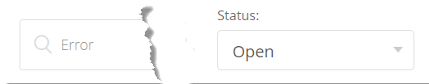

# Guide de l’utilisateur du centre d’aide Adobe Commerce

Dans ce guide, découvrez comment envoyer un ticket d’assistance au [Centre d’aide Adobe Commerce](https://support.magento.com/hc/en-us) et fournir un accès partagé aux comptes Adobe Commerce.

>[!NOTE]
>
>La prise en charge d’Adobe Commerce passe du centre d’aide Adobe Commerce à l’Experience League. Si vous avez été averti que vous avez accès, utilisez le flux de formulaire de dossier Experience League décrit [ici](#what-is-experience-support). Si vous n’avez pas été informé, continuez à utiliser le [flux de cas du centre d’aide Adobe Commerce](#what-is-adobe-commerce-help-center).

>[!NOTE]
>
>La partie Base de connaissances du centre d’aide Adobe Commerce a été migrée vers le portail Adobe Experience League. Lorsque vous créez un ticket d’assistance, les articles connexes de la base de connaissances vous seront proposés, ainsi que d’autres documents Adobe Commerce pertinents provenant de Adobe Experience League.

**Mise à jour majeure :** 8 juillet 2024

**[QU’EST-CE QUE LA PRISE EN CHARGE DES EXPERIENCE LEAGUE ?](#what-is-experience-support)**

**[CAS DE SUPPORT](#support-cases)**

* [Connexion à l’assistance Experience League](#sign-in-experience-support)
* [Soumettre un cas d’assistance](#submit-case)

   * [Page de début Adobe Experience League](#experience-league-start-page)
   * [Page de compte Adobe Commerce](#submit-case-adobe-commerce-account-page)
   * [*Veuillez vérifier votre adresse électronique*](#verify-email-address-error)

* [Suivi des cas d’assistance](#track-support-cases)
* [Commentaires dans votre cas](#comments-in-your-case)
* [Fermez votre dossier](#close-case)

**[QU’EST-CE QUE LE CENTRE D’AIDE ADOBE COMMERCE ?](#what-is-adobe-commerce-help-center)**

**[SUPPORT TICKETS](#support-tickets)**

* [Connexion au centre d’aide](#login)
* [Envoyer un ticket d’assistance](#submit-ticket)

   * [Page de début du centre d’aide](#submit-ticket-help-center-start-page)
   * [Page Compte Magento](#submit-ticket-magento-account-page)
   * [Cloud Console](#submit-ticket-magento-cloud-account-page)
   * [Informations sur votre ticket d’assistance](#info-in-support-ticket)
   * [Le lien &quot;Envoyer un ticket&quot; ne s’affiche pas sur la page de démarrage du centre d’aide Adobe Commerce](#no-submit-link)
   * [*&quot;Veuillez vérifier votre adresse électronique&quot;*](#verify-email-address)
   * [Formulaire d’envoi de ticket : le marchand ne s’affiche pas dans la liste déroulante Organisation .](#merchant-not-displayed)

* [Suivi des tickets](#track-tickets)
* [hotline Adobe Commerce P1 (connexion requise)](#P1-hotline)
* [Modèle opérationnel de responsabilité partagée Adobe Commerce (connexion requise)](#shared-responsibility-operational-model)
* [Explication des champs de ticket de support](#ticket-fields-explained)
* [État du ticket : traitement de vos requêtes](#ticket-status)
* [Conversation dans votre ticket](#conversation-in-ticket)
* [Résoudre votre ticket](#resolve-ticket)
* [Ouvrir un ticket de relance](#follow-up)

**[ACCÈS PARTAGÉ : OCTROYER DES DROITS À D’AUTRES UTILISATEURS POUR ACCÉDER À VOTRE COMPTE](#shared-access)**

* [Qui peut fournir un accès partagé](#who-can-provide-shared-access)
* [Fournir un accès partagé](#provide-shared-access)
* [Révoquer (supprimer) l’accès partagé](#revoke-shared-access)

   * [Comment supprimer les utilisateurs auxquels un accès partagé a été accordé via un projet Cloud ?](#remove-cloud-shared-access-users)

* [Accès au compte partagé (changer de compte)](#switch-accounts)
* [Résolution des problèmes d’accès partagé](#troubleshooting-shared-access)

**[FAQ SUR LA FACTURATION POUR ADOBE COMMERCE](#billing-faq)**

**[U MAGENTO FAIT DÉSORMAIS PARTIE DES SERVICES D’APPRENTISSAGE NUMÉRIQUE D’ADOBE](#magento-u)**

>[!NOTE]
>
>À moins d’avoir été informé, continuez à utiliser le [flux de cas du centre d’aide Adobe Commerce](#what-is-adobe-commerce-help-center). Si vous avez été informé que vous êtes dans la cohorte avec accès, suivez le flux de formulaire de cas Experience League décrit [ci-dessous](#what-is-experience-league-support).

## QU’EST-CE QUE LA PRISE EN CHARGE DES EXPERIENCE LEAGUE ? {#what-is-experience-support}

L’assistance Experience League est un portail d’assistance pour les Adobes sur lequel les clients Adobe Commerce admissibles peuvent envoyer et gérer des tickets d’assistance. C’est également là que vous pouvez consulter les articles de dépannage.

## CAS DE PRISE EN CHARGE {#support-cases}

La gestion des cas d’assistance Adobe Experience League permet de travailler avec l’assistance par le biais de cas afin de résoudre les problèmes spécifiques rencontrés lors de l’utilisation de produits Adobe, y compris Adobe Commerce, pour tous les produits Adobe Commerce sous contrat.

## CONNEXION À LA PRISE EN CHARGE DES EXPERIENCE LEAGUE {#sign-in-experience-support}

La connexion vous permet d’envoyer des agents sur des tickets d’assistance, de les mettre à jour et de répondre à leurs questions.

Pour vous connecter à l’assistance Adobe Experience League, procédez comme suit :

1. Accédez à [experienceleague.adobe.com](https://experienceleague.adobe.com/).
1. Connectez-vous à l’aide de vos informations de connexion d’Adobe.

### Soumettre un cas d’assistance {#support-case}

Une fois votre connexion établie, vous pouvez soumettre un cas d’assistance à l’aide de la page d’accueil de Adobe Experience League, de votre page de compte Adobe Commerce et de votre page de compte Adobe Commerce Cloud.

* Si vous êtes le propriétaire du compte, procédez comme suit.
* Si vous êtes un utilisateur d’accès partagé, vous devez d’abord changer de compte. Voir [Accès au compte partagé (changer de compte)](https://experienceleague.adobe.com/en/docs/commerce-knowledge-base/kb/help-center-guide/magento-help-center-user-guide#switch-accounts), puis vous pouvez passer aux étapes ci-dessous.

#### Page de début Adobe Experience League {#experience-league-start-page}

Pour soumettre un nouveau cas d’assistance à l’aide de la page de démarrage de Adobe Experience League, procédez comme suit :

>[!NOTE]
>
>1. Si vous appartenez à plusieurs organisations, vous devez sélectionner l’organisation appropriée dans la liste déroulante.
>1. Pour soumettre un dossier, vous devez avoir le droit de demander de l&#39;aide. Si ce n’est pas le cas, une barre s’affiche en haut de la page pour vous informer que vous n’êtes pas un utilisateur ayant les droits d’assistance dans l’organisation.

1. Cliquez sur **Assistance** dans l’en-tête. Il ouvrira la page d’accueil de l’assistance.

   

1. Pour commencer le processus d’admission de l’assistance, cliquez sur **[!UICONTROL Open Ticket]** dans le menu de gauche, ou cliquez sur **[!UICONTROL Get Started]** dans la carte *[!UICONTROL Open a support ticket]*.

   

1. Sélectionnez un produit dans le menu déroulant et fournissez un titre et une description de la casse.

   

1. Adobe Experience League vous proposera des articles et des bonnes pratiques qui peuvent vous aider à résoudre votre problème. Si vous avez toujours besoin d’une assistance directe, vous devrez fournir des informations supplémentaires avant de soumettre votre dossier.

   

1. Une fois que vous avez renseigné toutes les informations requises, cliquez sur **[!UICONTROL Submit case]**.

Vous devez disposer d’un compte sur https://account.adobe.com et https://account.magento.com pour vous connecter à l’Experience League afin de soumettre un cas d’assistance. Vous ne pourrez pas soumettre de demande d’assistance tant que vous n’aurez pas été connecté.

>[!NOTE]
>
>Si vous disposez déjà d’un compte à l’adresse https://account.magento.com mais que vous ne pouvez pas vous connecter, il se peut que vous ne vous soyez pas inscrit à un compte à l’adresse https://account.adobe.com, qui est obligatoire depuis août 2022.
>
>Pour résoudre ce problème :
>1. Créez un compte à l’adresse https://account.adobe.com à l’aide de la même adresse électronique que celle de votre ID MAG.
>1. Accédez à https://account.magento.com pour lier votre Adobe ID à l’identifiant MAG.

#### Page de compte Adobe Commerce {#submit-case-adobe-commerce-account-page}

Pour envoyer un nouveau ticket d’assistance à l’aide de la page de votre compte Adobe Commerce, procédez comme suit :

1. Connectez-vous à votre compte Adobe Commerce. Voir les [instructions détaillées](https://experienceleague.adobe.com/docs/commerce-admin/start/commerce-account/commerce-account-create.html?lang=en#create-a-commerce-account) dans notre guide d’utilisation.
1. Cliquez sur l’onglet **Assistance** .

   {width="800"}

1. La page de prise en charge de Adobe Experience League se charge pour vous.
1. Sélectionnez **[!UICONTROL Open Ticket]** dans le menu de gauche.
1. Renseignez les champs.
1. Cliquez sur **Submit**.

#### *Vérifiez l’erreur de votre adresse électronique* sur la page Compte Adobe Commerce. {#verify-email-address-error}

Vous ne pourrez pas envoyer de ticket d’assistance si vous recevez l’erreur Veuillez vérifier votre adresse électronique comme celle ci-dessous sur la page [Compte Adobe Commerce](https://account.magento.com/) .

### Suivi des cas d’assistance {#track-support-case}

Vos cas d’assistance sont ceux que vous avez :

* ont été soumises personnellement.
* ont été ajoutés à en tant que observateur via un CC (copie carbone).

#### Afficher vos dossiers

Vous pouvez afficher vos dossiers en cliquant sur **[!UICONTROL My Cases]** dans le menu de gauche.

#### Recherche de cas

Pour rechercher des cas, entrez votre requête dans le champ *[!UICONTROL Search]* et appuyez sur *enter* sur votre clavier.

#### Réaffectation de vos dossiers

Si vous pensez qu’un cas nécessite une attention supplémentaire et que notre temps de réponse initial est écoulé, vous pouvez escalader le cas. Pour cela,

1. Cliquez sur **[!UICONTROL Escalate to management]** en bas à droite du panneau *[!UICONTROL Case Detail]* sur le côté droit de l’écran.

   

1. Après avoir cliqué, un formulaire contextuel s’affiche. Remplissez le formulaire, puis cliquez sur **[!UICONTROL Escalate]**.

   

   *Les raisons de l’escalade peuvent inclure* : Compétences en communication de l’agent, Connaissances techniques de l’agent, En attente de rappel/mise à jour, Changement de l’urgence du problème, Résolution ne répondant pas aux attentes ou Temps jusqu’à la résolution.

#### Ajout d’un observateur sur les cas de support

Vous pouvez ajouter des observateurs pour prendre en charge les cas envoyés par des membres de votre organisation. Les observateurs recevront des notifications par e-mail lorsque de nouveaux cas seront envoyés ou lorsque des cas existants seront mis à jour.

1. Pour ajouter un observateur à une casse existante, ouvrez-la, puis cliquez sur l’icône en forme de crayon située en regard de &quot;observateurs&quot; dans le panneau Détails de la casse sur le côté droit de l’écran.

   

1. Après avoir cliqué sur le crayon, vous pouvez ajouter ou supprimer des observateurs de la liste.

   

### Commentaires dans votre cas {#comments-in-your-case}

Les commentaires dans votre cas contiennent tous les commentaires écrits par vous ou par l’équipe d’assistance d’Adobe Commerce. Les commentaires sont affichés du plus récent (en haut) au plus ancien (en bas).
Pour ajouter un commentaire, procédez comme suit :

1. Faites défiler jusqu’au bas de votre ticket.
1. Rédigez votre commentaire dans le champ **[!UICONTROL Comments]** et cliquez sur **[!UICONTROL Add comments]**.

### Fermez votre dossier {#close-case}

Pour fermer votre cas, cliquez sur **[!UICONTROL Close case]** en bas à droite du panneau *[!UICONTROL Case Detail]*.

>[!NOTE]
>
>Continuez à utiliser le flux de formulaire [ci-dessous](#what-is-adobe-commerce-help-center) du Centre d’aide Adobe Commerce pour l’envoi et la gestion des tickets, sauf si vous avez été informé que vous êtes dans la cohorte ayant accès au flux de formulaire de cas Experience League décrit [ici](#what-is-experience-league-support).

## QU’EST-CE QUE LE CENTRE D’AIDE ADOBE COMMERCE ? {#what-is-adobe-commerce-help-center}

Le [centre d’aide Adobe Commerce](https://support.magento.com/hc/en-us) est un portail d’assistance pour Adobe Commerce, où les clients admissibles peuvent envoyer et gérer des tickets d’assistance. C’est également là que vous pouvez consulter les articles de dépannage.

## TICKETS DE PRISE EN CHARGE {#support-tickets}

Adobe Commerce Ticketing System permet de travailler avec des tickets d’assistance pour résoudre les problèmes spécifiques que vous rencontrez lorsque vous travaillez avec Adobe Commerce, pour tous les produits Adobe Commerce.

## CONNEXION AU CENTRE D’AIDE {#login}

La connexion vous permet d’envoyer des agents sur des tickets d’assistance, de les mettre à jour et de répondre à leurs questions.

Pour vous connecter au centre d’aide Adobe Commerce, procédez comme suit :

1. Accédez au centre d’aide à l’adresse <https://support.magento.com>.
1. Cliquez sur **Se connecter** dans le coin supérieur droit.

Utilisez les informations d’identification de votre compte de Magento pour vous connecter. Pour plus d’informations, voir [Votre compte de Magento](https://experienceleague.adobe.com/docs/commerce-admin/start/commerce-account/commerce-account-create.html) dans notre guide d’utilisation.

### <strong>Envoyer un ticket d’assistance</strong> {#submit-ticket}

Une fois connecté, vous pouvez envoyer un ticket d’assistance à l’aide de la page de démarrage du centre d’aide, de la page Compte du Magento et de la page Compte Cloud du Magento.

* Si vous êtes le **propriétaire du compte**, procédez comme suit.
* Si vous êtes un **utilisateur d’accès partagé, vous devez changer de compte d’abord** [accéder au compte partagé (changer de compte)](#switch-accounts), puis vous pouvez passer aux étapes ci-dessous.

#### Page de début du centre d’aide {#submit-ticket-help-center-start-page}

Pour envoyer un nouveau ticket d’assistance à l’aide de la page de début du centre d’aide Adobe Commerce, procédez comme suit :

1. Accédez à [Centre d’aide Adobe Commerce](https://support.magento.com/hc/en-us).
1. Cliquez sur **Soumettre un ticket** dans le coin supérieur droit.

   {width="800"}

1. Renseignez les champs.
1. Cliquez sur **Submit**.

Vous *devez disposer d’un compte sur https://account.adobe.com et https://account.magento.com, puis vous connecter au centre d’aide à l’aide de votre compte Adobe Commerce pour envoyer un ticket d’assistance.* Tant que vous n&#39;êtes pas connecté, le bouton [ **Submit a ticket** ne s&#39;affiche pas ](#no-submit-link).

>[!NOTE]
>
>Si vous disposez déjà d’un compte à l’adresse https://account.magento.com mais que vous ne pouvez pas vous connecter, il se peut que vous ne vous soyez pas inscrit à un compte à l’adresse https://account.adobe.com, qui est obligatoire depuis août 2022.
>
>Pour résoudre ce problème :
>
>1. Créez un compte à l’adresse https://account.adobe.com à l’aide de la même adresse électronique que celle de votre ID MAG.
>1. Accédez à https://account.magento.com pour lier votre Adobe ID à l’identifiant MAG.

#### Page Compte Magento {#submit-ticket-magento-account-page}

Pour envoyer un nouveau ticket d’assistance à l’aide de la page Compte de Magento , procédez comme suit :

1. Connectez-vous à votre compte de Magento. Voir les [instructions détaillées](https://experienceleague.adobe.com/docs/commerce-admin/start/commerce-account/commerce-account-create.html?lang=en#create-a-commerce-account) dans notre guide d’utilisation.
1. Cliquez sur l’onglet **Assistance** .

   {width="800"}

1. La page de démarrage du centre d’aide se charge.
1. Cliquez sur **Envoyer un ticket** dans le coin supérieur droit.
1. Renseignez les champs.
1. Cliquez sur **Submit**.

#### Cloud Console {#submit-ticket-magento-cloud-account-page}

Pour envoyer un nouveau ticket d’assistance à l’aide de Cloud Console, procédez comme suit :

1. Connectez-vous à la [console cloud](https://console.adobecommerce.com).
1. Sélectionnez **[!UICONTROL Support]** dans le menu utilisateur.
1. La page **[!UICONTROL My Tickets]** se charge.
1. Cliquez sur **[!UICONTROL Submit a ticket]** dans le coin supérieur droit.
1. Renseignez les champs.
1. Cliquez sur **Submit**.
1. Cliquez sur **[!UICONTROL Submit]**.

#### Informations sur votre ticket d’assistance {#info-in-support-ticket}

Les champs, marqués d’un astérisque rouge ( **\*** ), sont obligatoires et doivent être remplis. Si vous laissez l’un de ces champs vide, vous ne pourrez pas envoyer votre ticket.

Pour plus d’informations, voir [Champs de ticket expliqués](#ticket-fields-explained) ci-dessous.

### Le lien &quot;Envoyer un ticket&quot; ne s’affiche pas sur la page de démarrage du centre d’aide Adobe Commerce {#no-submit-link}

#### Problème

Vous accédez au Centre d’aide Adobe Commerce et souhaitez envoyer une demande d’assistance, mais le lien **Soumettre un ticket** ne s’affiche pas sur la page de démarrage du Centre d’aide.

#### Cause

L’une des causes possibles est la suivante :

* Vous n’êtes pas connecté au centre d’aide.
* Si vous utilisez l’accès partagé pour la première fois, vous n’avez pas exécuté les étapes requises pour vous assurer que le centre d’aide Adobe Commerce est correctement configuré via l’appel SSO de Magento.com.
* Votre compte n’est pas autorisé pour l’assistance d’Adobe Commerce (par exemple, vous n’êtes pas un client Commerce payant ou vous êtes un client Open Source).

#### Solution

[Connectez-vous au centre d’aide](/help/help-center-guide/help-center/magento-help-center-user-guide.md#provide-shared-access).

Le lien **Soumettre un ticket** s’affiche uniquement pour les clients dont l’email est associé à un contrat de support valide.

#### Utilisation d’un compte d’accès partagé

Pour pouvoir utiliser le compte d’accès partagé afin d’envoyer des tickets d’assistance, vous devez effectuer les opérations suivantes (cette opération ne doit être effectuée qu’une seule fois) :

1. Après avoir reçu l&#39;[accès partagé](https://support.magento.com/hc/en-us/articles/360052444712#who-can-provide-shared-access), connectez-vous à votre [compte Magento sur le magento.com site Web](https://account.magento.com/).
1. Dans le champ déroulant **Changer de compte** situé dans le coin supérieur droit, sélectionnez le compte d’accès partagé.
1. Cliquez sur l’onglet **Assistance** dans le panneau de gauche. Cela permet de s’assurer que le centre d’aide Adobe Commerce est correctement configuré via l’appel SSO de Magento.com vers le centre d’aide Adobe Commerce.

#### Le lien **Submit a ticket** ne s’affiche toujours pas

Si vous ne disposez pas de **comptes partagés** dans la liste déroulante **Changer de compte**, mais que vous travaillez pour un client disposant d’une licence Adobe Commerce, demandez-lui de vous accorder l’accès partagé. Pour plus d’informations, consultez [Fournir un accès partagé au compte de Magento](/help/help-center-guide/help-center/magento-help-center-user-guide.md#provide-shared-access).

Si vous êtes propriétaire de licence Adobe Commerce, vérifiez que vous ne disposez pas d’une facture avec le statut **En attente de paiement**. Les prestations d’assistance sont automatiquement accordées ou révoquées en fonction de l’état du paiement de la facture.

Comment vérifier votre état de paiement :

1. Connectez-vous à [magento.com](https://support.magento.com/).
1. Cliquez sur **Historique de facturation** à gauche.
1. Si vous **do** avez une facture avec le statut **En attente de paiement**, **contactez votre équipe de compte d&#39;Adobe** pour que le problème de paiement soit résolu.

Nous ne prenons en charge que les propriétaires de licence Adobe Commerce et les comptes disposant d’un accès partagé à un compte avec une licence Adobe Commerce. Si vous avez besoin d’aide pour l’édition du Magento Open Source, veuillez utiliser ces ressources techniques d’aide autonome :

* [Centre d’aide Adobe Commerce](https://support.magento.com/)
* [Documentation du développeur Adobe Commerce](https://developer.adobe.com/commerce/docs/)
* [Ressources de documentation Adobe Commerce](https://experienceleague.adobe.com/docs/commerce.html)
* [Forums Magento](https://community.magento.com/?_ga=2.99592990.1084044056.1559046120-720752292.1551793747)

Si vous rencontrez des problèmes lors de la connexion à votre compte ou si vous pensez que l’accès partagé a été configuré correctement, mais que vous ne pouvez toujours pas voir le bouton **Envoyer un ticket**, veuillez envoyer un e-mail [Problèmes de connexion au centre d’aide](mailto:grp-magento-helpcenterloginissues@adobe.com). Nous passerons en revue les paramètres de votre compte et les droits de l’assistance.

>[!NOTE]
>
>Si vous rencontrez un problème lors de l’accès à votre projet cloud, envoyez la demande pour ce problème par le biais des canaux standard. N’envoyez pas d’email si vous pouvez envoyer un ticket.

### Erreur &quot;Veuillez vérifier votre adresse électronique&quot; sur la page Compte du Magento. {#verify-email-address}

Vous ne pourrez pas envoyer de ticket d’assistance si vous recevez l’erreur *Vérifiez votre adresse électronique* similaire à celle ci-dessous sur la [page du compte de Magento](https://account.magento.com/).

{width="800"}

La solution consiste à valider votre adresse électronique :

1. Connectez-vous à https://account.adobe.com et demandez un mot de passe si nécessaire.
1. Vérifiez votre compte d’Adobe.

>[!NOTE]
>
>Cela s’applique uniquement au lien de validation d’email provenant de https://account.magento.com (page Compte de Magento).

### Formulaire d’envoi de ticket : le marchand ne s’affiche pas dans la liste déroulante Organisation . {#merchant-not-displayed}

#### Problème

Conditions préalables : un compte d’accès partagé est accordé par un commerçant.

Étapes à reproduire :

1. Connectez-vous au centre d’aide à l’aide de votre compte partagé.
1. Cliquez sur le lien **Submit a ticket** . Le formulaire d’envoi du ticket s’ouvre.
1. Développez le champ déroulant **Organisation** pour sélectionner le commerçant.

Résultat attendu :

Le commerçant correspondant au compte partagé est répertorié dans les options **Organisation** .

Résultat réel :

Le commerçant correspondant au compte partagé utilisé n’est pas disponible dans les options **Organisation** .

#### Solution

Après avoir obtenu l’accès partagé du commerçant, vous devez effectuer les étapes suivantes (une seule fois) :

1. Connectez-vous à votre compte [Magento sur le magento.com site Web](https://account.magento.com/).
1. Dans le champ déroulant **Changer de compte** situé dans le coin supérieur droit, sélectionnez le compte d’accès partagé.
1. Cliquez sur l’onglet **Assistance** dans le panneau de gauche. Cela permet de s’assurer que le centre d’aide Adobe Commerce est correctement configuré via l’appel SSO de Magento.com vers le centre d’aide Adobe Commerce.

Si vous avez déjà effectué cette opération, vérifiez si l&#39;accès *partagé vous a été accordé depuis plusieurs commerçants* en cliquant sur l&#39;onglet [[!UICONTROL Shared with me] de votre compte](https://account.magento.com/grantor/manage/shared/) :
* Si un seul [!UICONTROL Share Name] est répertorié, c&#39;est-à-dire que vous n&#39;avez été accordé que par un seul commerçant, *vous ne verrez pas de liste déroulante [!UICONTROL Organization]*.
* S&#39;il existe plusieurs [!UICONTROL Share Names], les droits du commerçant au service clientèle peuvent avoir expiré car leur licence a été précédemment révoquée en raison de problèmes de paiement.

### Suivi des tickets {#track-tickets}

Vos billets sont ceux que vous avez :

* ont été envoyés personnellement
* ont été ajoutés à en tant qu’observateur via un CC (copie carbone).

#### Afficher vos tickets

Pour répertorier tous vos tickets, cliquez sur le menu de votre profil (dans le coin supérieur droit) sur la page de démarrage du centre d’aide et sélectionnez **Mes tickets**.

{width-&quot;800&quot;}

Pour basculer entre vos tickets et ceux sur lesquels vous avez été connecté, cliquez sur l’onglet correspondant :

* **Mes tickets**
* **Billets en licence CC sur**
* **Billets d’organisation** (disponibles si votre compte est associé à plusieurs organisations)

Pour trier les tickets, cliquez sur les en-têtes de colonne **Created** ou **Last Activity** .

#### Recherche de tickets

Pour rechercher des tickets, entrez votre requête dans le champ **Rechercher des tickets** et appuyez sur *Entrée* sur votre clavier. Sélectionnez [a status](#ticket-status) pour effectuer un filtrage supplémentaire.

#### Suivez les billets d’organisation

Vous pouvez suivre les tickets d&#39;assistance envoyés par les membres de votre organisation.

Lorsque vous suivez les billets de votre société, vous :

* peut afficher les tickets dans l’onglet **tickets d’organisation**
* recevoir des notifications par e-mail lorsque les nouveaux tickets sont envoyés ou que les tickets existants sont modifiés ;

Pour suivre/ne plus suivre les tickets d’une organisation :

1. Accédez à l’onglet **Mes tickets** > **billets d’organisation** .
1. Sélectionnez une organisation dans le menu et cliquez sur **Suivre/Ne plus suivre**.

### hotline Adobe Commerce P1 {#P1-hotline}

**La connexion est requise** pour accéder à l’article [hotline Adobe Commerce P1](https://experienceleague.adobe.com/docs/commerce-knowledge-base/kb/how-to/adobe-commerce-p1-notification-hotline.html) qui fournit les numéros de hotline P1 pour Adobe Commerce lors de la recherche d’aide lors d’un incident P1 et explique quelles informations fournir.

### Modèle opérationnel de responsabilité partagée Adobe Commerce {#shared-responsibility-operational-model}

Voir l’article sur le [Modèle opérationnel de responsabilité partagée Adobe Commerce](https://experienceleague.adobe.com/en/docs/commerce-operations/security-and-compliance/shared-responsibility#operational-responsibilities-summary),
qui vise à clarifier les responsabilités opérationnelles de notre offre d’infrastructure Pro uniquement.

### Explication des champs de ticket de support {#ticket-fields-explained}

#### URL affectée

Lien vers l’environnement dans lequel l’équipe d’assistance d’Adobe Commerce peut voir votre problème. Veillez à démarrer l’URL avec &quot;http://&quot; ou &quot;https://&quot;.

#### Pièces jointes

Joignez des journaux, des captures d’écran, des enregistrements vidéo ou tout autre média qui peut mieux illustrer votre problème.

#### URL du back-office (MOM uniquement)

L’URL doit commencer par &quot;https://&quot;. Il sera généralement au format suivant : nom du commerçant +&quot;.mcom.magento.com/admin/login&quot;, exemple, &quot;https://luma.mcom.magento.com/admin/login&quot;.

Vous pouvez également placer le lien direct associé à votre problème.

#### CC

Emails des personnes que vous souhaitez suivre votre ticket (par exemple, *first@e.mail*).

Vous pouvez ajouter les emails des personnes qui n&#39;ont pas de compte Magento ou de compte Zendesk ; ces personnes peuvent encore contribuer à la conversation dans votre ticket.

Pour ajouter plusieurs emails à CC :

>[!NOTE]
>
>L&#39;utilisateur en CC : doit disposer d&#39;un compte existant à l&#39;adresse https://account.magento.com. Dans le cas contraire, ils doivent d’abord en créer un à l’adresse https://account.adobe.com et se connecter à https://account.magento.com avec ce compte.

1. Saisissez l&#39;email.
1. Appuyez sur *Space* sur votre clavier pour enregistrer l’e-mail saisi. L&#39;email apparaît dans un cadre gris.\
   
1. Commencez à saisir l’e-mail suivant.
1. Enregistrez tous les autres emails en appuyant sur *Space*.

Pour supprimer des emails de CC : cliquez sur **x** dans un email encadré.

#### Produit

Sélectionnez le type de produit Adobe Commerce que vous utilisez :

* Adobe Commerce : le champ **[!UICONTROL Implementation Type]** s’affiche une fois que vous avez sélectionné cette option (voir ci-dessous pour plus de détails).
* Magento Order Management
* Création de rapports Adobe Commerce : sans [création de rapports avancés](https://experienceleague.adobe.com/docs/commerce-admin/config/general/advanced-reporting.html)
* Adobe Commerce [Services de paiement](https://experienceleague.adobe.com/docs/commerce-merchant-services/payment-services/overview.html)
* Services Adobe Commerce : [Gestionnaire de canaux](https://experienceleague.adobe.com/docs/commerce-channels/channel-manager/guide-overview.html) uniquement

#### Type d’implémentation

Ce champ s’affiche uniquement après avoir sélectionné **[!UICONTROL Product]** = *Adobe Commerce*

Indiquez votre méthode de déploiement :

* Cloud : choisissez cette option uniquement si vous utilisez Adobe Commerce sur l’infrastructure cloud
* Sur site : *Toutes les instances auto-hébergées ainsi que l’[hébergement cloud AWS]* (exclut Adobe Commerce on Cloud)

#### URL du projet cloud

Veuillez fournir l’URL du projet Cloud Console, par exemple, `https://console.adobecommerce.com/<owner-user-name>/<project-ID>`.

Une autre méthode pour obtenir l’URL du projet est la suivante :

1. Connectez-vous à la [console cloud](https://console.adobecommerce.com).
1. Cliquez sur le projet approprié.
1. Copiez l’URL.

#### Raison du contact

Les raisons de contact varient selon le produit. Choisissez la raison de contact qui convient le mieux aux symptômes que vous rencontrez. Pour en savoir plus sur la raison de contact que vous devez choisir, reportez-vous à l’article [Description du motif de contact du ticket d’assistance](/help/faq/general/support-ticket-contact-reason-descriptions.md).

#### Identifiant d’environnement Adobe Commerce

Ce champ s’affiche uniquement après avoir sélectionné **[!UICONTROL Contact Reason]** = *Application Adobe Commerce Cloud*, suivi de **Raison de contact de l’application Adobe Commerce** = *[!DNL Live Search]*.
Accédez à **[!UICONTROL System]** > **[!UICONTROL Services]** > **[!UICONTROL Commerce Services Connector]** > **[!UICONTROL SaaS Identifier]** et fournissez le *[!UICONTROL Data Space ID]*.

#### (Données) Type d’intégration (rapport Adobe Commerce uniquement)

Sélectionnez le type d’intégration dont vous disposez dans les rapports Adobe Commerce. Cela aidera nos ingénieurs à résoudre plus efficacement votre problème.

#### Description

Incluez un aperçu de votre problème avec autant de détails que possible.

Veuillez fournir des détails précis, des étapes à reproduire (à l’exception d’Adobe Commerce sur site et de l’infrastructure cloud, où il existe un champ [Procédure à reproduire](#steps) distinct) et les symptômes de votre problème ou de votre demande. Veillez à inclure les SKU affectés, les points de données pertinents et tout autre lien pertinent.

#### Environnement (Adobe Commerce sur l’infrastructure cloud, Adobe Commerce sur site, rapports et expédition Adobe Commerce uniquement)

Sélectionnez le **type d&#39;environnement** sur lequel vous faites face au problème :

* Développement (**branches d’intégration**)
* Évaluation
* Production

Pour en savoir plus sur Adobe Commerce sur les environnements d’infrastructure cloud, consultez l’article [Architecture Pro](https://experienceleague.adobe.com/docs/commerce-cloud-service/user-guide/architecture/pro-architecture.html) de notre guide d’utilisation.

#### Nombre de commandes affectées (MOM uniquement)

Sélectionnez la plage de commandes affectées.

Il s’agit d’une liste déroulante qui s’applique uniquement au produit Order Management.

#### Organisation

Indiquez l’organisation à laquelle vous souhaitez associer votre ticket, au cas où vous travailleriez avec plusieurs organisations.

Ce champ s’affiche lorsque votre compte est associé à plusieurs organisations.

>[!WARNING]
>
>Vous devez vous assurer que vous avez sélectionné la bonne organisation. Si vous sélectionnez la mauvaise organisation, une tierce partie qui n’est pas liée à l’organisation peut afficher des informations potentiellement sensibles et confidentielles.

>[!NOTE]
>
>L’organisation peut être modifiée après l’envoi du ticket. Pour modifier l’organisation, procédez comme suit.
>
>1. Accédez à la colonne de droite du ticket.
>1. Recherchez la liste déroulante pour les organisations disponibles.
>1. Sélectionnez l’organisation appropriée.
>
>

En outre, cela nous permettrait de croiser rapidement les références aux tickets similaires/dupliqués/associés envoyés par le passé pour cette organisation et d’identifier les indices qui pourraient aider à rechercher et résoudre le ticket actuel.

Si vous disposez d’un accès partagé à plusieurs organisations mais que ce champ n’est pas disponible, reportez-vous à la section [Formulaire d’envoi de ticket : le marchand ne s’affiche pas dans la liste déroulante Organisation](https://experienceleague.adobe.com/docs/commerce-knowledge-base/kb/help-center-guide/magento-help-center-user-guide.html#merchant-not-displayed)

#### Nom du partenaire (nom du commerçant)

Pour les commerçants : **Partner Name** est le nom de l’organisation de développement (Adobe Commerce [Technology Partner](https://partners.magento.com/portal/directory/?&amp;partner_type=6) ou [Solution Partner](https://partners.magento.com/portal/directory/?&amp;partner_type=1)) qui participe au développement de votre boutique Adobe Commerce.

Pour les partenaires : **Nom du commerçant** est le nom de votre client.

#### URL du projet (Commerce Cloud uniquement)

Lien vers la [console cloud](https://experienceleague.adobe.com/docs/commerce-cloud-service/user-guide/project/overview.html).

#### Étapes à reproduire (Adobe Commerce sur site et Adobe Commerce sur l’infrastructure cloud uniquement)

Donnez des instructions détaillées exactes pour reproduire votre problème, notamment :

* Procédure de réplication
* Résultat attendu
* Résultat réel

*Recommandation :* Supposons que vous écriviez ces étapes pour quelqu’un qui ne connaît **rien** à propos d’Adobe Commerce :

* Mentionnez chaque étape, même si elle semble simple et évidente.
* Ne vous fiez pas à l&#39;hypothèse que votre lecteur sait ce que vous voulez dire

Écrivez dans un langage simple, avec des phrases courtes.

#### Objet

Incluez une brève présentation de votre problème (par exemple, *Erreur 404 sur toutes les pages*).

**Articles suggérés :** Lorsque vous entrez le terme de recherche, une liste des articles de documentation Adobe Commerce pouvant être liés à votre problème s’affiche. Cliquez sur un article de la liste pour l’ouvrir.

*Recommandation :* Veuillez examiner attentivement les articles proposés. Ils peuvent contenir la solution que vous attendez de recevoir de l’équipe d’assistance d’Adobe Commerce.

#### Version (Adobe Commerce sur site, Adobe Commerce sur l’infrastructure cloud et livraison uniquement)

Sélectionnez la version d’Adobe Commerce avec laquelle vous demandez de l’aide. Toutes les versions prises en charge d’Adobe Commerce sont répertoriées en haut de l’écran. Les versions non prises en charge sont répertoriées en bas avec des parenthèses. Si vous êtes en cours de migration, sélectionnez la dernière version pour vous assurer que vous êtes pris en charge.

Pour trouver la version de votre Adobe Commerce (infrastructure cloud), faites défiler la page [Console cloud](https://experienceleague.adobe.com/docs/commerce-cloud-service/user-guide/project/overview.html) et vérifiez le milieu inférieur de la fenêtre.

Si vous utilisez [Elasticsearch](https://experienceleague.adobe.com/docs/commerce-operations/installation-guide/prerequisites/search-engine/overview.html) ou [OpenSearch](https://experienceleague.adobe.com/docs/commerce-operations/installation-guide/prerequisites/search-engine/aws-opensearch.html), ne sélectionnez pas cette option.

Pour obtenir ces informations, dans l’administrateur Adobe Commerce, accédez à **Marketing** > **Recherche en direct** > **GraphQL Playground**, faites défiler la page jusqu’au bas de la page, puis cliquez sur **EN-TÊTES HTTP**.

### État du ticket : traitement des tickets {#ticket-status}

Votre ticket peut avoir l’un de ces trois statuts.

#### **1. Ouvrez**

Votre ticket n’est pas résolu et est en cours de traitement par l’équipe d’assistance d’Adobe Commerce. Lorsque vous avez fourni toutes les informations attendues de votre part à une étape particulière de la conversation et que l’étape suivante doit être franchie par le support Adobe Commerce, votre ticket a le statut **Ouvrir**.

#### **2. En attente de votre réponse**

La prise en charge d’Adobe Commerce attend des informations de votre part.

Dans votre réponse, vous pouvez spécifier des détails techniques supplémentaires sur votre problème, fournir des détails de réaffectation ou indiquer si la solution, proposée par le support Adobe Commerce, s’est avérée utile pour votre problème. Veillez à fournir vos réponses dès que possible, puisque le support Adobe Commerce ne peut pas poursuivre le traitement de votre ticket lorsqu’il est à l’état **En attente de votre réponse** .

Pour plus d’informations sur la synchronisation et la stratégie de notification, reportez-vous à l’article [Mise à jour de la stratégie de cycle de vie des tickets d’assistance Adobe Commerce](/help/help-center-guide/help-center/magento-support-ticket-lifecycle-policy-update.md) .

#### **3. Résolu**

La prise en charge d’Adobe Commerce a fourni une solution à votre problème et vous avez convenu qu’elle a été utile. C&#39;est vous qui marquez le ticket comme **Solved**. Si le problème résolu se produit à nouveau, vous pouvez rouvrir le ticket, en redéfinissant son état sur **Ouvrir**.

### Conversation dans votre ticket {#conversation-in-ticket}

La conversation dans votre ticket unit tous les commentaires écrits par vous ou par l’équipe d’assistance d’Adobe Commerce. Les commentaires sont affichés du plus récent (en haut) au plus ancien (en bas).

Pour ajouter un commentaire à la conversation, procédez comme suit :

1. Faites défiler jusqu’au bas de votre ticket.
1. Cliquez sur le champ **Ajouter à la conversation** pour commencer à écrire.

   

1. Pour ajouter une personne à votre commentaire, spécifiez l’adresse électronique dans le champ **CC** du champ de commentaire.

   >[!NOTE]
   >
   >L&#39;utilisateur en CC : doit disposer d&#39;un compte existant à l&#39;adresse https://account.magento.com. Dans le cas contraire, ils doivent d’abord en créer un à l’adresse https://account.adobe.com et se connecter à https://account.magento.com avec ce compte.

   

1. Une fois le commentaire terminé, cliquez sur **Submit**.

### Résoudre votre ticket {#resolve-ticket}

Pour résoudre votre ticket, cliquez sur **Marquer comme résolu** au bas de votre ticket.

### Ouvrir un ticket de relance {#follow-up}

L’ouverture d’un ticket de relance garantit que le problème d’origine est lié au ticket de relance pour la continuité.

Pour ouvrir un ticket de relance, cliquez sur le lien &quot;*créer un suivi*&quot; au bas du ticket que vous souhaitez créer.

## ACCÈS PARTAGÉ : OCTROYEZ DES DROITS À D’AUTRES UTILISATEURS POUR ACCÉDER À VOTRE COMPTE. {#shared-access}

Vous pouvez accorder un accès limité à votre compte pour d’autres détenteurs de compte Adobe Commerce. En particulier, à l’aide de la fonctionnalité **accès partagé**, vous pouvez accorder des privilèges aux employés et aux fournisseurs de services de confiance pour qu’ils puissent utiliser votre compte du centre d’aide afin qu’ils puissent travailler avec vos tickets d’assistance.

Vous pouvez fournir et gérer l’accès partagé à l’aide de votre page de compte Adobe Commerce à l’adresse [https://account.magento.com](https://account.magento.com/).

### Qui peut fournir un accès partagé {#who-can-provide-shared-access}

Seul le propriétaire du compte (titulaire principal du compte) disposant des privilèges appropriés peut fournir un accès partagé aux autres utilisateurs.

La gestion des utilisateurs et de leur accès est de la responsabilité du client, en particulier dans la perspective d’accès partagé. Par conséquent, l’équipe d’assistance Adobe Commerce ne peut pas fournir un accès partagé à un compte Adobe Commerce pour le compte d’un client. Les clients sont encouragés à ajouter eux-mêmes des utilisateurs avec un accès partagé à l’aide de la [page de compte Adobe Commerce](https://account.magento.com/).

Les utilisateurs disposant d’un accès partagé ne peuvent pas le transférer ni l’accorder à d’autres utilisateurs.

### Fournir un accès partagé {#provide-shared-access}

Pour obtenir des instructions détaillées sur la configuration d’un compte partagé, reportez-vous à la section [Partager un compte Commerce](https://experienceleague.adobe.com/en/docs/commerce-admin/start/commerce-account/commerce-account-share) du Guide de prise en main d’Adobe Commerce.

Après avoir fourni un accès partagé à un nouvel utilisateur, les informations connexes sont disponibles dans **Accès partagé** > **Gérer les autorisations** de la page de votre compte Adobe Commerce.

### Révoquer (supprimer) l’accès partagé {#revoke-shared-access}

1. Connectez-vous à votre compte Adobe Commerce à l’adresse [https://account.magento.com](https://account.magento.com/).
1. Dans le panneau de gauche, sous Accès partagé, sélectionnez **Gérer les autorisations.**
1. Recherchez l’utilisateur à qui révoquer l’accès partagé et cliquez sur {width="25"} dans la ligne de l’utilisateur (**colonne Actions**).
1. Cliquez sur **Supprimer l’utilisateur** pour révoquer l’accès ou sur X dans le coin supérieur pour annuler la révocation.

   {width="800"}

   Vous pouvez également révoquer l’accès partagé à l’aide du menu **Edit** :

1. Connectez-vous à votre compte Adobe Commerce à l’adresse [https://account.magento.com](https://account.magento.com/).
1. Dans le panneau de gauche, sous Accès partagé, sélectionnez **Gérer les autorisations.**
1. Recherchez l’utilisateur à qui révoquer l’accès partagé et cliquez sur **Modifier** dans la ligne de l’utilisateur (**Colonne Actions**).
1. Cliquez sur **Supprimer cet utilisateur** au bas de la page.
1. Dans la fenêtre contextuelle de confirmation, cliquez sur **Supprimer l’utilisateur** pour révoquer l’accès ou sur X dans le coin supérieur pour annuler la révocation.

### Comment supprimer les utilisateurs auxquels un accès partagé a été accordé via un projet Cloud ? {#remove-cloud-shared-access-users}

<u> Produits et versions concernés</u>

* Adobe Commerce Cloud (toutes versions)

<u>Cause</u>

Si vous avez/avez eu un projet Adobe Commerce Cloud et que vous avez ajouté un utilisateur au projet, un accès partagé aurait été automatiquement accordé à l’ID MAGE du propriétaire du projet. Cela serait normalement indiqué dans la colonne **[!UICONTROL Share Name]**, affichant *Cloud Shared Access from MAG[XYZ]*.

Si le lien du DELETE est manquant, cela signifie que l’accès partagé a été automatiquement accordé par Commerce Cloud.

<u>Solution</u>

Il n’est pas possible de supprimer la liste des utilisateurs d’accès partagé avec le nom de partage *Cloud Shared Access de MAG[XYZ]* si l’accès partagé n’a pas été ajouté/donné sur cette page. Elles sont conservées à des fins d’information/de vérification.

Cependant, une fois que vous avez révoqué les autorisations sur ces utilisateurs d’accès partagé, ils ne disposent plus de cet accès.

1. Connectez-vous à votre compte Adobe Commerce à l’adresse [https://account.magento.com](https://account.magento.com/).
1. Dans le panneau de gauche, sous *[!UICONTROL Shared Access]*, choisissez **[!UICONTROL Manage Permissions]**.
1. Recherchez l’utilisateur à partir duquel révoquer l’accès partagé et cliquez sur **[!UICONTROL Edit]** dans la ligne de l’utilisateur (*[!UICONTROL Actions]* colonne).
1. Décochez toutes les ressources sous *[!UICONTROL Grant Account Permissions]*.

{width="800"}

Pour plus d’informations, reportez-vous à la documentation [Gérer l’accès des utilisateurs](https://experienceleague.adobe.com/docs/commerce-cloud-service/user-guide/project/user-access.html#manage-users-from-the-project-web-interface) de notre guide Commerce on Cloud Infrastructure.

### Accès au compte partagé (changer de compte) {#switch-accounts}

Pour utiliser l’accès partagé fourni pour vous, procédez comme suit :

1. Connectez-vous à votre compte Adobe Commerce à l’adresse [https://account.magento.com](https://account.magento.com/).
1. Cliquez sur le menu **Changer de compte** et sélectionnez un compte.

   {width="800"}

Pour savoir quel compte vous utilisez actuellement (votre propre compte natif ou accès partagé), consultez le menu **Changer de compte** : il affiche le compte actif.

### Résolution des problèmes d’accès partagé {#troubleshooting-shared-access}

Reportez-vous à l’ [ article sur le dépannage de l’accès partagé](/help/troubleshooting/miscellaneous/shared-access-troubleshooting.md) dans notre base de connaissances d’assistance.

## FAQ SUR LA FACTURATION POUR ADOBE COMMERCE {#billing-faq}

Les marchands paient généralement nos services par une transaction par carte de crédit (CC), et cette [FAQ sur la facturation pour Adobe Commerce](/help/faq/general/billing-faq-for-adobe-commerce.md) est une ressource pour vous aider lorsque vous payez votre facture.

## MAGENTO U FAIT DÉSORMAIS PARTIE DES SERVICES D’APPRENTISSAGE NUMÉRIQUE ADOBE {#magento-u}

Vous Magento a fusionné avec [Adobe Digital Learning Services (ADLS)](https://learning.adobe.com/).

