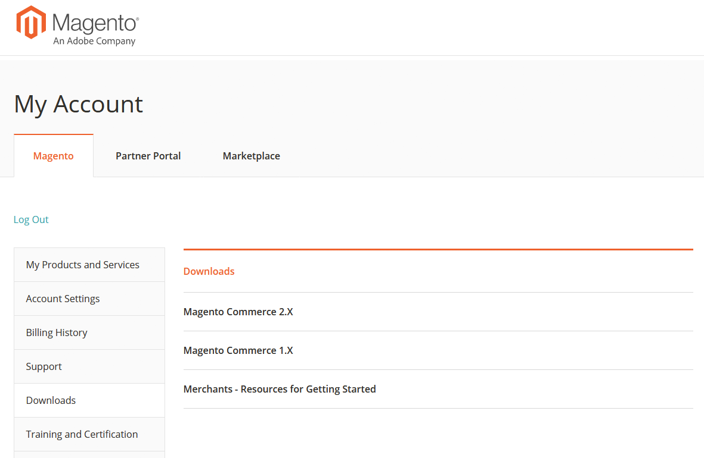

# Accès au guide du service clientèle d’Adobe Commerce

Le Guide du service clientèle d’Adobe Commerce explique les offres d’assistance clientèle et comment les utiliser. Cela inclut les bonnes pratiques relatives aux relations d’assistance, la collecte des informations nécessaires au diagnostic, la priorité du service clientèle, l’envoi d’une demande d’assistance et des liens vers des ressources. Ce guide est accessible à partir de la section des téléchargements de la page de votre compte de Magento. Pour accéder à :

1. Accédez à la page de connexion du compte [ du Magento.](https://account.magento.com/customer/account/login)
1. Connectez-vous avec votre nom d’utilisateur et votre mot de passe de Magento.
1. Dans la barre de navigation de gauche, cliquez sur **Téléchargements**.
1. Dans le volet de droite, cliquez sur **Merchants - Resources for Getting Started**.  
