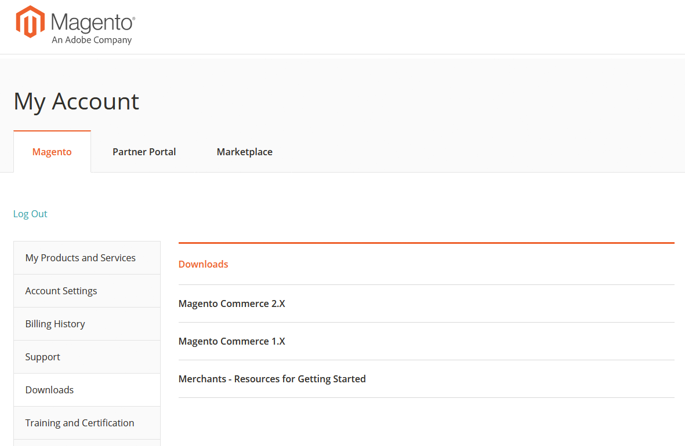

# Accéder au Guide du service clientèle d’Adobe Commerce

Le Guide du service clientèle d’Adobe Commerce explique les offres du service clientèle et comment les utiliser. Cela inclut les bonnes pratiques relatives à la relation d’assistance, la collecte des informations nécessaires au diagnostic, les priorités du service clientèle, l’envoi d’une demande d’assistance et les liens vers les ressources. Ce guide est accessible à partir de la section des téléchargements de la page de votre compte Magento. Pour accéder à :

1. Accédez à la page de connexion au compte Magento ](https://account.magento.com/customer/account/login).[
1. Connectez-vous avec votre nom d’utilisateur et votre mot de passe Magento.
1. Dans la barre de navigation de gauche, cliquez sur **Téléchargements**.
1. Dans le volet de droite, cliquez sur **Commerçants - Ressources pour la prise en main**.  
