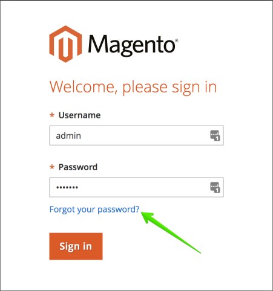

# Modification du mot de passe administrateur sur Adobe Commerce sur l’infrastructure cloud

## Méthode 1 : votre mot de passe oublié (réinitialisé par courrier électronique)

Lisez les étapes de la section [Réinitialiser votre mot de passe de la connexion administrateur](https://experienceleague.adobe.com/docs/commerce-admin/start/admin/admin-signin.html?lang=fr#admin-sign-in) de notre guide d’utilisation.

Vous trouverez ci-dessous les notes critiques sur l’utilisation de .

### Activer les emails sortants

Avant d&#39;utiliser le formulaire **Vous avez oublié votre mot de passe**, [activez les emails sortants](https://experienceleague.adobe.com/docs/commerce-cloud-service/user-guide/project/outgoing-emails.html?lang=fr) à l&#39;aide de la [console cloud](https://experienceleague.adobe.com/docs/commerce-cloud-service/user-guide/project/overview.html?lang=fr).

### Vérification du dossier de courrier électronique indésirable

Si vous ne trouvez pas le message avec un lien Réinitialiser le mot de passe , vérifiez votre dossier *Junk Email*. Le nom de l&#39;email est *Confirmation de réinitialisation de mot de passe pour le nom d&#39;utilisateur administrateur*.

## Méthode 2 : ajout d’un nouvel utilisateur administrateur

Si vous ne pouvez pas restaurer ou réinitialiser le mot de passe de l’utilisateur existant, vous pouvez créer un nouvel utilisateur administrateur et lui définir un mot de passe. Pour ce faire, procédez comme suit :

1. Utilisez [SSH pour vous connecter à l’environnement distant](https://experienceleague.adobe.com/docs/commerce-cloud-service/user-guide/develop/secure-connections.html?lang=fr).
1. Exécutez la commande suivante : `bin/magento admin:user:create   --admin-user=%user_name% --admin-password=%your_password% --admin-email=%your_email% --admin-firstname=%admin_user_first_name% --admin-lastname=%admin_user_last_name%`
