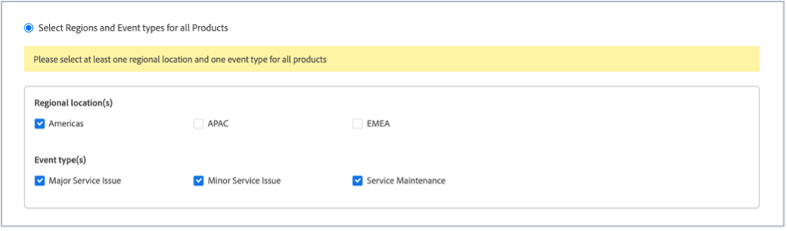
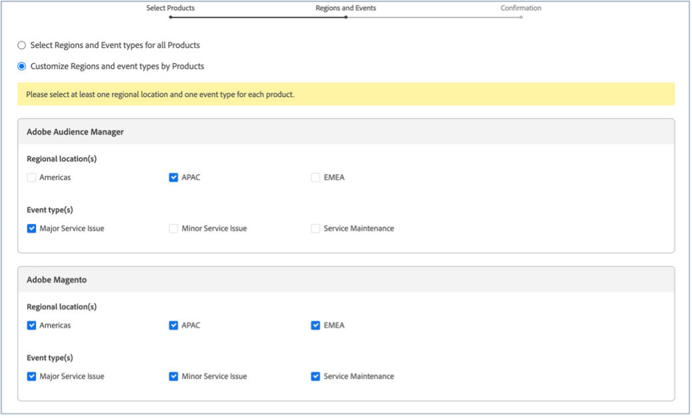

# Abonnement aux mises à jour d’état d’Adobe Commerce

## Comment s’abonner aux mises à jour d’état d’Adobe Magento

1. Accédez à [Statut de l’Adobe](https://status.adobe.com).
1. Cliquez sur **Se connecter**.
1. Connectez-vous à l’aide de vos informations d’identification d’Adobe.
1. Sélectionner **Compte d’entreprise ou d’école** si cette option est présentée.
1. Cliquez sur **Gestion des abonnements** en haut à droite, au-dessus des nuages répertoriés.

   
1. Cliquez sur **Créer des abonnements**.

   
1. Une fenêtre s’affiche, dans laquelle vous pouvez sélectionner des notifications pour les produits. Elle peut différer de la capture d’écran suivante, car certains abonnements peuvent être présélectionnés en fonction de votre profil ou parce que vous avez déjà configuré certains abonnements. Cliquez sur **Adobe Magento** sous Experience Cloud. Si vous souhaitez recevoir des notifications pour tous les services de Magento d’Adobe, cochez la case Adobe Magento. Cela permet de sélectionner automatiquement tous les services de Magento d’Adobe que vous pouvez voir lorsque la section Magento d’Adobe se développe (voir la capture d’écran).

   

   Vous pouvez également sélectionner un service de Magento d’Adobe en décochant les cases des autres services de Magento d’Adobe. Ainsi, par exemple, si vous souhaitez uniquement recevoir des notifications pour le module de gestion des commandes (MOM), décochez les autres services, de sorte que seules la case Adobe Magento et la case Gestion des commandes (MOM) soient cochées (voir la capture d’écran).

   
1. Une fenêtre s’affiche, dans laquelle vous pouvez sélectionner des notifications pour des produits pour des régions et des événements sélectionnés. Si vous souhaitez recevoir des notifications pour les mêmes régions et types d’événement pour tous les produits, cochez la case **Sélection de régions et de types d’événements pour tous les produits** (voir capture d’écran).

   

   Si vous vous êtes abonné à plusieurs produits (et pas seulement à Adobe Magento) et que vous souhaitez que chaque produit reçoive des notifications pour différentes régions et différents types d’événement, vous pouvez également cocher la case **Personnalisation des régions et des types d’événement par produits** (voir capture d’écran).

   
1. Cliquez sur **Continuer**.
1. La variable **Confirmation de vos préférences d’abonnement** s’affiche. Vérifiez que les notifications correspondent à vos besoins. Cliquez sur **Terminé**.

Cliquez ensuite sur **Terminé** vous devriez voir un résumé de vos abonnements aux produits et à vos abonnements aux événements. vous recevrez un e-mail intitulé &quot;Inscription aux notifications par e-mail d’état&quot; de la part de l’Adobe. Si vous souhaitez vous désabonner et/ou modifier vos paramètres de notification, répétez les étapes 1 à 9.
