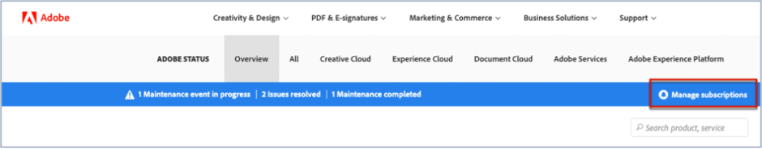
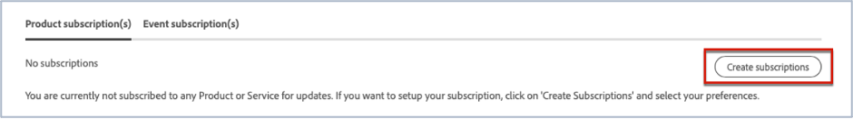
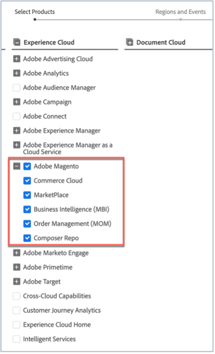
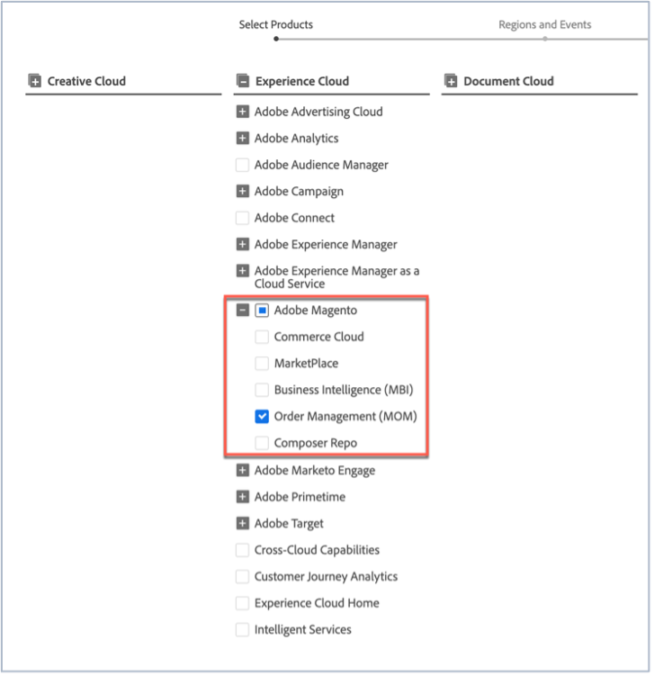
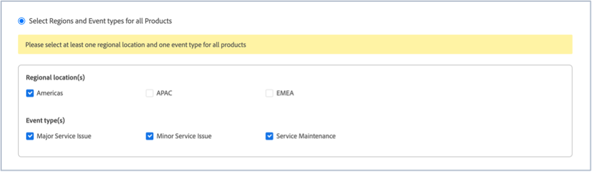
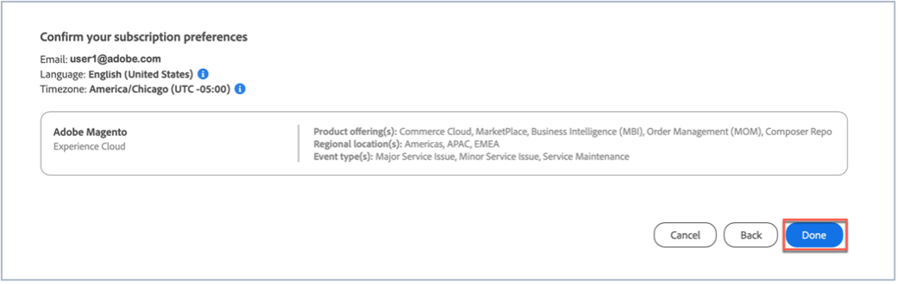

# S’abonner aux mises à jour de statut d’Adobe Commerce

## Comment s’abonner aux mises à jour de statut d’Adobe Magento

1. Accédez au statut [&#128279;](https://status.adobe.com/fr-fr).
1. Cliquez sur **Se connecter**.
1. Connectez-vous à l’aide de vos informations d’identification Adobe.
1. Sélectionnez **Compte d’entreprise ou d’école** si cette option est présentée.
1. Cliquez sur **Gérer les abonnements** en haut à droite, au-dessus des nuages répertoriés.

   
1. Cliquez sur **Créer des abonnements**.

   
1. Une fenêtre s’affiche, dans laquelle vous pouvez sélectionner des notifications pour les produits. Elle peut différer de la capture d’écran suivante, car certains abonnements peuvent être présélectionnés en fonction de votre profil ou parce que vous avez déjà configuré certains abonnements. Cliquez sur **Adobe Magento** sous Experience Cloud. Si vous souhaitez recevoir des notifications pour tous les services Adobe Magento, cochez la case Adobe Magento . Cela sélectionne automatiquement tous les services Adobe Magento que vous pouvez voir lorsque la section Adobe Magento se développe (voir la capture d’écran).

   

   Vous pouvez également sélectionner un service Adobe Magento en décochant les cases des autres services Adobe Magento. Ainsi, par exemple, si vous souhaitez uniquement recevoir des notifications pour Order Management (MOM), désélectionnez les autres services, de sorte que seules les cases Adobe Magento et Order Management (MOM) soient cochées (voir la capture d’écran).

   
1. Une fenêtre s’affiche, dans laquelle vous pouvez sélectionner des notifications pour des produits pour des régions et des événements sélectionnés. Si vous souhaitez recevoir des notifications pour les mêmes régions et types d’événement pour tous les produits, cochez la case **Sélectionner les régions et les types d’événement pour tous les produits** (voir la capture d’écran).

   

   Si vous vous êtes également abonné à plusieurs produits (et pas seulement à Adobe Magento) et souhaitez que chaque produit dispose de notifications pour différentes régions et différents types d’événements, cochez la case **Personnaliser les régions et les types d’événements par produits** (voir la capture d’écran).

   
1. Cliquez sur **Continuer**.
1. La fenêtre **Confirmer vos préférences d’abonnement** s’affiche. Vérifiez que les notifications reflètent ce que vous souhaitez. Cliquez sur **Terminé**.

Après avoir cliqué sur **Terminé** un résumé de vos abonnements aux produits et de vos abonnements aux événements s’affiche. Vous recevrez ensuite un e-mail intitulé « Abonnement aux notifications par e-mail de Status » d’Adobe. Si vous souhaitez vous désabonner et/ou modifier vos paramètres de notification, répétez les étapes 1 à 9.
