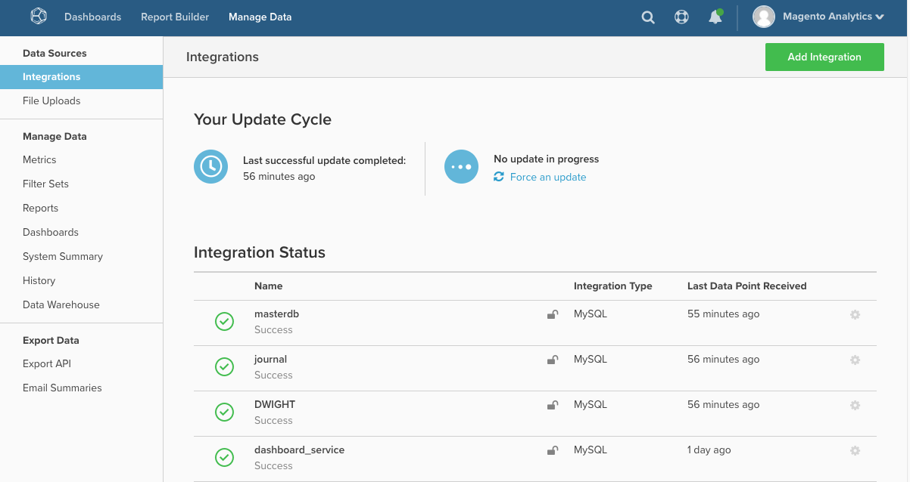

# MBI : ré-authentification des intégrations

Cet article fournit des solutions pour autoriser à nouveau une intégration afin d’accorder à Magento Business Intelligence (MBI) les privilèges requis pour extraire des données d’un service tiers. Une nouvelle autorisation est requise lorsque ces privilèges sont révoqués.

## Intégrations de bases de données et SaaS

Pour obtenir la liste des intégrations Database et SaaS, reportez-vous à la section [Connexion de données externes à l’aide d’une intégration](https://experienceleague.adobe.com/en/docs/commerce-business-intelligence/mbi/analyze/saas/integrations) dans la documentation destinée aux développeurs. (Lors de l’ouverture de la page, utilisez la table des matières à gauche pour la navigation).

## Vous rencontrez des problèmes de connexion ?

L&#39;autorisation d&#39;une intégration accorde à MBI les privilèges requis pour extraire des données d&#39;un service tiers. Une nouvelle autorisation est requise lorsque ces privilèges sont révoqués.

Cela peut être dû à plusieurs raisons :

* un problème lié au service tiers
* expiration du jeton d’authentification
* modification apportée à votre compte d’administration
* ou un problème interne à MBI

Le statut de toutes les intégrations se trouve sur la page Intégrations ( **Gérer les données > Intégrations** ) :

Pour vous réauthentifier, vous devrez peut-être saisir à nouveau les informations d’identification de votre compte. Dans certains cas, vous devrez peut-être générer de nouvelles clés API pour l’intégration du problème. Cliquez sur le nom de l’intégration du problème pour lancer le processus de réautorisation.

Si le problème persiste, veuillez [soumettre un ticket d’assistance](https://experienceleague.adobe.com/en/docs/support-resources/adobe-support-tools-guide/adobe-commerce-support/adobe-commerce-help-center-user-guide#submit-ticket).
