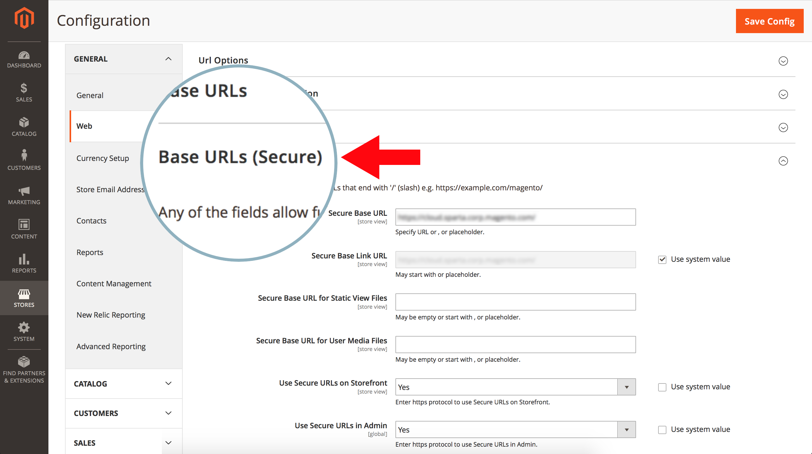
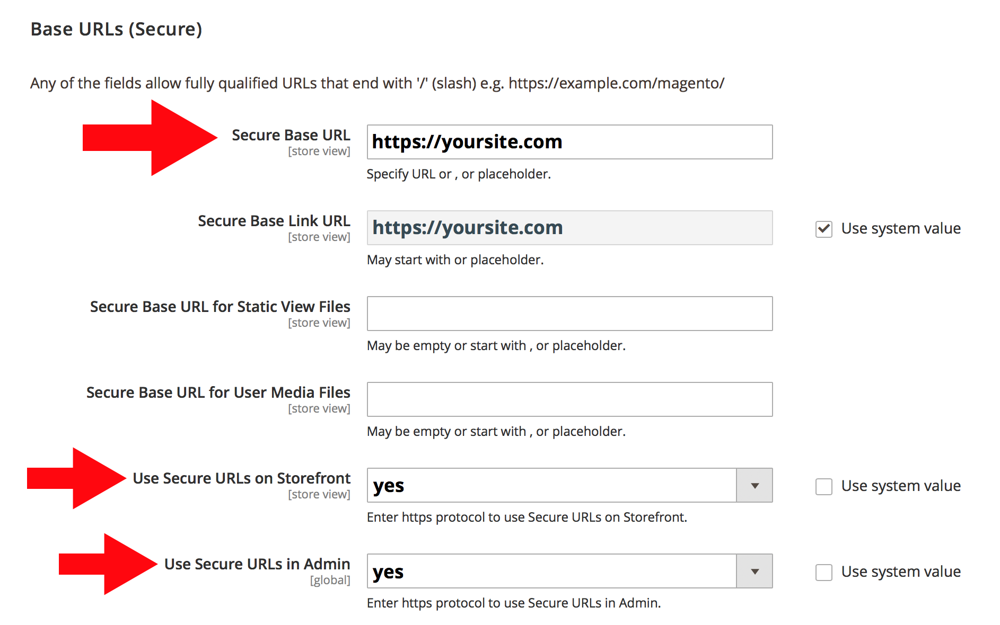
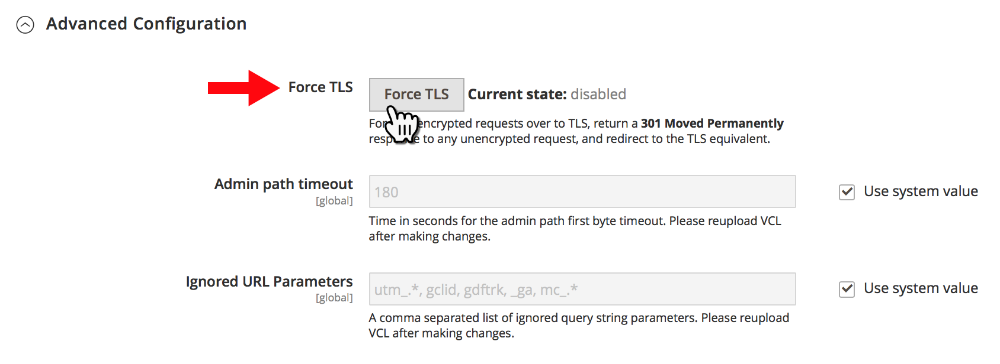
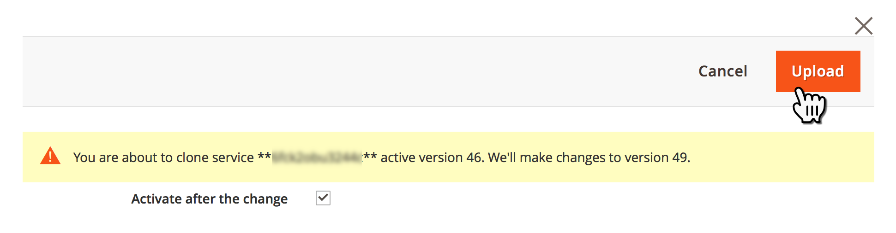
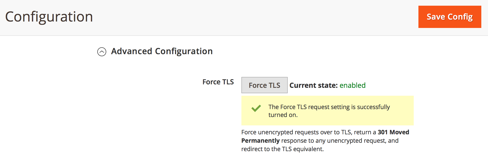

# Rediriger le HTTP vers HTTPS pour toutes les pages d’Adobe Commerce sur l’infrastructure cloud (Forcer TLS)

Activez la fonctionnalité **Forcer TLS** de Fastly dans l’administration Commerce pour activer la redirection HTTP vers HTTPS globale pour toutes les pages de votre Adobe Commerce sur le magasin d’infrastructure cloud.

Cet article fournit des [étapes](#steps) détaillées, un aperçu rapide de la fonctionnalité Forcer le protocole TLS, les versions affectées et des liens vers la documentation connexe.

## Étapes {#steps}

### Étape 1 : Configurer des URL sécurisées {#step-1-configure-secure-urls}

Au cours de cette étape, nous définissons les URL sécurisées du magasin. Si cela est déjà fait, passez à l’[Étape 2 : Activer Forcer TLS](#step-2-enable-force-tls).

1. Connectez-vous à l’administration Commerce.
1. Accédez à **Magasins** > **Configuration** > **Général** > **Web**.
1. Développez la section **URL de base (sécurisées)** .    
1. Dans le champ **URL de base sécurisée**, spécifiez l’URL HTTPS de votre magasin.
1. Définissez les paramètres **Utiliser des URL sécurisées sur Storefront** et **Utiliser des URL sécurisées sur Admin** sur **Oui**. 
1. Cliquez sur **Enregistrer la configuration** dans le coin supérieur droit pour appliquer les modifications.

**Documentation connexe dans notre guide d’utilisation :** [Stockage des URL](https://experienceleague.adobe.com/en/docs/commerce-admin/stores-sales/site-store/store-urls).

### Étape 2 : activer Forcer TLS {#step-2-enable-force-tls}

1. Dans Commerce Admin, accédez à **Magasins** > **Configuration** > **Avancé** > **Système**.
1. Développez la section **Cache de page complet**, puis **Configuration Fastly** et **Configuration avancée**.
1. Cliquez sur le bouton **Forcer TLS**.    
1. Dans la boîte de dialogue qui s’affiche, cliquez sur **Charger**. 
1. Une fois la boîte de dialogue fermée, assurez-vous que l’état actuel de Force TLS s’affiche comme **enabled**. 

**Documentation Fastly associée :** [Guide TLS forcé](https://github.com/fastly/fastly-magento2/blob/master/Documentation/Guides/FORCE-TLS.md) pour Adobe Commerce 2.

## À propos du TLS forcé

TLS (Transport Layer Security) est un protocole pour les connexions HTTP sécurisées qui remplace son prédécesseur moins sécurisé, le protocole SSL (Secure Socket Layer).

La fonctionnalité Forcer TLS de Fastly vous permet de forcer toutes les requêtes non chiffrées entrantes pour les pages de votre site à utiliser TLS.

&#x200B;>>
Il fonctionne en renvoyant une réponse *301 Moved Permanency* à toute requête non chiffrée, qui redirige vers l’équivalent TLS. Par exemple, effectuer une demande pour ** redirigerait vers *https://www.example.com/foo.jpeg*.

[Sécurisation des communications](https://docs.fastly.com/guides/securing-communications/) (documentation Fastly)

## Versions affectées

* **Adobe Commerce sur les infrastructures cloud :**
  * version : 2.1.4 et ultérieure
  * plans : Adobe Commerce sur l’infrastructure cloud Architecture du plan de démarrage et Adobe Commerce sur l’infrastructure cloud Architecture du plan Pro (y compris l’infrastructure Pro héritée)
* **Fastly :** 1.2.4

## Aucune modification nécessaire dans routes.yaml

Pour activer la redirection HTTP vers HTTPS sur **toutes** les pages de votre boutique, vous n’avez pas à ajouter les pages au fichier de configuration `routes.yaml` ; l’activation de Forcer le protocole TLS globalement pour l’ensemble de votre boutique (à l’aide de l’administrateur Commerce) suffit.

## Documentation Fastly connexe

* [Forcer le guide TLS pour Adobe Commerce 2](https://github.com/fastly/fastly-magento2/blob/master/Documentation/Guides/FORCE-TLS.md)
* [Forcer une redirection TLS](https://docs.fastly.com/guides/securing-communications/forcing-a-tls-redirect)
* [Sécurisation des communications](https://docs.fastly.com/guides/securing-communications/)
