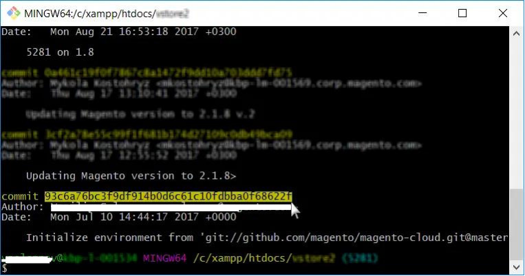

# Réinitialisation de l’environnement sur Adobe Commerce sur l’infrastructure cloud

Cet article présente différents scénarios de restauration d’un environnement sur Adobe Commerce sur une infrastructure cloud.
>[!NOTE]
>
>Ce guide s’applique à tous les environnements Cloud Starter et uniquement aux environnements d’intégration sur Cloud Pro.

Choisissez la solution la plus adaptée à votre cas :

* Si vous avez une activité planifiée (déploiement ou mise à niveau planifiés) - [Scénario 1 : activité planifiée)](#scen1).
* Si vous disposez d’un instantané valide - [Scénario 2 : restauration d’un instantané](#scen2).
* Si vous avez une version stable, mais aucun instantané valide - [Scénario 3 : aucun instantané, build stable (connexion SSH disponible)](#scen3).
* Si la version est rompue et que vous ne disposez pas d’un instantané valide - [Scénario 4 : aucun instantané ; version rompue (aucune connexion SSH)](#scen4).

## Scénario 1 : Activité prévue

Dans le cadre d&#39;un déploiement ou d&#39;une mise à niveau planifiés, la [!UICONTROL Rollback] la plus simple et recommandée serait que le commerçant, dans le cadre de vos préparatifs, effectue les opérations suivantes :

>[!NOTE]
>
>Testez toujours d’abord ces étapes dans votre environnement inférieur.

<u>Cinq jours avant les activités de mise à niveau/déploiement</u> :

1. Vérifie la taille de la base de données active.
1. Vérifiez que vous disposez de suffisamment d’espace disque sur `/data/exports` pour contenir une [!UICONTROL Database Dump]. Si vous ne disposez pas de suffisamment d’espace disque, supprimez les données indésirables ou créez un dossier de support et demandez que le disque soit développé.

<u>Le jour des modifications</u> :

1. Placez le site web dans [!UICONTROL Maintenance Mode].
Pour en savoir plus sur [ Activer ou désactiver le [!UICONTROL Maintenance Mode]](https://experienceleague.adobe.com/docs/commerce-operations/installation-guide/tutorials/maintenance-mode.html), consultez notre guide de l’utilisateur et [[!UICONTROL Maintenance Mode] les options de mise à niveau](https://experienceleague.adobe.com/docs/commerce-operations/upgrade-guide/troubleshooting/maintenance-mode-options.html) consultez notre guide de mise à niveau.
1. Désactivez les tâches cron. Pour en savoir plus sur la désactivation des tâches cron, consultez notre [guide des propriétés cron](<https://experienceleague.adobe.com/en/docs/commerce-cloud-service/user-guide/configure/app/properties/crons-property#disable-cron-jobs>).
1. Prenez un [[!UICONTROL Database Dump]](https://experienceleague.adobe.com/docs/commerce-knowledge-base/kb/how-to/create-database-dump-on-cloud.html) local.

<u>Si une [!UICONTROL Rollback] est requise</u> :

1. Si des applications telles que [!DNL MariaDB] ont été mises à niveau dans le cadre de cette activité planifiée, vous devez d&#39;abord réinstaller cette application sur une version précédente.
1. [!UICONTROL Rollback] la base de données à l&#39;aide du [!UICONTROL Database Dump] local et réimportez-la dans [!DNL MariaDB].
1. [!UICONTROL Rollback] le code par [!DNL Git] à une version de travail précédente.

L’utilisation de [!UICONTROL Snapshots] n’est pas recommandée pour les [!UICONTROL rollbacks/restores] de mise à niveau/d’activité planifiée, car la récupération des données prend beaucoup plus de temps qu’une [!UICONTROL Database Dump] locale, comme indiqué ci-dessus à l’étape 2 de la section **Si une [!UICONTROL Rollback] est requise**.

Les [!UICONTROL Snapshots] ne sont pas conservées sur le nœud/serveur, elles sont conservées sur un bloc de stockage distinct, et comme ces données doivent être transmises du bloc de stockage sur le réseau à un nouveau disque, cela prend du temps dans le processus. Ce nouveau disque est ensuite monté sur le nœud prêt à être récupéré/importé sur le disque d’origine connecté au nœud/serveur.

Si vous le comparez à l’importation d’un [!UICONTROL Database Dump] local, les données peuvent déjà être récupérées sur le nœud/serveur, ce qui permet de gagner beaucoup de temps, car seul un [!UICONTROL Database Import] est nécessaire.

## Scénario 2 : restauration d’un instantané

Lire : [Restaurez un instantané sur Adobe Commerce sur l’infrastructure cloud](https://experienceleague.adobe.com/en/docs/commerce-cloud-service/user-guide/develop/storage/snapshots#restore-snapshot) dans notre documentation destinée aux développeurs.

>[!NOTE]
>
>La création d’un instantané doit être la toute première étape après l’accès au compte d’infrastructure cloud d’Adobe Commerce et avant l’application de modifications majeures. Il s’agit d’une bonne pratique fortement recommandée.

Lire : [Créer un instantané](https://experienceleague.adobe.com/en/docs/commerce-cloud-service/user-guide/develop/storage/snapshots#create-snapshot) dans notre documentation destinée aux développeurs.

## Scénario 3 : aucun instantané, build stable (connexion SSH disponible)

Cette section explique comment réinitialiser un environnement lorsque vous n’avez pas créé d’instantané, mais que vous pouvez accéder à l’environnement via SSH.

Les étapes sont les suivantes :

1. Désactivez la gestion de la configuration.
1. Désinstallez le logiciel Adobe Commerce.
1. Réinitialisez la branche [!DNL git].

Après avoir effectué les étapes suivantes :

* Votre installation d’Adobe Commerce revient à son état Vanilla (base de données restaurée ; configuration de déploiement supprimée ; répertoires sous `var` effacés).
* Votre branche [!DNL git] est réinitialisée à l’état souhaité dans le passé.

Lisez les étapes détaillées ci-dessous.

### Étape 0 (Prérequis) : Supprimer config.php pour désactiver Configuration Management

Nous devons désactiver la gestion de la configuration afin qu’elle n’applique pas automatiquement les paramètres de configuration précédents lors du déploiement.

Pour désactiver la gestion de la configuration, assurez-vous que votre répertoire `/app/etc/` ne contient pas le fichier `config.php`.

Pour supprimer le fichier de configuration, procédez comme suit :

1. [SSH à votre environnement](https://experienceleague.adobe.com/docs/commerce-cloud-service/user-guide/develop/secure-connections.html).
1. Supprimez le fichier de configuration : `rm app/etc/config.php`

Pour en savoir plus sur [la gestion des configurations pour les paramètres de la boutique](https://experienceleague.adobe.com/docs/commerce-cloud-service/user-guide/configure-store/store-settings.html), consultez notre documentation destinée aux développeurs.

### Étape 1 : désinstaller le logiciel Adobe Commerce avec la commande setup:uninstall


La désinstallation du logiciel Adobe Commerce interrompt et restaure la base de données, supprime la configuration de déploiement et efface les répertoires situés sous `var`.

Lire : [Désinstaller le logiciel Adobe Commerce](https://experienceleague.adobe.com/docs/commerce-operations/installation-guide/tutorials/uninstall.html) dans notre documentation destinée aux développeurs.

Pour désinstaller le logiciel Adobe Commerce, procédez comme suit :

1. [SSH à votre environnement](https://experienceleague.adobe.com/docs/commerce-cloud-service/user-guide/develop/secure-connections.html).
1. Exécuter `setup:uninstall` : `bin/magento setup:uninstall`
1. Confirmez la désinstallation.

Le message suivant s’affiche pour confirmer la réussite de la désinstallation :

```php
[SUCCESS]: Magento uninstallation complete.
```

Cela signifie que nous avons rétabli notre installation d’Adobe Commerce (y compris DB) à son état authentique (Vanilla).

### Étape 2 : réinitialiser la branche [!DNL git]

Avec [!DNL git] réinitialisé, nous rétablissons l’état souhaité du code dans le passé.

1. Clonez l’environnement vers votre environnement de développement local. Vous pouvez copier la commande dans la console Cloud :    
1. Accéder à l’historique des validations. Utilisez `--reverse` pour afficher l’historique dans l’ordre inverse pour plus de commodité : `git log --reverse`
1. Sélectionnez le hachage de validation pour lequel vous êtes satisfait. Pour réinitialiser le code à son état d’authenticité (Vanilla), recherchez la toute première validation qui a créé votre branche (environnement).
   
1. Appliquer la réinitialisation du [!DNL git] dur : `git reset --h <commit_hash>`
1. Envoi des modifications au serveur : `git push --force <origin> <branch>`

Après avoir effectué ces étapes, notre branche [!DNL git] est réinitialisée et l’ensemble du journal des modifications [!DNL git] est clair. La dernière notification push [!DNL git] déclenche le redéploiement pour appliquer toutes les modifications et réinstaller Adobe Commerce.

## Scénario 4 : aucun instantané ; version rompue (aucune connexion [!DNL SSH])

Cette section explique comment réinitialiser un environnement lorsqu’il est dans un état critique : la procédure de déploiement ne peut pas réussir à créer une application en cours d’exécution, ce qui rend la connexion [!DNL SSH] indisponible.

Dans ce scénario, vous devez d’abord restaurer l’état de fonctionnement de votre application Adobe Commerce à l’aide de [!DNL git] réinitialisation, puis désinstaller le logiciel Adobe Commerce (pour supprimer et restaurer la base de données, supprimer la configuration de déploiement, etc.). Le scénario implique les mêmes étapes que dans le scénario 3, mais l’ordre des étapes est différent et il existe une étape supplémentaire : forcer le redéploiement. Les étapes sont les suivantes :

1. [Réinitialisez la branche  [!DNL git] .](/help/how-to/general/reset-environment-on-cloud.md#reset-git-branch)
1. [Désactivez la gestion de la configuration.](/help/how-to/general/reset-environment-on-cloud.md#disable_config_management)
1. [Désinstallez le logiciel Adobe Commerce.](/help/how-to/general/reset-environment-on-cloud.md#setup-uninstall)
1. Forcer le redéploiement.

Après avoir effectué ces étapes, vous obtiendrez les mêmes résultats que dans le scénario 3.

### Étape 4 : forcer le redéploiement

Effectuez une validation (il peut s’agir d’une validation vide, bien que nous ne la recommandions pas) et envoyez-la au serveur pour déclencher le redéploiement :

```git
git commit --allow-empty -m "<message>" && git push <origin> <branch>
```

## Si la configuration échoue:uninstall réinitialisez manuellement la base de données

Si l&#39;exécution de la commande `setup:uninstall` échoue avec une erreur et ne peut pas être exécutée, nous pouvons effacer manuellement la base de données en procédant comme suit :

1. [SSH à votre environnement](https://experienceleague.adobe.com/docs/commerce-cloud-service/user-guide/develop/secure-connections.html).
1. Connectez-vous à la base de données MySQL : `mysql -h database.internal` (pour les environnements Pro, voir : [Configurer le service MySQL](https://experienceleague.adobe.com/docs/commerce-cloud-service/user-guide/configure/service/mysql.html)).
1. Déposez la base de données `main` : `drop database main;`
1. Créez une base de données `main` vide : `create database main;`
1. Supprimez les fichiers de configuration suivants : `config.php`, `config.php.bak`, `env.php`, `env.php.bak`

Après la réinitialisation de la base de données, effectuez une [push [!DNL git] vers l’environnement pour déclencher le redéploiement](https://experienceleague.adobe.com/docs/commerce-operations/configuration-guide/deployment/examples/example-using-cli.html) et installez Adobe Commerce sur une base de données nouvellement créée. Ou [exécutez la commande redeploy](https://experienceleague.adobe.com/docs/commerce-cloud-service/user-guide/dev-tools/cloud-cli.html#environment-commands).
