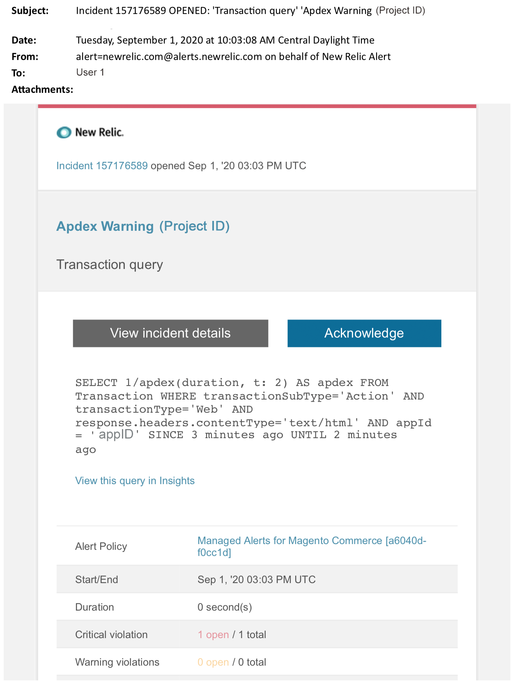

# Alertes gérées pour Adobe Commerce : alerte d’avertissement Apdex

Cet article décrit les étapes de dépannage à suivre lorsque vous recevez une alerte d’avertissement Apdex pour Adobe Commerce dans New Relic. Le score Apdex mesure la satisfaction des utilisateurs quant au temps de réponse des applications et services web. Une action immédiate est nécessaire pour résoudre le problème. L’alerte se présente comme suit, selon le canal de notification d’alerte sélectionné.

{width="500"}

## Produits et versions concernés

* Architecture de plan d’Adobe Commerce sur l’infrastructure cloud Pro
* Architecture du plan de démarrage d’Adobe Commerce sur l’infrastructure cloud

## Problème

Vous recevrez une alerte gérée dans New Relic si vous vous êtes inscrit à [Alertes gérées pour Adobe Commerce](/help/support-tools/managed-alerts-for-adobe-commerce/managed-alerts-for-magento-commerce.md) et un ou plusieurs seuils d’alerte ont été dépassés. Ces alertes ont été développées par Adobe pour fournir aux commerçants un ensemble standard d’informations provenant du support et de l’ingénierie.

<u> **Faites-le !** </u>

* Abandonnez tout déploiement planifié jusqu’à ce que cette alerte soit effacée.
* Mettez votre site en mode de maintenance immédiatement si votre site est ou ne répond plus complètement. Pour connaître les étapes, voir  [Guide d’installation > Activer ou désactiver le mode de maintenance](https://devdocs.magento.com/guides/v2.4/install-gde/install/cli/install-cli-subcommands-maint.html?itm_source=devdocs&amp;itm_medium=search_page&amp;itm_campaign=federated_search&amp;itm_term=mainten) dans notre documentation destinée aux développeurs. Veillez à ajouter votre adresse IP à la liste des adresses IP exemptées afin de vous assurer que vous pouvez toujours accéder à votre site pour la résolution des problèmes. Pour connaître les étapes, voir [Maintenir la liste des adresses IP exemptées](https://devdocs.magento.com/guides/v2.4/install-gde/install/cli/install-cli-subcommands-maint.html?itm_source=devdocs&amp;itm_medium=search_page&amp;itm_campaign=federated_search&amp;itm_term=mainten#instgde-cli-maint-exempt) dans notre documentation destinée aux développeurs.

<u>**Ne le faites pas !**</u>

* Lancez d’autres campagnes marketing qui peuvent apporter des pages vues supplémentaires à votre site.
* Exécutez des indexeurs ou des crons supplémentaires qui peuvent entraîner une contrainte supplémentaire sur le processeur ou le disque.
* Effectuez toutes les tâches administratives importantes (c’est-à-dire l’administration de Commerce, les importations/exportations de données).
* Effacez le cache.

## Solution

Suivez ces étapes pour identifier et dépanner la cause.

1. Pour identifier la source du problème, utilisez [Page Transaction de New Relic APM](https://docs.newrelic.com/docs/apm/applications-menu/monitoring/transactions-page-find-specific-performance-problems) pour identifier les transactions présentant des problèmes de performances :
   * Triez les transactions par scores Apdex croissants. [Apdex](https://docs.newrelic.com/docs/apm/new-relic-apm/apdex/apdex-measure-user-satisfaction) fait référence à la satisfaction des utilisateurs par rapport au temps de réponse de vos applications et services web. A [note basse d’Apdex](/help/support-tools/managed-alerts-for-adobe-commerce/managed-alerts-for-magento-commerce-apdex-warning-alert.md) peut indiquer un goulot d’étranglement (une transaction avec un temps de réponse plus élevé). Il s’agit généralement de la base de données, de Redis ou de PHP. Pour connaître les étapes, voir New Relic [Afficher les transactions présentant le plus grand insatisfaction Apdex](https://docs.newrelic.com/docs/apm/new-relic-apm/apdex/view-your-apdex-score#apdex-dissat).
   * Triez les transactions selon le débit le plus élevé, le temps de réponse moyen le plus lent, le plus long et d’autres seuils. Pour connaître les étapes, voir New Relic [Trouver des problèmes de performances spécifiques](https://docs.newrelic.com/docs/apm/applications-menu/monitoring/transactions-page-find-specific-performance-problems).
1. Utilisation [Page d’infrastructure du New Relic APM](https://docs.newrelic.com/docs/infrastructure/infrastructure-ui-pages/infra-hosts-ui-page/) pour identifier les processus gourmands en ressources. Pour connaître les étapes, voir New Relic [Page Hôtes de surveillance de l’infrastructure > Onglet Processus](https://docs.newrelic.com/docs/infrastructure/infrastructure-ui-pages/infra-hosts-ui-page/#processes).
1. Si des services tels que Redis ou MySQL sont la principale source de consommation de mémoire, essayez les méthodes suivantes :
   * Vérifiez que vous utilisez la dernière version. Les versions plus récentes peuvent parfois corriger les fuites de mémoire. Si vous n’utilisez pas la dernière version, envisagez de mettre à niveau. Pour connaître les étapes, voir [Cloud pour Adobe Commerce > Services > Modifier les services](https://experienceleague.adobe.com/docs/commerce-cloud-service/user-guide/configure/service/services-yaml.html) dans notre documentation destinée aux développeurs.
1. Si le problème n’est pas causé par les versions de service :
   * Recherchez d’autres problèmes MySQL tels que les requêtes longues, les clés de Principal non définies et les index en double. Pour connaître les étapes, voir [Problèmes de base de données les plus courants dans Adobe Commerce sur l’infrastructure cloud](https://experienceleague.adobe.com/docs/commerce-operations/implementation-playbook/best-practices/maintenance/resolve-database-performance-issues.html) dans notre base de connaissances de soutien.
   * Recherchez d’autres problèmes PHP. Vérifier les processus en cours d’exécution `ps aufx` dans l’interface de ligne de commande/le terminal. Dans la sortie du terminal, vous verrez les traitements et processus cron en cours d’exécution. Vérifiez la sortie pour le temps d&#39;exécution des processus. S’il existe un cron avec un long délai d’exécution, le cron peut être suspendu. Pour connaître les étapes de dépannage, voir [Lenteur des performances, lenteur et longueur des fils](/help/troubleshooting/miscellaneous/slow-performance-slow-and-long-running-crons.md) et [Tâche Cron bloquée en état &quot;en cours d’exécution&quot;](/help/troubleshooting/miscellaneous/cron-job-is-stuck-in-running-status.md) dans notre base de connaissances de soutien.
1. Une fois qu’une source potentielle du problème est identifiée, SSH s’engage dans l’environnement pour étudier plus en détail. Pour connaître les étapes, voir [Cloud pour Adobe Commerce > Technologies et exigences > SSH dans votre environnement](https://devdocs.magento.com/cloud/env/environments-ssh.html#ssh) dans notre documentation destinée aux développeurs.
1. Si vous avez toujours du mal à identifier la source, passez en revue les tendances récentes afin d’identifier les problèmes liés aux déploiements de code récents ou aux modifications de configuration (par exemple, de nouveaux groupes de clients et des modifications importantes du catalogue). Il est recommandé de passer en revue les sept derniers jours d’activité pour toute corrélation dans les déploiements ou modifications de code.
1. Si vous ne parvenez pas à trouver une solution dans un délai raisonnable, demandez une mise à niveau ou mettez un site en mode de maintenance si vous ne l’avez pas déjà fait. Pour connaître les étapes, voir [Comment demander le redimensionnement temporaire](/help/how-to/general/how-to-request-temporary-magento-upsize.md) dans notre base de connaissances de soutien; [Guide d’installation > Activer ou désactiver le mode de maintenance](https://devdocs.magento.com/guides/v2.4/install-gde/install/cli/install-cli-subcommands-maint.html?itm_source=devdocs&amp;itm_medium=search_page&amp;itm_campaign=federated_search&amp;itm_term=mainten) dans notre documentation destinée aux développeurs.
1. Si la variable [upsize](/help/how-to/general/how-to-request-temporary-magento-upsize.md) renvoie le site à des opérations normales, pensez à demander une mise à niveau permanente (contactez votre équipe de compte d’Adobe) ou essayez de reproduire le problème dans votre évaluation dédiée en exécutant un test de charge et en optimisant les requêtes, ou du code qui réduit la pression sur les services. Voir [Cloud pour Adobe Commerce > Déploiement de test > Tests de charge et de stress](https://devdocs.magento.com/cloud/live/stage-prod-test.html#loadtest) dans notre documentation destinée aux développeurs.
