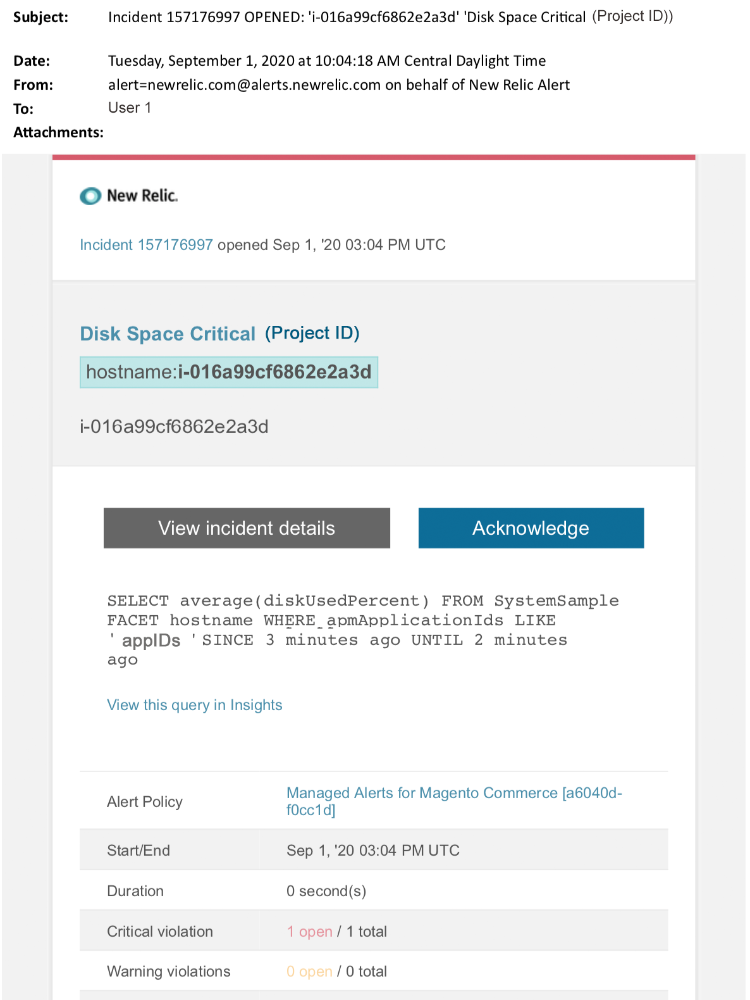

# Alertes gérées pour Adobe Commerce : alerte critique sur le disque

Cet article décrit les étapes de dépannage lorsque vous recevez une alerte de disque critique pour Adobe Commerce dans New Relic. Une action immédiate est nécessaire pour résoudre le problème. L’alerte se présente comme suit, selon le canal de notification d’alerte sélectionné.

{width="500"}

## Produits et versions concernés

Infrastructure cloud Adobe Commerce sur l’architecture Pro

## Problème

Vous recevrez une alerte dans New Relic si vous avez signé jusqu’à [Alertes gérées pour Adobe Commerce](/help/support-tools/managed-alerts-for-adobe-commerce/managed-alerts-for-magento-commerce.md) et qu’un ou plusieurs seuils d’alerte ont été dépassés. Ces alertes ont été développées par Adobe pour fournir aux clients un ensemble standard utilisant les informations du service d’assistance et d’ingénierie.

<u> **Do!** </u>

* Abandonnez tout déploiement planifié jusqu’à ce que cette alerte soit effacée.
* Mettez votre site en mode de maintenance immédiatement si votre site est ou ne répond plus complètement. Pour les étapes, reportez-vous au [Guide d’installation > Activer ou désactiver le mode de maintenance](https://devdocs.magento.com/guides/v2.4/install-gde/install/cli/install-cli-subcommands-maint.html?itm_source=devdocs&amp;itm_medium=search_page&amp;itm_campaign=federated_search&amp;itm_term=mainten) . Veillez à ajouter votre adresse IP à la liste des adresses IP exemptées afin de vous assurer que vous pouvez toujours accéder à votre site pour la résolution des problèmes. Pour les étapes, voir [Conserver la liste des adresses IP exemptées](https://devdocs.magento.com/guides/v2.4/install-gde/install/cli/install-cli-subcommands-maint.html?itm_source=devdocs&amp;itm_medium=search_page&amp;itm_campaign=federated_search&amp;itm_term=mainten#instgde-cli-maint-exempt).

**Ne pas faire !**

* Lancez d’autres campagnes marketing qui peuvent apporter des pages vues supplémentaires à votre site.
* Exécutez des indexeurs ou des crons supplémentaires qui peuvent entraîner une contrainte supplémentaire sur le processeur ou le disque.
* Effectuez les tâches administratives principales (c’est-à-dire l’administration de Commerce, l’importation/exportation de données).
* Effacez le cache.

Votre site peut ne plus être réactif (si vous n’êtes pas déjà en panne) si vous effectuez l’une des actions &quot;Ne pas&quot; avant d’avoir enquêté et résolu la cause de l’alerte.

## Solution

Suivez ces étapes pour identifier et dépanner la cause.

>[!WARNING]
>
>Puisqu’il s’agit d’une alerte critique, il est vivement recommandé de terminer l’**étape 1** avant de tenter de résoudre le problème (à partir de l’étape 2).

1. Vérifiez si un ticket d’assistance Adobe Commerce existe. Pour connaître les étapes, reportez-vous à la section [Suivi de vos tickets d&#39;assistance](/help/help-center-guide/help-center/magento-help-center-user-guide.md#track-tickets) dans notre base de connaissances d&#39;assistance. L’assistance a peut-être reçu une alerte de seuil New Relic, créé un ticket et commencé à travailler sur le problème. S’il n’existe aucun ticket, créez-en un. Le ticket doit comporter les informations suivantes :
   * Raison de contact : sélectionnez &quot;New Relic CRITICAL alert received&quot;.
   * Description de l’alerte.
   * [Lien d’incident New Relic](https://docs.newrelic.com/docs/alerts-applied-intelligence/new-relic-alerts/alert-incidents/view-violation-event-details-incidents). Elle est incluse dans vos [alertes gérées pour Adobe Commerce](/help/support-tools/managed-alerts-for-adobe-commerce/managed-alerts-for-magento-commerce.md).
1. Dans New Relic, consultez les disques pour une utilisation optimale. Pour les étapes, reportez-vous à l’onglet Stockage de la page Hôtes de surveillance de l’infrastructure de New Relic :](https://docs.newrelic.com/docs/infrastructure/infrastructure-ui-pages/infra-hosts-ui-page/#storage)[
   * Si, dans New Relic, vous constatez une augmentation lente de l’utilisation du disque, essayez les options suivantes :
   * Optimisation de l’espace disque en ajustant l’allocation de l’espace. Pour les étapes, reportez-vous à la section [Gestion de l’espace disque](https://experienceleague.adobe.com/docs/commerce-cloud-service/user-guide/develop/storage/manage-disk-space.html) dans notre documentation destinée aux développeurs. Vous devrez peut-être également demander plus d’espace disque (contactez votre équipe de compte d’Adobe).
   * Effacez l’espace disque pour MySQL. Pour connaître les étapes, reportez-vous à la section [L’espace disque MySQL est faible](/help/troubleshooting/database/mysql-disk-space-is-low-on-magento-commerce-cloud.md) dans notre base de connaissances de support.
   * Si New Relic affiche une utilisation de disque en augmentation rapide, cela peut indiquer qu’un problème a provoqué une augmentation très rapide d’un fichier dans un répertoire. Effectuez les vérifications suivantes :
1. Vérifiez l&#39;espace disque global pour identifier le problème en exécutant la commande suivante dans l&#39;interface de ligne de commande/le terminal : `df -h`
1. Après avoir identifié un répertoire avec une utilisation de disque inattendue importante et croissante, vous devez vérifier le système de fichiers concerné. L’exemple suivant montre comment vérifier le répertoire de fichiers `pub/media/`. Il s’agit du répertoire utilisé par Commerce pour le stockage des journaux et des fichiers multimédias volumineux. Cependant, vous devez exécuter cette commande pour tout répertoire présentant une utilisation inattendue du disque : `du -sch ~/pub/media/*`

Si la sortie du terminal affiche un fichier dans l’un de ces répertoires, ce qui augmente rapidement l’utilisation du disque et si vous savez que le contenu du fichier n’est pas nécessaire, envisagez de le supprimer. Si vous n’êtes pas à l’aise avec cette action, [soumettez un ticket d’assistance Adobe Commerce](/help/help-center-guide/help-center/magento-help-center-user-guide.md#submit-ticket).
