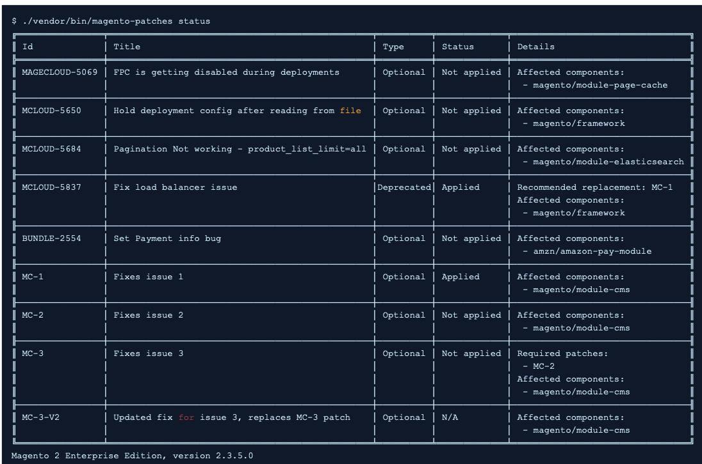

# Correctifs disponibles dans l’outil QPT - Aperçu

Cet article présente un aperçu des [!DNL Quality Patches Tool] (QPT) et liens vers des ressources expliquant comment l’utiliser.

## Produits et versions concernés

* Adobe Commerce sur site, toutes [versions prises en charge](https://www.adobe.com/content/dam/cc/en/legal/terms/enterprise/pdfs/Adobe-Commerce-Software-Lifecycle-Policy.pdf)
* Adobe Commerce sur l’infrastructure cloud, tous [versions prises en charge](https://www.adobe.com/content/dam/cc/en/legal/terms/enterprise/pdfs/Adobe-Commerce-Software-Lifecycle-Policy.pdf)

## Qu’est-ce que l’outil Correctifs de qualité ?

La variable [[!DNL Quality Patches Tool]](https://github.com/magento/quality-patches) (QPT) est un outil permettant d’appliquer des correctifs de qualité individuels développés par Adobe et la communauté Magento Open Source.

Il vous permet d’effectuer les opérations suivantes :

* appliquer des correctifs de qualité inclus dans le package ;
* rétablir les correctifs précédemment appliqués
* consultez les informations générales sur les correctifs de qualité disponibles pour la version installée d’Adobe Commerce.

Voici un exemple du tableau d’état pour afficher les correctifs disponibles :

L’outil a pour but de vous permettre d’utiliser en libre-service des correctifs pour les problèmes que vous pouvez rencontrer avec Adobe Commerce ou d’appliquer facilement des correctifs suggérés par le support d’Adobe Commerce.

>[!NOTE]
>
>QPT est réservé aux correctifs de qualité. Les correctifs de sécurité sont disponibles dans la [Notes de mise à jour pour Adobe Commerce et Magento Open Source](https://experienceleague.adobe.com/docs/commerce-operations/release/notes/overview.html).

## Correctifs disponibles dans la [!DNL Quality Patches Tool]

Dans cette section de la base de connaissances de support Adobe Commerce, vous trouverez des descriptions détaillées des problèmes résolus par des correctifs QPT, regroupés par version de publication QPT.
Vous pouvez également afficher une liste des correctifs QPT disponibles et filtrer les correctifs par composant, à l’aide du tableau généré dynamiquement sur le [[!DNL Quality Patches Tool]: recherchez la page des correctifs.](https://experienceleague.adobe.com/tools/commerce-quality-patches/index.html) dans notre base de connaissances de soutien.

## Comment installer et utiliser le [!DNL Quality Patches Tool]

Les commandes d’installation et d’utilisation sont différentes pour Adobe Commerce sur site et Adobe Commerce sur l’infrastructure cloud, car pour le cloud, le package QPT est inclus dans le package ece-tools.

### Comment installer et utiliser QPT pour Adobe Commerce sur site

Reportez-vous à [Commerce > Outils > Utilisation](https://experienceleague.adobe.com/docs/commerce-operations/tools/quality-patches-tool/usage.html) dans notre documentation destinée aux développeurs pour plus d’informations sur l’installation et l’utilisation de QPT pour appliquer et rétablir des correctifs.

### Comment installer et utiliser QPT pour Adobe Commerce sur l’infrastructure cloud

Reportez-vous à [Guide Commerce on Cloud Infrastructure > Appliquer les correctifs](https://experienceleague.adobe.com/docs/commerce-cloud-service/user-guide/develop/upgrade/apply-patches.html) dans notre documentation destinée aux développeurs pour plus d’informations sur l’installation et l’utilisation de QPT pour l’application et la restauration de correctifs sur Adobe Commerce sur l’infrastructure cloud.

## Lecture connexe

* [[!DNL Quality Patches Tool] notes de mise à jour](https://experienceleague.adobe.com/docs/commerce-operations/tools/quality-patches-tool/release-notes.html) dans notre documentation destinée aux développeurs.
