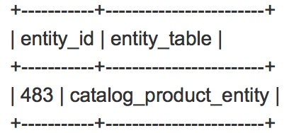

# Dupliquer les entrées dans la table du catalogue après avoir modifié la date de fin d’une mise à jour de planning

Cet article fournit un correctif pour le problème connu d’Adobe Commerce 2.2.3 où la modification de la date ou de l’heure de fin d’une planification de règle de prix de catalogue entraîne l’ajout d’entrées en double à la variable `catalogrule` et les erreurs dans la variable `catalogrule_rule` Réindexation de l’indexeur (produit de règle de catalogue).

## Problème

Lorsque vous modifiez la date ou l’heure de fin d’une mise à jour de calendrier de règles de prix de catalogue existante, des entrées en double sont créées dans la variable `catalogrule` table de base de données. Par conséquent, la variable `catalogrule_rule` la réindexation échoue avec l’erreur suivante dans le journal des exceptions : *L’élément avec le même ID existe déjà*.

<u>Étapes à reproduire</u>:

Conditions préalables : la `catalogrule_rule` l’indexeur est défini sur *[Mise à jour de la planification](https://experienceleague.adobe.com/docs/commerce-operations/implementation-playbook/best-practices/maintenance/indexer-configuration.html)* mode .

1. Dans l’administrateur Commerce, créez une règle de prix de catalogue sous **Marketing** > **Promotions** > **Règle de prix du catalogue**.
1. Dans le **Règle de prix du catalogue** grille, cliquez sur **Modifier**, et planifiez une nouvelle mise à jour et un nouveau jeu **État** to *Actif.*
1. Cliquez sur **Afficher/Modifier** en regard de la mise à jour nouvellement créée et remplacez la date de fin par une date antérieure.
1. Enregistrez la mise à jour.
1. Exécutez la commande reindex pour la fonction `catalogrule_rule` indexeur.

<u>Résultat attendu</u>:

La variable `catalogrule_rule` indexeur est réindexé avec succès. Aucune entrée en double dans la variable `catalogrule` table.

<u>Résultat réel</u>:

La réindexation échoue avec l’erreur suivante : *L’élément avec le même ID existe déjà*, car il existe des entrées en double dans la variable `catalogrule` table.

## Solution

Pour résoudre le problème, vous devez appliquer le correctif joint et supprimer les entrées dupliquées existantes. Voir [Suppression des entrées en double](#remove) pour plus d’informations sur la vérification de l’existence des doublons et leur suppression.

## Correctif

Le correctif est joint à cet article. Pour le télécharger, faites défiler l’écran jusqu’à la fin de l’article et cliquez sur le nom du fichier, ou cliquez sur le lien suivant :

[Téléchargez MDVA-10974\_EE\_2.2.3\_COMPOSER\_v2.patch.](assets/MDVA-10974_EE_2.2.3_COMPOSER_v2.patch.zip)

### Versions Adobe Commerce compatibles :

Le correctif a été créé pour :

* Adobe Commerce 2.2.3

Le correctif est également compatible (mais peut ne pas résoudre le problème) avec les versions et éditions Adobe Commerce suivantes :

* Adobe Commerce sur l’infrastructure cloud 2.2.1 - 2.2.5
* Adobe Commerce on-premise 2.2.1 - 2.2.2 et 2.2.4 - 2.2.5

## Comment appliquer le correctif

Voir [Comment appliquer un correctif de compositeur fourni par Adobe](/help/how-to/general/how-to-apply-a-composer-patch-provided-by-magento.md) pour obtenir des instructions dans notre base de connaissances du soutien.

## Suppression des entrées en double {#remove}

>[!NOTE]
>
>Veillez à avoir une sauvegarde récente avant toute manipulation.

Pour localiser les entrées dupliquées et les supprimer, procédez comme suit :

1. Exécutez la requête suivante pour vérifier si les entrées dupliquées existent dans la base de données :

   ```SQL
   SELECT entity_id, "catalog_product_entity" AS entity_table FROM catalog_product_entity GROUP BY entity_id, created_in HAVING COUNT(*) > 1    UNION    SELECT entity_id, "catalog_product_entity" AS entity_table FROM catalog_product_entity group by entity_id, updated_in having count(*) > 1    UNION    SELECT rule_id as entity_id, "catalogrule" AS entity_table FROM catalogrule GROUP BY entity_id, created_in HAVING COUNT(*) > 1    UNION    SELECT rule_id as entity_id, "catalogrule" AS entity_table FROM catalogrule GROUP BY entity_id, updated_in HAVING COUNT(*) > 1    UNION    SELECT rule_id as entity_id, "salesrule" AS entity_table FROM salesrule GROUP BY entity_id, created_in HAVING COUNT(*) > 1    UNION    SELECT rule_id as entity_id, "salesrule" AS entity_table FROM salesrule GROUP BY entity_id, updated_in HAVING COUNT(*) > 1    UNION    SELECT page_id as entity_id, "cms_page" AS entity_table FROM cms_page GROUP BY entity_id, created_in HAVING COUNT(*) > 1    UNION    SELECT page_id as entity_id, "cms_page" AS entity_table FROM cms_page GROUP BY entity_id, updated_in HAVING COUNT(*) > 1    UNION    SELECT block_id as entity_id, "cms_block" AS entity_table FROM cms_block GROUP BY entity_id, created_in HAVING COUNT(*) > 1    UNION    SELECT block_id as entity_id, "cms_block" AS entity_table FROM cms_block GROUP BY entity_id, updated_in HAVING COUNT(*) > 1;
   ```

   S’il n’existe aucune entrée en double, la réponse sera vide et vous n’aurez rien à faire d’autre. Si les entrées dupliquées existent, vous obtiendrez le nom de la table et `entity_id` de l&#39;entité dupliquée, comme dans l&#39;exemple suivant :

   

   Veuillez noter que dans certains tableaux, le nom du champ avec l’ID d’entité sera différent de `entity_id`. Par exemple, dans la variable `cms_page` table, ce serait `page_id` au lieu de `entity_id`.

1. Ensuite, vous devez examiner de plus près les doublons et déterminer ceux qui doivent être supprimés. Utilisez une requête similaire à la suivante pour afficher les doublons. Remplacez le nom du tableau, le nom de l’identifiant de l’entité et la valeur en fonction des résultats reçus à l’étape précédente.

   ```sql
   SELECT row_id, entity_id, created_in, updated_in FROM catalog_product_entity WHERE entity_id = 483 ORDER BY created_in;
   ```

   Vous recevrez une liste d&#39;enregistrements avec plusieurs colonnes. Exemple :

   

   La variable `created_in` et `updated_in` Les valeurs doivent suivre le modèle suivant : `created_in` La valeur de la ligne actuelle est égale à la valeur de la ligne `updated_in` dans la ligne précédente. En outre, la variable **première ligne** doit contenir created\_in = 1 et la variable **dernière ligne** doit contenir update\_in = 2147483647. (S’il n’y a qu’une seule ligne, vous devez voir created\_in=1 **et** update\_in=2147483647). Les lignes pour lesquelles ce modèle est rompu doivent être supprimées. Dans notre exemple, ce serait la ligne avec `row_id` =2052 car la deuxième et la troisième lignes partagent toutes deux la même valeur pour created_in: 1540837826, ce qui ne devrait pas se produire.

1. Supprimez le doublon à l&#39;aide d&#39;une requête similaire à celle-ci. Remplacez le nom du tableau, le nom de l’identifiant de l’entité et la valeur en fonction des résultats reçus aux étapes précédentes :

   ```sql
   DELETE FROM catalog_product_entity WHERE entity_id = 483 AND row_id = 2052;
   ```

1. Nettoyer le cache en exécutant :

   ```bash
   bin/magento cache:clean
   ```

   ou dans l’administrateur Commerce sous **Système** > **Outils** > **Gestion du cache**.

## Liens utiles dans notre documentation destinée aux développeurs

* [Application de correctifs personnalisés à Adobe Commerce sur l’infrastructure cloud](https://experienceleague.adobe.com/docs/commerce-cloud-service/user-guide/develop/upgrade/apply-patches.html)
* [Affichage et gestion des journaux pour Adobe Commerce sur l’infrastructure cloud](https://experienceleague.adobe.com/docs/commerce-cloud-service/user-guide/develop/test/log-locations.html))

## Fichiers attachés
