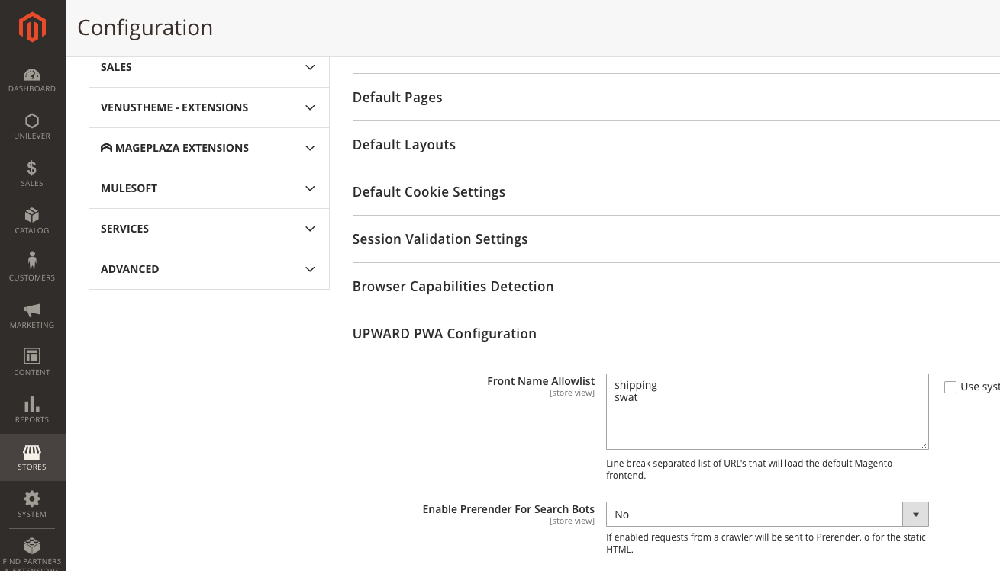

# Erreurs 403 lors de l’accès à l’outil d’analyse à l’échelle du site sur Adobe Commerce

Cet article fournit une solution pour les erreurs 403 survenant lorsque vous tentez d’accéder à l’outil d’analyse à l’échelle du site sur Adobe Commerce.

## Produits et versions concernés

Adobe Commerce sur l’infrastructure cloud 2.4.1 et versions ultérieures.

## Problème

Une erreur 403 s’affiche lorsque vous tentez d’accéder à l’outil d’analyse à l’échelle du site.

<u>Étapes à reproduire :</u>

Connectez-vous au panneau d’administration de Commerce et cliquez sur **Rapports** > *Informations sur le système* > **Outil d’analyse à l’échelle du site**.

<u>Résultat attendu :</u>

L’outil d’analyse à l’échelle du site s’affiche.

<u>Résultat réel :</u>

Vous voyez : *Erreur 403.*


## Solution

Pour vous assurer que l’outil d’analyse à l’échelle du site dispose d’un accès approprié à votre application, exécutez la commande suivante dans l’interface de ligne de commande. Remplacer `<store URL>` avec votre URL de magasin :

```cURL
curl -sIL -X GET <store URL>/swat/key/index | grep HTTP
HTTP/2 403
```

Prenez des mesures en fonction du code de réponse que vous obtenez.

### 403 Code de réponse interdit

Si le code de réponse est 403, vous pouvez disposer d’une protection de robot CloudFlare qui bloque l’outil d’analyse à l’échelle du site. Pour accéder à l’outil, whitelister ses adresses IP :

* 107.23.33.174
* 3.225.9.244
* 3.88.83.85

### Correction du code de réponse 200 et de la sortie JSON

Si la réponse est le code 200 et la sortie JSON corrects, [envoyer un ticket d’assistance](/help/help-center-guide/help-center/magento-help-center-user-guide.md#submit-ticket) pour résoudre le problème avec l’accès à l’outil d’analyse à l’échelle du site.


### Code de réponse 500 (Erreur fatale)

Si un code de réponse est 500 (Erreur fatale), installez le correctif MDVA-38526. Utilisez l’un des liens suivants pour télécharger le correctif, en fonction du type de correctif souhaité :

* Adobe Commerce sur le correctif d’infrastructure cloud : [MDVA-38526_EE_2.4.1-p1_v3.patch.zip](assets/MDVA-38526_EE_2.4.1-p1_v3.patch.zip)
* Correctif du compositeur d’infrastructure cloud Adobe Commerce : [MDVA-38526_EE_2.4.1-p1_COMPOSER_v3.patch.zip](assets/MDVA-38526_EE_2.4.1-p1_COMPOSER_v3.patch.zip)

Le correctif s’applique à Adobe Commerce sur les versions 2.4.1 et ultérieures de l’infrastructure cloud.

### Réponse non JSON

Si le résultat de la réponse n’est pas JSON, cela peut être dû à une mise en oeuvre PWA/sans affichage. Si vous utilisez l’implémentation sans affichage, mettez à jour la configuration UPWARD pour contourner les requêtes dans Adobe Commerce Origin. Pour ce faire, dans l’administrateur Adobe Commerce, sous **Magasins** > **Configuration** > **Général** > **Web** > **Configuration du PWA UPWARD** > **Liste autorisée de prénom**, ajoutez *swat*.



Si vous ne parvenez toujours pas à accéder à l’outil d’analyse à l’échelle du site, la prochaine fois que vous vous connecterez au panneau d’administration de Commerce, accédez à **Rapports** > *Informations sur le système* > **Outil d’analyse à l’échelle du site**, [envoyer un ticket d’assistance](/help/help-center-guide/help-center/magento-help-center-user-guide.md#submit-ticket).

## Lecture connexe

* [Guide de l’outil d’analyse à l’échelle du site](https://experienceleague.adobe.com/docs/commerce-operations/tools/site-wide-analysis-tool/intro.html)
