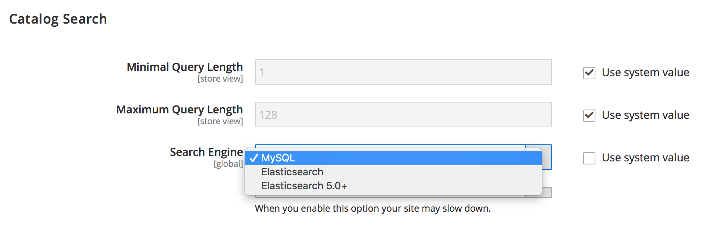

# Impossible de modifier le moteur de recherche à l’aide de l’administrateur Commerce (le menu Moteur de recherche est inaccessible)

>[!WARNING]
>
> [Le moteur de recherche de catalogue MySQL sera supprimé dans Adobe Commerce 2.4.0](/help/announcements/adobe-commerce-announcements/mysql-catalog-search-engine-will-be-removed-in-magento-2-4-0.md). Vous devez avoir configuré et configuré l’hôte Elasticsearch avant d’installer la version 2.4.0.
> 
> Voir :
> [Installez et configurez Elasticsearch](https://experienceleague.adobe.com/en/docs/commerce-cloud-service/user-guide/configure/service/elasticsearch).
> [Installation et configuration d’OpenSearch](https://experienceleague.adobe.com/en/docs/commerce-cloud-service/user-guide/configure/service/opensearch)
> [Installation et configuration de Live Search](https://experienceleague.adobe.com/en/docs/commerce-merchant-services/live-search/install)

Cet article fournit une solution pour modifier le moteur de recherche Adobe Commerce à l’aide de l’administrateur Commerce si le champ **Moteur de recherche** n’est pas affiché ou si la case à cocher **Utiliser la valeur système** est grisée et inaccessible.

Dans cet article :

* [Versions affectées](#affected-versions)
* [Modification du moteur de recherche à l’aide de l’administrateur Commerce (étapes)](#change-search-engine-using-magento-admin-steps)
* [Problèmes avec Adobe Commerce sur site](#magento-commerce-on-premise)
* [Adobe Commerce sur l’infrastructure cloud](#magento-commerce-cloud)

## Versions affectées

* Adobe Commerce sur site : 2.4.X
* Adobe Commerce sur l’infrastructure cloud :
   * Version : 2.4.X
   * Architecture de la formule de départ et de la formule Pro
* MySQL, Elasticsearch, OpenSearch, Live Search : toutes les versions prises en charge

## Modification du moteur de recherche à l’aide de l’administrateur (étapes)

1. Connectez-vous à **[!UICONTROL Admin]** en tant qu’administrateur.
1. Sur le côté gauche de la barre latérale **[!UICONTROL Admin]**, cliquez sur **[!UICONTROL Stores]**.
1. Sous **[!UICONTROL Settings]**, choisissez **[!UICONTROL Configuration]**.
1. Accédez au panneau de gauche sous **[!UICONTROL Catalog],** et sélectionnez **[!UICONTROL Catalog]**.
1. Développez la section **[!UICONTROL Catalog Search]** .    
1. Accédez au champ **[!UICONTROL Search Engine]** et supprimez la sélection de la case à cocher **[!UICONTROL Use system value]** .
1. Cliquez sur le menu **[!UICONTROL Search Engine]** et sélectionnez l’une des options disponibles, comme illustré ci-dessous.    
1. Cliquez sur **[!UICONTROL Save Config]** dans le coin supérieur droit de la page.

## Problèmes avec Adobe Commerce sur site

### Problème 1 : le champ Moteur de recherche ne s’affiche pas

Lorsque vous accédez à la section **Recherche catalogue**, le menu **Moteur de recherche** ne s’affiche pas du tout.


### Cause : le mode Boutique n’est pas la configuration par défaut

La vue du magasin pour l’administrateur a été définie sur n’importe quelle valeur autre que *Default Config*.

Le moteur de recherche est un jeu de configuration global au niveau de l’application, et non sur la portée du magasin. Les magasins d’une application Adobe Commerce ne peuvent pas utiliser des moteurs de recherche différents.

### Solution : définissez la vue du magasin sur la configuration par défaut

1. Connectez-vous à **[!UICONTROL Admin]** en tant qu’administrateur.
1. Sur le côté gauche de la barre latérale **[!UICONTROL Admin]**, cliquez sur **[!UICONTROL Stores]**.
1. Accédez à **[!UICONTROL Settings]** et sélectionnez **[!UICONTROL Configuration]**.
1. Dans le coin supérieur gauche, cliquez sur le sélecteur **[!UICONTROL Store View]** et sélectionnez **[!UICONTROL *Default Config *]**.
1. Cliquez sur **[!UICONTROL OK]** dans la boîte de dialogue de confirmation pour approuver les modifications de la vue du magasin.


**Documentation connexe :** [Modification de la portée](https://experienceleague.adobe.com/docs/commerce-admin/config/scope-change.html#set-the-scope) dans notre guide d’utilisation.

### Problème 2 : impossible de décocher &quot;Utiliser la valeur système&quot;

Lorsque vous accédez à la section **Recherche catalogue** de l’administrateur, la case à cocher **Utiliser la valeur système** est grisée. Vous ne pouvez donc pas supprimer la sélection de la case à cocher pour modifier ultérieurement le moteur de recherche.

### Cause

Le moteur de recherche par défaut a été configuré au niveau de configuration de l’application dans les fichiers `app/etc/env.php` ou `app/etc/config.php` et ne peut donc pas être modifié à l’aide de l’administrateur.

Exemple de section avec configuration par défaut du moteur de recherche :

```php
'system'=>
array (
'default'=>
array (
'catalog'=>
array (
'search'=>
array (
'engine'=>'mysql',
),
),
),
),
```

### Solution

Supprimez la section avec la configuration par défaut du moteur de recherche des fichiers de configuration `app/etc/env.php` ou `app/etc/config.php`.

### Articles connexes dans notre documentation destinée aux développeurs

[Fichiers de configuration Adobe Commerce](https://experienceleague.adobe.com/docs/commerce-operations/configuration-guide/files/deployment-files.html) dans le Guide de configuration Adobe Commerce

## Adobe Commerce sur l’infrastructure cloud

Le fait de changer de moteur de recherche à l’aide de l’option Administration n’est pas disponible dans Adobe Commerce sur l’infrastructure cloud en raison de l’organisation de l’infrastructure cloud.

Au cours du processus de déploiement, les scripts de déploiement Adobe Commerce on Cloud Infrastructure vérifient si l’Elasticsearch a été déclaré dans la variable `MAGENTO_CLOUD_RELATIONSHIPS`. S’il est déclaré, l’Elasticsearch est sélectionné comme moteur de recherche actif et configuré automatiquement ; le [moteur de recherche MySQL](/help/announcements/adobe-commerce-announcements/mysql-catalog-search-engine-will-be-removed-in-magento-2-4-0.md) devient inaccessible dans l’administrateur. Si la relation Elasticsearch n’a pas été déclarée, MySQL est défini sur actif et Elasticsearch devient inaccessible.

Il n’est pas recommandé de modifier les fichiers de configuration `app/etc/env.php` ou `app/etc/config.php` directement sur votre environnement cloud. C’est pourquoi la modification de ces fichiers pour que le moteur Elasticsearch à afficher dans l’Admin (la solution que nous recommandons dans la section précédente) ne s’applique pas à votre projet cloud.

### Modification du moteur de recherche dans les environnements d’évaluation et de production

Avant de passer du moteur de recherche MySQL à l’Elasticsearch dans vos environnements d’évaluation et de production, assurez-vous d’avoir déjà [ envoyé un ticket d’assistance](/help/help-center-guide/help-center/magento-help-center-user-guide.md#submit-ticket) demandant l’activation de l’Elasticsearch dans l’environnement et que le ticket a été résolu avec succès.

Pour modifier le moteur de recherche utilisé dans vos environnements d’évaluation et de production, modifiez la variable d’environnement `SEARCH_CONFIGURATION` dans votre fichier `.magento.env.yaml` sur votre environnement local, puis redirigez les modifications vers les environnements d’intégration et d’évaluation/de production pour que les modifications soient prises en compte.

Si vous passez à Elasticsearch 7, la variable SEARCH\_CONFIGURATION du fichier `.magento.env.yaml` obtenu peut se présenter comme suit :

```yaml
stage:
  deploy:
   SEARCH_CONFIGURATION:
     engine: elasticsearch7
     elasticsearch_server_hostname: hostname
     elasticsearch_server_port: '12345'
     elasticsearch_index_prefix: magento
     elasticsearch_server_timeout: '15'
```

Si vous passez à [Opening-search (dans la version 2.4.6 et ultérieure)](https://experienceleague.adobe.com/en/docs/commerce-knowledge-base/kb/troubleshooting/elasticsearch/search-engine-shown-elasticsearch-despite-open-search), la variable SEARCH\_CONFIGURATION du fichier `.magento.env.yaml` résultant peut se présenter comme suit :

```yaml
stage:
  deploy:
   SEARCH_CONFIGURATION:
     engine: opensearch
     elasticsearch_server_hostname: hostname
     elasticsearch_server_port: '12345'
     elasticsearch_index_prefix: magento
     elasticsearch_server_timeout: '15'
```

Si vous [ passez à la recherche en direct ](https://experienceleague.adobe.com/en/docs/commerce-knowledge-base/kb/troubleshooting/miscellaneous/error-opensearch-search-engine-doesnt-exist-falling-back-to-livesearch), la variable SEARCH\_CONFIGURATION du fichier `.magento.env.yaml` obtenu peut se présenter comme suit :

```yaml
stage:
  deploy:
   SEARCH_CONFIGURATION:
     engine: livesearch
```

### Documentation connexe

#### Base de connaissances d’assistance

* [Activation d’Elasticsearch dans le cloud](/help/how-to/general/enable-elasticsearch-on-cloud.md)

#### Documentation destinée aux développeurs

* [Configuration du service Elasticsearch](https://experienceleague.adobe.com/docs/commerce-cloud-service/user-guide/configure/service/elasticsearch.html)
* [Créer et déployer](https://experienceleague.adobe.com/docs/commerce-cloud-service/user-guide/configure/env/configure-env-yaml.html) (documentation sur le fichier de configuration `.magento.env.yaml`)
* [ Déployer des variables](https://experienceleague.adobe.com/docs/commerce-cloud-service/user-guide/configure/env/stage/variables-deploy.html) ([section RECHERCHER\_CONFIGURATION](https://experienceleague.adobe.com/docs/commerce-cloud-service/user-guide/configure/env/stage/variables-deploy.html#search_configuration))
* [Services](https://experienceleague.adobe.com/docs/commerce-cloud-service/user-guide/configure/service/services-yaml.html) (documentation sur le fichier de configuration `.magento/services.yaml`)
* [Recherche en direct](https://experienceleague.adobe.com/en/docs/commerce-merchant-services/live-search/overview)
