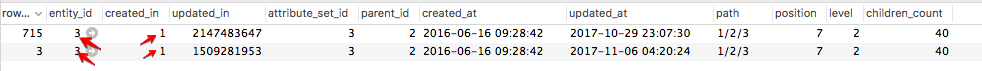
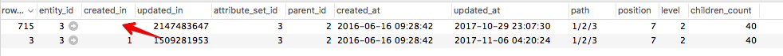

# Les modifications apportées aux catégories ne sont pas enregistrées

Cet article fournit un correctif pour le moment où les catégories de produits sont mises à jour via l’administrateur Commerce, les modifications ne sont pas affichées sur l’administrateur et le storefront. Le problème est causé par les données corrompues dans la table `catalog_category_entity`. Pour résoudre le problème, corrigez ou supprimez les enregistrements de mise à jour de catégorie problématiques dans le tableau . Ensuite, vous devriez être en mesure de mettre à jour les catégories de produits à l’aide de l’administrateur.

## Problème

Après avoir apporté des modifications à une catégorie de produits dans l’Admin et enregistré, les nouvelles mises à jour ne sont ni enregistrées ni affichées dans l’Admin et le storefront.

### Procédure à suivre

1. Accédez à **Catalogue** > **Catégories**.
1. Sélectionnez une catégorie.
1. Apportez des modifications, puis cliquez sur **Enregistrer**.
1. Le message suivant s’affiche : *Vous avez enregistré la catégorie*.
1. Notez que la modification que vous avez apportée n’a pas été enregistrée.

## Cause possible : données corrompues dans la table `catalog_category_entity`

Le problème est dû aux mêmes valeurs dans la colonne `created_in` des enregistrements de catégorie concernés dans la base de données (DB).

Détails :

* La table de base de données `catalog_category_entity` comporte plusieurs enregistrements pour la catégorie concernée (ces enregistrements ont la même valeur `entity_id`).
* Ces enregistrements de catégorie ont **les mêmes valeurs dans la `created_in` colonne**.

### Comment la deuxième entrée de la base de données (et toutes les suivantes) apparaît-elle dans la base de données pour une même catégorie ?

Le deuxième enregistrement de base de données (et, éventuellement, les suivants) pour la catégorie affectée signifie que des mises à jour de catégorie ont été planifiées à l’aide du module Magento\_Staging. Le module crée un enregistrement supplémentaire pour une catégorie dans la `catalog_category_entity` et c&#39;est le comportement attendu de l&#39;application ; le problème est que les enregistrements ont les mêmes valeurs pour la colonne `created_in`.

### Comment les mêmes valeurs apparaissent-elles ?

Nous ne pouvons pas énoncer avec certitude les raisons de la corruption des données. Les raisons possibles peuvent inclure :

* personnalisations (code, thèmes, etc.)
* migration de données incorrecte
* restauration de données incorrecte à partir de la sauvegarde

À notre connaissance, une telle corruption de données n’est pas typique de l’instance Adobe Commerce « propre » (prête à l’emploi) et ne peut pas être reproduite sur une installation Adobe Commerce sans personnalisation.

### Comment vérifier qu’il s’agit bien de votre problème

La table `catalog_category_entity` doit comporter plusieurs enregistrements pour la catégorie concernée (les enregistrements doivent avoir la même valeur de `entity_id`) et au moins deux de ces enregistrements doivent avoir les mêmes valeurs de `created_in`. Ainsi, les mises à jour planifiées de l’évaluation ne s’afficheraient pas dans l’administration Commerce ; vous ne verriez que le bloc vide Modifications planifiées .

#### Étapes de vérification

1. Accédez à la table catalog\_category\_entity de votre base de données.
1. Filtrez les entités par entité\_id, l’entité\_id identifiant la catégorie affectée.
1. Si les valeurs de la colonne created\_in sont identiques pour différentes entrées avec le même entité\_id, c&#39;est notre cas. Normalement, les valeurs `created_in` sont différentes pour chaque enregistrement.

## Solution

Vous pouvez choisir l’une des solutions suivantes :

1. **Supprimer** les enregistrements de mise à jour de catégorie problématiques
1. **Réparer** les enregistrements de mise à jour de catégorie problématiques

### Supprimer les enregistrements de mise à jour de catégorie posant problème

Dans cette solution, vous devez définir la valeur `updated_in` correcte pour l’enregistrement de catégorie initial et supprimer tous les autres enregistrements de cette catégorie. Cela supprime toutes les mises à jour de catégorie planifiées.

Procédez comme suit :

1. Recherchez les enregistrements de base de données avec le `entity_id` de la catégorie affectée.
1. Sélectionnez l&#39;enregistrement ayant le plus grand entier dans la colonne `updated_in`.
1. Copiez la valeur `updated_in` de l’enregistrement sélectionné.
1. Sélectionnez l’enregistrement avec `row_id` = `entity_id` (enregistrement de catégorie initial) et collez la valeur copiée dans la colonne `updated_in` de cet enregistrement.
1. Supprimez la ou les lignes dont la `row_id` n’est pas égale à `entity_id` .

### Réparer les enregistrements de mise à jour de catégorie posant problème

1. Recherchez les enregistrements de catégorie avec la même `entity_id` et la même valeur de `created_in`.
1. Sélectionnez l’enregistrement où `row_id` = `entity_id` et copiez la valeur `updated_in`.
1. Sélectionnez l’enregistrement pour lequel `row_id` n’est pas égal à `entity_id` et collez la valeur de `updated_in` copiée comme valeur de `created_in`. Consultez la capture d’écran ci-dessous à titre d’illustration.    
1. Vérifiez que l&#39;enregistrement de mise à jour de catégorie, dont vous avez mis à jour la valeur `created_in` (à l&#39;étape 3), existe dans la table `staging_update`. *Par exemple :* SI la valeur `created_in` copiée est 1509281953, ALORS l’entité avec `row_id` = 1509281953 doit exister dans la table `staging_update`.

## Lecture connexe

[Recommandations relatives à la modification des tables de base de données](https://experienceleague.adobe.com/fr/docs/commerce-operations/implementation-playbook/best-practices/development/modifying-core-and-third-party-tables#why-adobe-recommends-avoiding-modifications) dans le manuel Commerce Implementation Playbook
