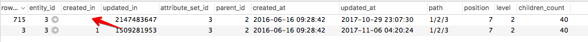

# Les modifications apportées aux catégories ne sont pas enregistrées.

Cet article fournit un correctif pour la mise à jour des catégories de produits via l’administrateur Commerce. Les modifications ne s’affichent pas sur l’administrateur et le storefront. Le problème est causé par les données corrompues dans la table `catalog_category_entity`. Pour résoudre ce problème, corrigez ou supprimez les enregistrements de mise à jour de catégorie problématiques dans le tableau. Ensuite, vous devriez pouvoir mettre à jour les catégories de produits à l’aide de l’administrateur.

## Problème

Après avoir apporté des modifications à une catégorie de produits dans l’Admin et l’enregistrement, les nouvelles mises à jour ne sont ni enregistrées, ni affichées dans l’Admin et le storefront.

### Étapes à reproduire

1. Accédez à **Catalogue** > **Catégories**.
1. Sélectionnez une catégorie.
1. Apportez des modifications, puis cliquez sur **Enregistrer**.
1. Le message s&#39;affiche : *Vous avez enregistré la catégorie*.
1. Notez que la modification que vous avez effectuée n’a pas été enregistrée.

## Cause possible : données endommagées dans la table `catalog_category_entity`

Le problème est causé par les mêmes valeurs dans la colonne `created_in` des enregistrements de catégorie affectés dans la base de données (DB).

Détails :

* La table `catalog_category_entity` de la base de données contient plusieurs enregistrements pour la catégorie affectée (ces enregistrements ont la même valeur `entity_id`).
* Ces enregistrements de catégorie ont **les mêmes valeurs dans la colonne `created_in`**.

### Comment la deuxième entrée DB (et toutes les entrées suivantes) apparaît-elle dans DB pour une catégorie et une même catégorie ?

Le deuxième enregistrement DB (et, éventuellement, les suivants) pour la catégorie affectée signifie qu’il y a eu des mises à jour de catégorie planifiées à l’aide du module Magento\_Staging . Le module crée un enregistrement supplémentaire pour une catégorie dans `catalog_category_entity` et il s’agit du comportement attendu de l’application. Le problème est que les enregistrements ont les mêmes valeurs pour la colonne `created_in`.

### Comment apparaissent les mêmes valeurs ?

Nous ne pouvons expliquer avec certitude les raisons de la corruption des données. Les raisons possibles peuvent être les suivantes :

* personnalisations (code, thèmes, etc.)
* migration incorrecte des données
* restauration des données incorrectes à partir de la sauvegarde

À notre connaissance, cette corruption de données n’est pas typique pour l’instance Adobe Commerce &quot;propre&quot; (prête à l’emploi) et ne peut pas être reproduite sur une installation Adobe Commerce sans personnalisation.

### Comment vérifier que c&#39;est votre problème

La table `catalog_category_entity` doit comporter plusieurs enregistrements pour la catégorie affectée (les enregistrements doivent avoir la même valeur `entity_id`) et au moins deux de ces enregistrements doivent avoir les mêmes valeurs `created_in`. Ainsi, les mises à jour planifiées par évaluation ne s’afficheraient pas dans l’administrateur Commerce ; vous ne verriez que le bloc Modifications planifiées vide.

#### Étapes à vérifier

1. Accédez à la table catalog\_category\_entity dans votre base de données.
1. Filtrez les entités par entity\_id, avec entity\_id identifiant la catégorie affectée.
1. Si les valeurs de la colonne created\_in sont identiques pour différentes entrées ayant le même entity\_id, c’est notre cas. Normalement, les valeurs `created_in` sont différentes pour chaque enregistrement.

## Solution

Vous pouvez choisir l’une des solutions suivantes :

1. **Supprimer** les enregistrements de mise à jour de catégorie problématiques
1. **Réparer** les enregistrements de mise à jour de catégorie problématiques

### Supprimer les enregistrements de mise à jour de catégorie problématiques

Dans cette solution, vous devrez définir la valeur `updated_in` correcte pour l’enregistrement de catégorie initial et supprimer tous les autres enregistrements pour cette catégorie. Cette opération supprime toutes les mises à jour de catégorie planifiées.

Procédez comme suit :

1. Recherchez les enregistrements DB avec le `entity_id` de la catégorie affectée.
1. Sélectionnez l&#39;enregistrement avec le plus grand entier dans la colonne `updated_in`.
1. Copiez la valeur `updated_in` de l’enregistrement sélectionné.
1. Sélectionnez l’enregistrement avec `row_id` = `entity_id` (enregistrement de catégorie initial) et collez la valeur copiée dans la colonne `updated_in` de cet enregistrement.
1. Supprimez la ou les lignes dont `row_id` n’est pas égal à `entity_id` .

### Réparer les enregistrements de mise à jour de catégorie problématiques

1. Recherchez les enregistrements de catégorie avec la même valeur `entity_id` et la même valeur `created_in`.
1. Sélectionnez l’enregistrement où `row_id` = `entity_id` et copiez la valeur `updated_in`.
1. Sélectionnez l’enregistrement où `row_id` n’est pas égal à `entity_id` et collez la valeur `updated_in` copiée comme valeur `created_in`. Reportez-vous à la capture d’écran ci-dessous comme illustration.    
1. Vérifiez que l’enregistrement de mise à jour de catégorie, dont la valeur `created_in` a été mise à jour (à l’étape 3), existe dans la table `staging_update`. *Par exemple :* Si la valeur `created_in` copiée est 1509281953, ALORS l’entité avec `row_id` = 1509281953 doit exister dans la table `staging_update`.

## Lecture connexe

[ Bonnes pratiques pour la modification des tables de base de données](https://experienceleague.adobe.com/fr/docs/commerce-operations/implementation-playbook/best-practices/development/modifying-core-and-third-party-tables#why-adobe-recommends-avoiding-modifications) dans le manuel de mise en oeuvre de Commerce
