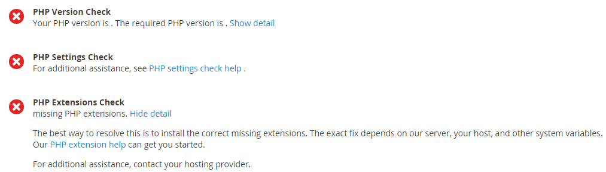

# Problèmes de vérification de l’état de préparation Cron

Cet article fournit des solutions aux problèmes de préparation de cron. Voici les symptômes des problèmes de cron :

* Un message d’erreur relatif au paramètre PHP `$HTTP_RAW_POST_DATA` s’affiche même s’il est correctement défini.
* La vérification de l’état de préparation PHP n’affiche pas la version PHP comme le montre la figure suivante :
  
* L’erreur suivante s’affiche dans l’administrateur Commerce :
  
Pour voir l’erreur, vous devrez peut-être cliquer sur **Messages système** en haut de la fenêtre comme suit :
  

## Vérifiez votre crontab existant. {#check-your-existing-crontab}

Cette section explique comment vérifier si cron est en cours d’exécution et s’il est correctement configuré.

Pour vérifier si votre crontab est configuré :

1. Connectez-vous à votre serveur Commerce en tant que [&#x200B; propriétaire du système de fichiers du Magento &#x200B;](https://experienceleague.adobe.com/fr/docs/commerce-operations/installation-guide/prerequisites/file-system/overview) ou passez à cette propriété.
1. Vérifiez si le fichier suivant existe : `$ ls -al <magento_root>/var/.setup_cronjob_status`. Si le fichier existe, cron s’est exécuté avec succès dans le passé. Si le fichier *n’existe pas, vous n’avez pas encore installé Adobe Commerce ou cron n’est pas en cours d’exécution.* Dans les deux cas, passez à l’étape suivante.
1. Obtenez plus de détails sur cron. En tant qu&#39;utilisateur disposant de droits `root`, saisissez la commande suivante : `$ crontab -u <Magento file system owner name> -l`. Par exemple, sur CentOS `$ crontab -u magento_user -l`. Si aucun onglet crontab n’a été configuré pour l’utilisateur, le message suivant s’affiche :    `no crontab for magento_user`. Votre crontab vous indique ce qui suit :
   * Quel binaire PHP vous utilisez (dans certains cas, vous en avez plusieurs) ?
   * Scripts Adobe Commerce cron en cours d’exécution (en particulier, chemins d’accès à ces scripts)
   * Emplacement de vos journaux cron

   Consultez l’une des sections suivantes pour une solution à votre problème.

## Solution : crontab non configuré {#solution-crontab-not-set-up}

Pour vérifier que vos tâches cron sont correctement configurées, voir [Configuration des tâches cron](https://experienceleague.adobe.com/fr/docs/commerce-operations/installation-guide/next-steps/configuration) dans notre documentation destinée aux développeurs.

## Solution : cron s’exécutant à partir d’un binaire PHP incorrect {#solution-cron-running-from-incorrect-php-binary}

Si votre tâche cron utilise un binaire PHP différent du plug-in du serveur web, des erreurs de paramètres PHP peuvent s’afficher. Pour résoudre ce problème, définissez des paramètres PHP identiques pour la ligne de commande PHP et le module externe de serveur Web PHP.

Pour plus d’informations sur les paramètres PHP, voir [Paramètres PHP requis](https://experienceleague.adobe.com/fr/docs/commerce-operations/installation-guide/prerequisites/php-settings) dans notre documentation destinée aux développeurs.

## Solution : cron s’exécutant en erreur {#solution-cron-running-with-errors}

Essayez d’exécuter chaque commande manuellement, car la commande peut afficher des messages d’erreur utiles. Voir [Configuration des tâches cron](https://experienceleague.adobe.com/fr/docs/commerce-operations/installation-guide/next-steps/configuration) dans notre documentation destinée aux développeurs.

>[!NOTE]
>
>Vous devez exécuter cron au moins *deux fois* pour que la tâche s’exécute ; la première fois que vous mettez des tâches en file d’attente, la deuxième fois que vous exécutez les tâches.
