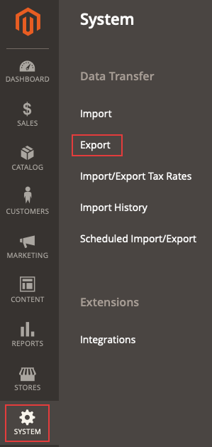

# Le fichier .csv des produits exportés n’apparaît pas

Cet article fournit une solution au problème où l’exportation du type d’entité souhaité dans un fichier .csv dans Commerce Admin entraîne l’absence du fichier.

## Produits et versions concernés

* Adobe Commerce sur les infrastructures cloud, toutes les [versions prises en charge](https://magento.com/sites/default/files/magento-software-lifecycle-policy.pdf).

## Problème

<u>Procédure à suivre</u>

Conditions préalables : l’option **Ajouter une clé secrète aux URL** est définie sur *Oui*. L’option est configurée dans l’Administration Commerce sous **Magasins** > **Configuration** > **Avancé** > **Admin** > **Sécurité**.

1. Dans Admin, accédez à **Système** > **Transfert de données** > **Exporter**.

   

1. Sélectionner
   * **Type d’entité** : l’entité à exporter
   * **Format du fichier d’exportation** : *CSV*
   * **Enceinte de champ** : ne pas cocher.
1. Cliquez sur **Continuer**.
1. Le message suivant s’affiche : *« Message ajouté à la file d’attente, attendez d’obtenir votre fichier »*.

<u>Résultat attendu</u>

Le fichier .csv contenant le type d’entité souhaité exporté s’affiche dans la grille en quelques minutes.

<u>Résultat réel</u>

Le fichier .csv contenant le type d’entité souhaité exporté n’est pas affiché dans la grille pendant 10 minutes ou plus.

## Cause

Un problème connu avec la fonctionnalité d’exportation dans la version 2.3.2 de la partie application Adobe Commerce.

## Solution

Il existe deux solutions possibles à ce problème :

* Désactivez l’option Ajouter la clé secrète à l’URL .
* Exécutez la commande `bin/magento queue:consumers:start exportProcessor` manuellement et, éventuellement, configurez-la pour qu’elle soit exécutée par cron.

Voir les détails des deux options dans les paragraphes suivants.

### Désactivez l’option Ajouter la clé secrète à l’URL .

1. Dans Admin, accédez à **Magasins** > **Configuration** > **Avancé** > **Admin** > **Sécurité**.
1. Définissez l’option **Ajouter la clé secrète aux URL** sur *Non.*
1. Cliquez sur **Enregistrer la configuration**.
1. Nettoyez le cache sous **Système** > **Outils** > **Gestion du cache** ou en exécutant `bin/magento cache:clean` ou dans Admin.

### Exécutez manuellement la commande d’exportation et ajoutez-la éventuellement en tant que tâche cron

Pour obtenir le fichier d’exportation, exécutez la commande `bin/magento queue:consumers:start exportProcessor` . Après avoir exécuté cette opération, le fichier doit s’afficher dans la grille.


Pour ajouter éventuellement le processus en tant que tâche cron, vous devez ajouter la variable `CRON_CONSUMERS` au fichier `.magento.env.yaml`.

#### Ajouter un processus en tant que tâche cron (facultatif)

1. Assurez-vous que le cron est configuré. Pour plus d’informations, consultez [Configuration de tâches cron](https://experienceleague.adobe.com/docs/commerce-cloud-service/user-guide/configure/app/properties/crons-property.html).
1. Exécutez la commande suivante pour renvoyer une liste de consommateurs de file d’attente de messages : `./bin/magento queue:consumers:list`
1. Ajoutez les éléments suivants à votre fichier `.magento.env.yaml` dans le répertoire racine de l’application et incluez les consommateurs que vous souhaitez ajouter. Par exemple, voici le client requis pour le traitement des exportations :

   ```yaml
   stage:
       deploy:
           CRON_CONSUMERS_RUNNER:
               cron_run: true
               max_messages: 1000
               consumers:
                   - exportProcessor
   ```

   Envoyez ensuite ce fichier mis à jour et redéployez votre environnement. Consultez également la section [Ajouter des tâches cron personnalisées à votre projet](https://experienceleague.adobe.com/docs/commerce-cloud-service/user-guide/configure/app/properties/crons-property.html#add-custom-cron-jobs-to-your-project) dans notre documentation destinée aux développeurs.

>[!NOTE]
>
>Si vous ne trouvez pas le fichier `.magento.env.yaml` pour votre environnement et que vous pensez qu’il a été supprimé, vous devez créer un nouveau `.magento.env.yaml`. Il peut être vide au départ, vous pouvez y ajouter des informations selon vos besoins. Référencez les articles suivants : [Configurer des variables d’environnement pour le déploiement](https://experienceleague.adobe.com/docs/commerce-cloud-service/user-guide/configure/env/configure-env-yaml.html) et [Variables d’environnement](https://experienceleague.adobe.com/docs/commerce-cloud-service/user-guide/configure/env/stage/variables-intro.html) dans notre documentation destinée aux développeurs.

>[!TIP]
>
>Les [fichiers YAML](https://experienceleague.adobe.com/docs/commerce-cloud-service/user-guide/configure/env/configure-env-yaml.html) sont sensibles à la casse et n’autorisent pas les onglets. Veillez à utiliser une mise en retrait cohérente dans l’ensemble du fichier .magento.env.yaml, sans quoi votre configuration risque de ne pas fonctionner comme prévu. Les exemples de la documentation et de l’exemple de fichier utilisent la mise en retrait à deux espaces. Utilisez la commande de validation ece-tools pour vérifier votre configuration.

>[!NOTE]
>
>Dans les projets Pro d’Adobe Commerce sur les infrastructures cloud, la fonctionnalité [auto-crons](https://experienceleague.adobe.com/docs/commerce-cloud-service/user-guide/configure/app/properties/crons-property.html?lang=en#crontab) doit être activée sur votre Adobe Commerce sur les infrastructures cloud avant que vous puissiez ajouter des tâches cron personnalisées aux environnements d’évaluation et de production à l’aide de `.magento.app.yaml`. Si cette fonctionnalité n’est pas activée, [créez un ticket d’assistance](https://experienceleague.adobe.com/en/docs/support-resources/adobe-support-tools-guide/adobe-commerce-support/adobe-commerce-help-center-user-guide#submit-ticket) pour que la tâche soit ajoutée pour vous.

