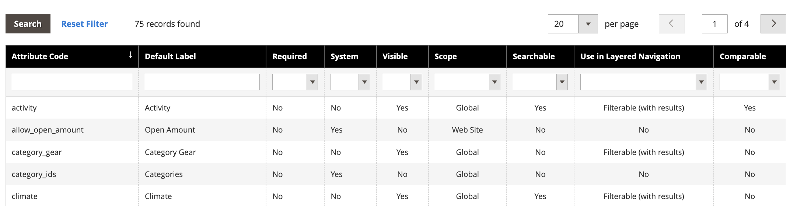

# [!DNL Live Search] facettes ne sont pas triées par ordre alphabétique

## Produits et versions concernés

Adobe Commerce versions 2.4.x et ultérieures

## Problème

Toutes les facettes de storefront Adobe Commerce sont triées par ordre alphabétique avec des options à sélection unique, quel que soit le type d’entrée affecté à l’attribut correspondant.

## Solution

Cependant, dans certains cas, les facettes ne sont pas triées par ordre alphabétique comme configuré dans l’espace de travail [[!DNL Live Search] Facettisation](https://experienceleague.adobe.com/fr/docs/commerce-merchant-services/live-search/live-search-admin/facets/faceting-workspace).

Pour pallier ce problème, vous pouvez trier les attributs de produit dans la section attributs de [!UICONTROL Admin] .

1. Sur la barre latérale **[!UICONTROL Admin]**, accédez à **Magasins** > *Attributs* > **Produit**.
1. Sélectionnez un attribut dans le tableau.

   

1. Ouvrez l’attribut qui contient les valeurs à trier et sélectionnez **Informations sur l’attribut** > **Propriétés**.
1. Sous **Gérer les options**, vous pouvez trier les valeurs d’attribut.

   
