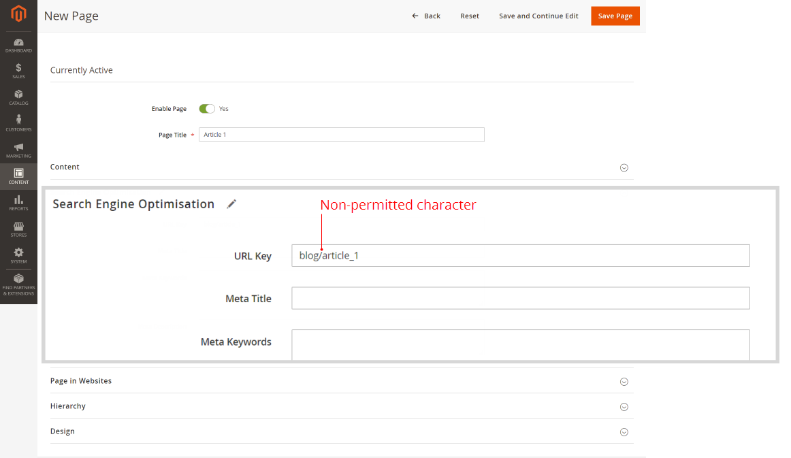
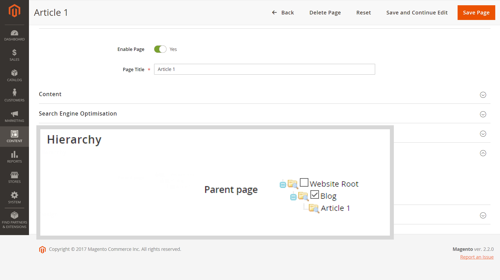

# Le menu principal (Catégories) ne s’affiche pas sur les sous-pages avec Fastly activé

Cet article fournit un correctif pour les cas où le menu principal (ou le [menu de navigation supérieur des catégories](https://experienceleague.adobe.com/docs/commerce-admin/catalog/catalog/navigation/navigation-top.html) de notre guide d’utilisation) n’est pas affiché sur storefront pour les sous-pages (par exemple, *blog/page*) lorsque Fastly ou Varnish est activé.

**Cause :** caractère `/` non autorisé (barre oblique) dans le paramètre *Clé URL* de la page (paramètres d’optimisation du moteur de recherche). Le caractère est généralement ajouté lorsque *Chemin d’URL* (avec l’emplacement de page entier) est spécifié par erreur au lieu de *Clé d’URL* : par exemple, *blog/page\_name* au lieu de simplement *page\_name*.

**Solution :** supprimez le caractère `/` (barre oblique) ; pour le paramètre *Clé URL*, spécifiez uniquement le nom de la page.

## Versions affectées

* Adobe Commerce On-Premise 2.X.X
* Adobe Commerce sur Cloud Infrastructure 2.X.X
* Fastly ou vernis

## Problème

Le menu principal (également appelé [menu de navigation supérieur de catégorie](https://experienceleague.adobe.com/docs/commerce-admin/catalog/catalog/navigation/navigation-top.html) dans notre guide d’utilisation) n’est pas affiché sur storefront pour les sous-pages lorsque Fastly ou d’autres services basés sur un vernis sont activés.

## Cause

Le problème est dû au caractère `/` non autorisé (barre oblique), ajouté au paramètre *Clé d’URL* (paramètres d’optimisation du moteur de recherche).

Le caractère est généralement ajouté lorsque *Chemin d’URL* (avec l’emplacement de la page entière, y compris la ressource/le répertoire parent de la page) est spécifié par erreur au lieu de *Clé d’URL* : par exemple, *blog/page\_name* au lieu de *page\_name*.

## Solution

Supprimez le caractère `/` (barre oblique) du paramètre *Clé d’URL* pour toutes les pages de votre boutique.

En d’autres termes, utilisez *Clé d’URL* au lieu de *Chemin d’URL* : ne mentionnez que le nom de la page sans ressource/répertoire parent.

### Recommandations sur la hiérarchie des pages et l’optimisation du moteur de recherche (SEO)

Pour définir la hiérarchie de la page, accédez à la section **Hiérarchie** du menu Modifier la page .

Vous pouvez également utiliser le menu **Contenu** > **Éléments** > **Hiérarchie** pour des solutions de hiérarchie plus complexes.

Pour des raisons d’optimisation du moteur de recherche (SEO) sur les pages de produits, utilisez Réécritures d’URL (**Marketing** > **SEO et recherche** > **Réécritures d’URL**).

## Plus d&#39;informations dans notre guide de l&#39;utilisateur

Le paramètre *URL Key* pour l’optimisation du moteur de recherche :

* [Optimisation du moteur de recherche](https://experienceleague.adobe.com/docs/commerce-admin/catalog/categories/create/categories-search-engine-optimization.html)
* [Ajout d’une nouvelle page](https://experienceleague.adobe.com/docs/commerce-admin/content-design/elements/pages/page-add.html)

Hiérarchie de page :

* [Aperçu](https://experienceleague.adobe.com/docs/commerce-admin/content-design/elements/pages/page-hierarchy.html)
* [Ajout d’un nœud &#x200B;](https://experienceleague.adobe.com/docs/commerce-admin/content-design/elements/pages/page-hierarchy.html#add-a-hierarchy-node)
