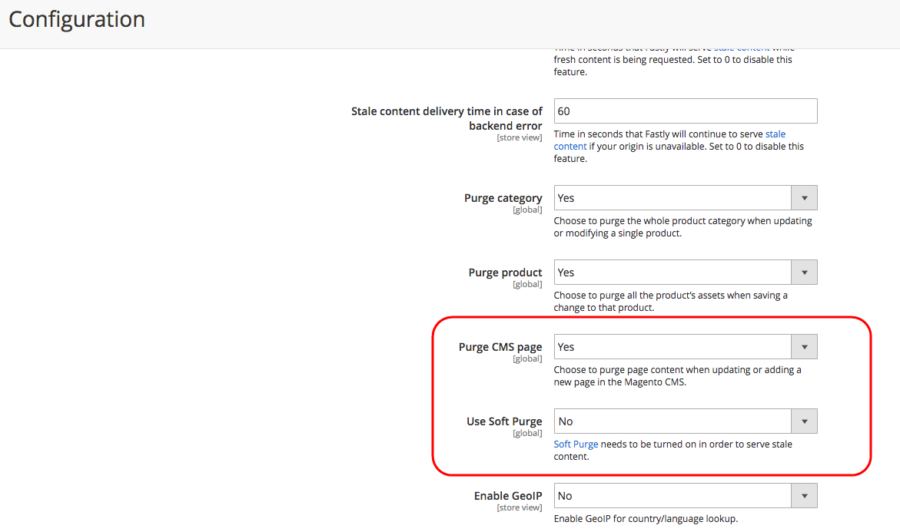

# Les mises à jour de l’évaluation de contenu planifiées ne s’affichent pas avec le cache Fastly obsolète

Cet article fournit un correctif pour les cas où les magasins Adobe Commerce n’affichent pas de mises à jour planifiées lors de l’utilisation de Content Staging et de Fastly. Le problème est dû à l’activation par défaut de la fonction Purge rapide. Cette fonctionnalité réduit la charge des ressources de l’application et ne régénère un nouveau cache que lors d’une seconde requête. Pour résoudre ce problème, vous pouvez activer la page Purge de CMS via l’Administration de Commerce afin de toujours générer et diffuser du contenu récent.

## Problème

Mises à jour planifiées d’une ressource de contenu de magasin (page, produit, bloc, etc.) ne s’affichent pas sur storefront immédiatement après l’heure de début de la mise à jour. Cela se produit lorsque des mises à jour ont été planifiées à l’aide de la fonctionnalité [Évaluation de contenu](https://experienceleague.adobe.com/docs/commerce-admin/content-design/staging/content-staging.html?lang=fr).

## Cause

En raison de la fonctionnalité de purge progressive de Fastly (activée par défaut), le storefront Adobe Commerce reçoit toujours l’ancien contenu (obsolète) mis en cache lors de l’envoi de **la première** demande de ressource mise à jour à Fastly. Fastly nécessite une seconde requête pour régénérer les données du site.

Par conséquent, Fastly peut diffuser du contenu obsolète jusqu’à la deuxième demande de contenu mis à jour.

**Mise en cache attendue :** après avoir planifié une mise à jour pour une ressource de contenu à l’aide de l’évaluation de contenu, Adobe Commerce envoie une demande de mise à jour du cache vers Fastly. Invalide rapidement le contenu mis en cache précédent (sans supprimer le contenu) et commence à diffuser le contenu mis à jour.

**Mise en cache effective :** si Fastly diffuse toujours le contenu obsolète lors de la réception **la première** de la demande de contenu mis à jour, elle n’enverra le contenu régénéré et correct qu’après avoir reçu **la seconde** la demande. Ce comportement a été implémenté pour réduire la charge du serveur en renouvelant le cache uniquement dans les zones où le trafic a fait ses preuves, sans régénérer le cache pour l’ensemble du site web. Rapidement met à jour le cache progressivement, ce qui permet d’économiser les ressources de l’application.

## Solution

Si la diffusion de contenu obsolète, même pour la première requête, est inacceptable, vous pouvez désactiver la purge réversible et activer la page Purge de CMS :

1. Connectez-vous à votre administrateur Commerce local en tant qu’administrateur.
1. Accédez à **Magasins** > **Configuration** > **Avancé** > **Système** > **Cache de page complet**.
1. Développez **Configuration rapide**, puis **Avancé**.
1. Définissez **Utiliser la purge réversible** sur *Non*.
1. Définissez **Purge de la page CMS** sur *Oui*.
1. Cliquez sur **Enregistrer la configuration** en haut de la page.

## Documentation connexe

* [Configurer les options de purge](https://experienceleague.adobe.com/docs/commerce-cloud-service/user-guide/cdn/setup-fastly/fastly-configuration.html?lang=fr) dans le Guide de Commerce sur les infrastructures cloud.
* [Évaluation du contenu](https://experienceleague.adobe.com/docs/commerce-admin/content-design/staging/content-staging.html?lang=fr) dans la documentation sur le contenu et la conception.
* [Diffusion de contenu obsolète](https://docs.fastly.com/guides/performance-tuning/serving-stale-content) dans la documentation Fastly .
