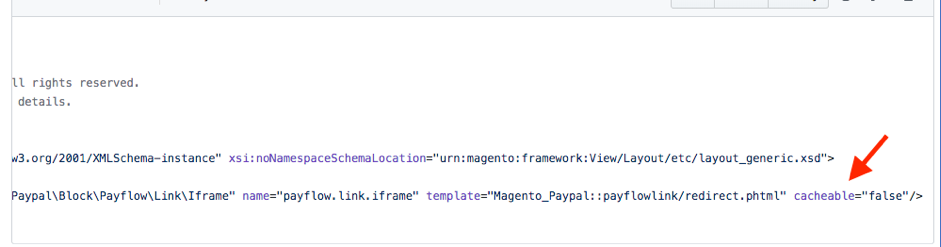

# Faibles performances en raison de pages non mises en cache

Cet article fournit des solutions pour augmenter les temps de chargement du site web ou les pannes en raison de la désactivation du cache de la page entière (par exemple, Fastly) pour n’importe quel bloc de n’importe quelle page qui doit être mise en cache.

## Produits et versions concernés

* Adobe Commerce sur l’infrastructure cloud 2.x.x
* Adobe Commerce On-Premise 2.x.x

### Problème

Les performances du site sont lentes, car il existe des blocs de cache sur les pages qui doivent pouvoir être mis en cache, mais qui ont été définis sur `cacheable="false"` .

### Cause

Certaines pages doivent être mises en cache par Adobe Commerce. Ces pages ont le plus grand débit. Chaque requête de ces types de pages, et non du cache, ralentit le fonctionnement d’Adobe Commerce.

Ces pages sont les suivantes :

* Catégorie de catalogue (PLP)
* Page Détails du produit (PDP)
* Pages de contenu statique (page d’accueil, nous contacter, etc.)

Les termes pouvant être mis en cache ou non sont des termes utilisés pour indiquer si une page doit être mise en cache ou non. Par défaut, toutes les pages peuvent être mises en cache. Toutefois, si un bloc d’une mise en page est considéré comme impossible à mettre en cache, la page entière ne peut pas être mise en cache.

La capture d’écran ci-dessous montre un bloc avec un paramètre `cacheable="false"` **&#x200B; ** qui crée une page pouvant être mise en cache.

Parmi les exemples de pages pouvant faire l’objet d’une mise en cache, citons la comparaison de produits, de paniers et de pages de passage en caisse.

La liste de pages suivante n’est pas mise en cache (les caches Fastly, Block et Layout sont évités). Cela se produit en raison de la configuration &quot;mise en cache&quot; dans la mise en page.

### Solution

Vérifiez si les fichiers spécifiés ci-dessus ont le paramètre `cacheable="false"` . Si tel est le cas, vérifiez si ce paramètre est nécessaire ou obligatoire.

* Si nécessaire, envisagez plutôt de déplacer des blocs non pouvant être mis en cache vers le [mécanisme de contenu privé](https://developer.adobe.com/commerce/php/development/cache/page/private-content/) .
* Si ce n’est pas nécessaire, supprimez l’attribut `cacheable="false"` et videz le cache de mise en page.

>[!NOTE]
>
>Pour Adobe Commerce sur l’infrastructure cloud 2.4.1 et versions ultérieures, vous pouvez utiliser l’ [ outil d’analyse à l’échelle du site ](https://experienceleague.adobe.com/fr/docs/commerce-operations/tools/site-wide-analysis-tool/access) pour vérifier automatiquement si votre cache de page complète n’est pas correctement configuré.

### Lecture connexe

[Présentation du cache Adobe Commerce](https://developer.adobe.com/commerce/frontend-core/guide/caching/) dans notre documentation destinée aux développeurs.
