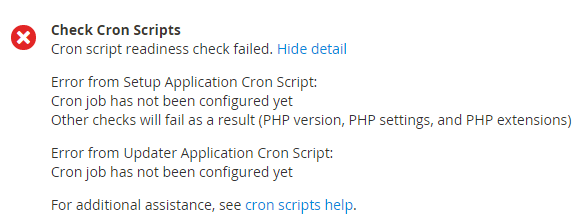

# Résolution des problèmes liés à cron

Cet article propose des solutions de dépannage pour les problèmes liés à cron dans les produits Adobe Commerce sur site.

## Produits et versions concernés

* Adobe Commerce on-premise 2.2.x, 2.3.x
* Magento Open Source 2.2.x, 2.3.x

## Problèmes

## Voici les symptômes des problèmes de cron :

* Votre mise à jour ou mise à niveau ne s’exécute jamais ; elle reste à l’état `pending`.
* Un message d’erreur relatif au paramètre PHP `$HTTP_RAW_POST_DATA` s’affiche même s’il est correctement défini.
* Le contrôle cron de préparation échoue. Les erreurs possibles incluent les chemins non modifiables et cron non configuré. Voici un exemple :

  

* La vérification de l’état de préparation PHP n’affiche pas la version PHP comme le montre la figure suivante.

  

* L’erreur suivante s’affiche dans l’administrateur Commerce :

  

Pour voir l’erreur, vous devrez peut-être cliquer sur **Messages système** en haut de la fenêtre comme suit :

## Chercher la cause {#check-your-existing-crontab}

Cette section explique comment vérifier si cron est en cours d’exécution et s’il est correctement configuré.

Pour vérifier si votre crontab est configuré, procédez comme suit :

1. Connectez-vous à votre serveur de Magento en tant que [propriétaire du système de fichiers du Magento](https://experienceleague.adobe.com/fr/docs/commerce-operations/installation-guide/prerequisites/file-system/overview) ou basculez-vous vers ce serveur.
1. Vérifiez si le fichier suivant existe :    `bash    ls -al <magento_root>/var/.setup_cronjob_status`. Si le fichier existe, cron s’est exécuté avec succès dans le passé. Si le fichier *n’existe pas, vous n’avez pas encore installé Magento ou cron n’est pas en cours d’exécution.* Dans les deux cas, passez à l’étape suivante.
1. Obtenez plus de détails sur cron. En tant qu’utilisateur disposant de droits `root`, saisissez la commande suivante :    `bash    crontab -u <Magento file system owner name> -l`. Par exemple, sur CentOS `bash    crontab -u magento_user -l`.  Si aucun onglet crontab n’a été configuré pour l’utilisateur, le message suivant s’affiche :    `terminal    no crontab for magento_user`. Votre crontab vous indique ce qui suit :

   * Quel binaire PHP vous utilisez (dans certains cas, vous en avez plusieurs) ?
   * Scripts cron Magento en cours d’exécution (en particulier, les chemins d’accès à ces scripts)
   * Emplacement de vos journaux cron

Consultez l’une des sections suivantes pour une solution à votre problème.

## Solutions

### Solution pour crontab non configurée {#solution-crontab-not-set-up}

Pour vérifier que vos tâches cron sont correctement configurées, voir [Configuration des tâches cron](https://experienceleague.adobe.com/fr/docs/commerce-operations/installation-guide/next-steps/configuration).

### Solution pour cron utilisant un binaire PHP incorrect {#solution-cron-running-from-incorrect-php-binary}

Si votre tâche cron utilise un binaire PHP différent du plug-in du serveur web, des erreurs de paramètres PHP peuvent s’afficher. Pour résoudre ce problème, définissez des paramètres PHP identiques pour la ligne de commande PHP et le module externe de serveur Web PHP.

Pour plus d’informations sur les paramètres PHP, voir [Paramètres PHP requis](https://experienceleague.adobe.com/fr/docs/commerce-operations/installation-guide/prerequisites/php-settings) dans notre documentation destinée aux développeurs.

### Solution pour cron s’exécutant en erreur {#solution-cron-running-with-errors}

Essayez d’exécuter chaque commande manuellement, car la commande peut afficher des messages d’erreur utiles. Voir [Configuration de tâches cron](https://experienceleague.adobe.com/fr/docs/commerce-operations/installation-guide/next-steps/configuration).

>[!NOTE]
>
>Vous devez exécuter cron au moins *deux fois* pour que la tâche s’exécute ; la première fois que vous mettez des tâches en file d’attente, la deuxième fois que vous exécutez les tâches.
