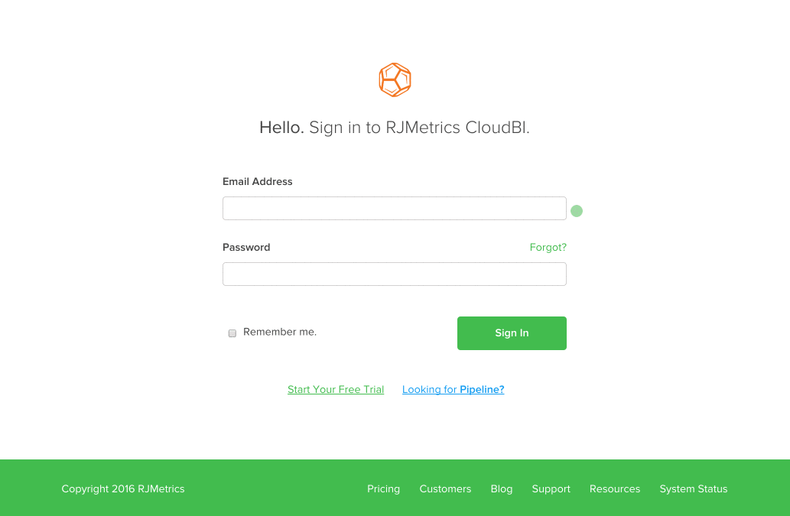

# Dépannage du verrouillage des comptes Adobe Commerce Intelligence

<!--
BOB: Is this in TOC?
-->

Cet article fournit des solutions pour le verrouillage des comptes Commerce Intelligence. Nous devrons d&#39;abord déterminer s&#39;il s&#39;agit d&#39;un défaut, d&#39;un problème temporaire ou de quelque chose d&#39;autre. Suivez les étapes ci-dessous pour vous réintégrer à votre compte le plus rapidement possible.

## Vérifier que votre adresse e-mail est correcte

Vérifiez à nouveau votre adresse e-mail pour vous assurer que celle que vous tentez d’utiliser pour vous connecter est associée à un compte Commerce Intelligence existant. Vous devrez peut-être demander à un administrateur de compte de confirmer que l’adresse e-mail ne contient aucune faute de frappe.

Une fois que vous avez confirmé que l’adresse e-mail est correcte, tentez de vous reconnecter à l’aide de [ce lien](https://dashboard.rjmetrics.com/v2/session/create#/).

## Réinitialisez votre mot de passe

Si vous avez vérifié que vous utilisez l’adresse e-mail appropriée, essayez de réinitialiser votre mot de passe. Vous pouvez utiliser le **oublié ?** lien sur la page de connexion de la section précédente pour déclencher un e-mail de réinitialisation de mot de passe.

Si vous ne voyez pas l’e-mail au début, veillez à consulter votre dossier Courrier indésirable. Parfois, même les e-mails bien intentionnés peuvent être pris pour du courrier indésirable. **Notez que les liens d’accès temporaires dans ces e-mails ne sont valides qu’une seule fois !**

Si vous êtes toujours verrouillé, vérifiez que votre adresse e-mail est correcte et que vous utilisez le lien correct figurant dans l’e-mail de réinitialisation. Nous vous recommandons d’essayer l’une des opérations suivantes **avant de demander une autre réinitialisation et de tenter de vous reconnecter :**

* Effacez le cache, les cookies et les mots de passe enregistrés de votre navigateur
* Désactivez temporairement tout logiciel de blocage des publicités

## Documentez les erreurs éventuelles et contactez l’assistance

>[!NOTE]
>
>Cette étape n’est pas toujours obligatoire, mais une exécution proactive peut réduire le temps nécessaire pour traiter une demande d’assistance.

Si vous ne parvenez toujours pas à accéder à votre compte , nous vous recommandons de rechercher les erreurs et d’envoyer un ticket à notre équipe d’assistance. Comment pouvez-vous faire ça ? En ouvrant les outils de développement de votre navigateur et en effectuant une capture d’écran de toutes les erreurs affichées dans la console ou la fenêtre du journal du site. Dans le GIF ci-dessous, j’ouvre les outils de développement pour Google Chrome :

Dans l’exemple ci-dessus, nous avons utilisé la méthode la plus courante (**clic droit** > **Inspect**) pour ouvrir la console. Si votre navigateur ne dispose pas de cette méthode ou si vous avez besoin d’aide, utilisez les liens vers la documentation ci-dessous correspondant au navigateur web que vous utilisez :

<table>
<tbody>
<tr>
<td><a href="https://www.technipages.com/mac-os-x-enable-web-inspector-in-safari">Safari</a></td>
<td><a href="https://developer.mozilla.org/en-US/docs/Tools/Web_Console/Opening_the_Web_Console">Firefox</a></td>
<td><a href="https://developers.google.com/web/tools/chrome-devtools/?hl=en">Chrome</a></td>
<td><a href="https://www.opera.com/dragonfly/documentation/">Opéra</a></td>
<td><a href="https://msdn.microsoft.com/en-us/library/gg589512(v=vs.85).aspx#OpeningTools">Internet Explorer</a></td>
</tr>
</tbody>
</table>

Dans certains navigateurs, l’ouverture des outils de développement peut ne pas afficher automatiquement la console : le code du site peut s’afficher en premier. Si cela vous arrive, cliquez sur l’option Console dans la fenêtre du développeur et prenez des captures d’écran des erreurs qui s’y affichent.

Envoyez un ticket à notre équipe d’assistance avec les **captures d’écran d’erreur** et l’adresse e-mail de votre compte **Commerce Intelligence**.

## Vous ne voyez pas d&#39;erreur ou vous êtes perdu ?

Ne vous inquiétez pas ! Enregistrez un nouveau ticket d’assistance (veillez à inclure l’adresse e-mail de votre compte Commerce Intelligence) et nous vous reconnecterons à votre compte dès que possible.

## Rubriques connexes dans notre base de connaissances d’assistance :

* [Ajout d’un nouvel utilisateur et définition des autorisations](https://experienceleague.adobe.com/docs/commerce-business-intelligence/mbi/administrator/user-mgmt/user-management.html)
* [Comment mettre à jour mon adresse e-mail ou mon mot de passe ?](https://experienceleague.adobe.com/docs/commerce-business-intelligence/mbi/administrator/user-mgmt/create-user.html)
* [Comment réinitialiser mon mot de passe ?](https://experienceleague.adobe.com/docs/commerce-business-intelligence/mbi/administrator/user-mgmt/reset-password.html)
