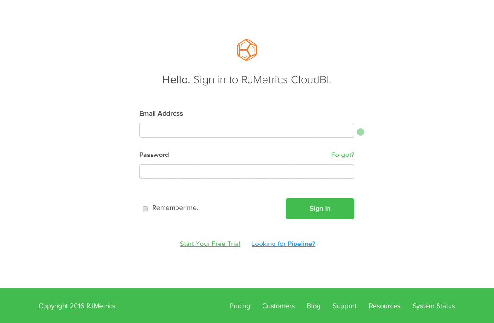

# Dépannage du verrouillage du compte Adobe Commerce Intelligence

<!--
BOB: Is this in TOC?
-->

Cet article fournit des solutions pour le verrouillage de compte Commerce Intelligence. Il nous faudra d&#39;abord déterminer s&#39;il s&#39;agit d&#39;un défaut, d&#39;un problème temporaire, ou de quelque chose d&#39;autre. Suivez les étapes ci-dessous pour revenir le plus rapidement possible dans votre compte.

## Vérifiez que votre adresse électronique est correcte.

Vérifiez deux fois votre adresse électronique pour vous assurer que l’adresse électronique que vous tentez d’utiliser pour vous connecter est associée à un compte Commerce Intelligence existant. Vous devrez peut-être demander à un administrateur de compte de confirmer qu’il n’y a pas de fautes de frappe dans l’adresse électronique.

Une fois que vous avez confirmé que l’adresse électronique est correcte, tentez de vous reconnecter à l’aide de [ce lien](https://dashboard.rjmetrics.com/v2/session/create#/).

## Essayez de réinitialiser votre mot de passe

Si vous avez vérifié que vous utilisez le bon courrier électronique, essayez de réinitialiser votre mot de passe. Vous pouvez utiliser la variable **Oublié ?** lien sur la page de connexion de la section précédente pour déclencher un courrier électronique de réinitialisation de mot de passe.

Si vous ne voyez pas l’email au début, veillez à rechercher dans votre dossier de courrier indésirable. Parfois même des emails bien intentionnés peuvent être confondus avec du courrier indésirable. **Notez que les liens d’accès temporaires de ces emails ne sont utiles qu’une seule fois !**

Si vous êtes toujours verrouillé, assurez-vous que votre adresse électronique est correcte et que vous utilisez le lien correct à partir de l’e-mail de réinitialisation. Nous vous recommandons de tester les **avant de demander une autre réinitialisation et de tenter de vous reconnecter :**

* Effacer le cache, les cookies et les mots de passe enregistrés de votre navigateur
* Désactivez temporairement un logiciel de blocage des publicités.

## documenter les erreurs et contacter pour la prise en charge ;

>[!NOTE]
>
>Cette étape n’est pas toujours requise, mais une exécution proactive peut réduire le temps passé à aller-retour sur une demande d’assistance.

Si vous ne parvenez toujours pas à accéder à votre compte, nous vous recommandons de vérifier les erreurs et d’envoyer un ticket à notre équipe d’assistance. Comment pouvez-vous faire ceci ? En ouvrant les outils de développement de votre navigateur et en réalisant une capture d’écran des erreurs affichées dans la console ou la fenêtre de journal du site. Dans le GIF ci-dessous, j’ouvre les outils de développement pour Google Chrome :

Dans l’exemple ci-dessus, nous avons utilisé la méthode la plus courante (**clic droit** > **Inspect**) pour ouvrir la console. Si votre navigateur ne dispose pas de cette méthode ou si vous avez besoin d’aide, utilisez les liens de documentation ci-dessous pour le navigateur web que vous utilisez :

<table>
<tbody>
<tr>
<td><a href="https://www.technipages.com/mac-os-x-enable-web-inspector-in-safari">Safari</a></td>
<td><a href="https://developer.mozilla.org/en-US/docs/Tools/Web_Console/Opening_the_Web_Console">Firefox</a></td>
<td><a href="https://developers.google.com/web/tools/chrome-devtools/?hl=en">Chrome</a></td>
<td><a href="https://www.opera.com/dragonfly/documentation/">Opera</a></td>
<td><a href="https://msdn.microsoft.com/en-us/library/gg589512(v=vs.85).aspx#OpeningTools">Internet Explorer</a></td>
</tr>
</tbody>
</table>

Dans certains navigateurs, l’ouverture des outils de développement peut ne pas afficher automatiquement la console ; le code du site peut s’afficher en premier. Si cela vous arrive, cliquez sur l’option Console dans la fenêtre du développeur et prenez des captures d’écran des erreurs qui y sont affichées.

Envoyez un ticket à notre équipe d’assistance avec la méthode **captures d’écran d’erreur** et votre **Adresse électronique du compte Commerce Intelligence**.

## Vous ne voyez aucune erreur ou vous êtes juste perdu ?

Ne vous inquiétez pas ! Remplissez un nouveau ticket d’assistance (veillez à inclure l’adresse électronique de votre compte Commerce Intelligence) et nous vous remettrons sur votre compte dès que possible.

## Rubriques connexes de notre base de connaissances sur l’assistance :

* [Ajout d’un nouvel utilisateur et définition des autorisations](https://experienceleague.adobe.com/docs/commerce-business-intelligence/mbi/administrator/user-mgmt/user-management.html)
* [Comment mettre à jour mon adresse électronique ou mon mot de passe ?](https://experienceleague.adobe.com/docs/commerce-business-intelligence/mbi/administrator/user-mgmt/create-user.html)
* [Comment réinitialiser mon mot de passe ?](https://experienceleague.adobe.com/docs/commerce-business-intelligence/mbi/administrator/user-mgmt/reset-password.html)
