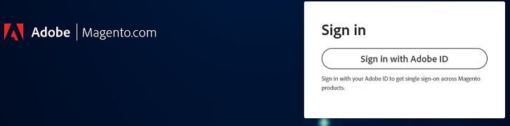

# Impossible de se connecter au support Adobe Commerce ou au compte cloud

Cet article fournit une solution lorsque vous avez du mal à vous connecter à l’assistance Adobe Commerce ou à votre projet cloud.

## Produits et versions concernés

Adobe Commerce (toutes les méthodes de déploiement) toutes les [versions prises en charge](https://www.adobe.com/content/dam/cc/en/legal/terms/enterprise/pdfs/Adobe-Commerce-Software-Lifecycle-Policy.pdf)

## Problème

Lorsque vous accédez à  ou [https://accounts.magento.cloud/user](https://accounts.magento.cloud/user) vous remarquerez peut-être qu&#39;il existe désormais un formulaire de connexion unifié et que vous ne pouvez plus saisir vos informations d&#39;identification comme vous l&#39;avez fait précédemment.

<u>Procédure à suivre </u> :

Essayez de vous connecter à votre compte Commerce.

<u>Résultat attendu </u> :

Connexion réussie.

<u>Résultat réel</u> :

Redirigez-vous vers une page pour vous connecter à l’aide d’un compte Adobe et les informations d’identification ne fonctionnent pas.

## Cause

Dans le cadre de notre processus d’intégration d’Adobe Commerce à d’autres solutions Adobe, tous les utilisateurs devront se connecter à Adobe (s’ils n’en ont pas déjà une) à l’aide de la même adresse e-mail associée à leur MageID.

## Solution

Vous pouvez vous connecter au compte avec :

- Un compte professionnel/personnel Adobe existant.
- Si vous ne disposez pas d’un compte Adobe, créez-en un avec la même adresse e-mail.

Pour connaître les étapes, reportez-vous à [Commerce Identity Manager](https://experienceleague.adobe.com/docs/commerce-admin/start/commerce-account/commerce-identity-manager.html) dans Adobe Experience League.

## Lecture connexe

- [Lier les connexions aux comptes Magento.com et accounts.magento.cloud](/help/faq/general/linking-magento-com-and-accounts-magento-cloud-account-logins.md)
