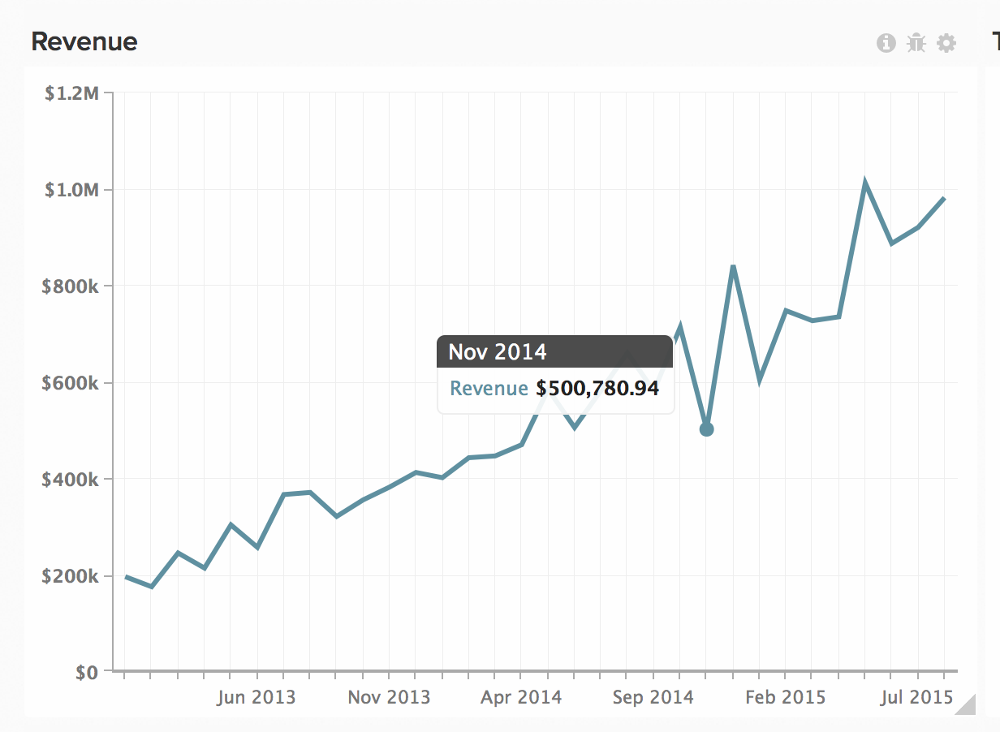
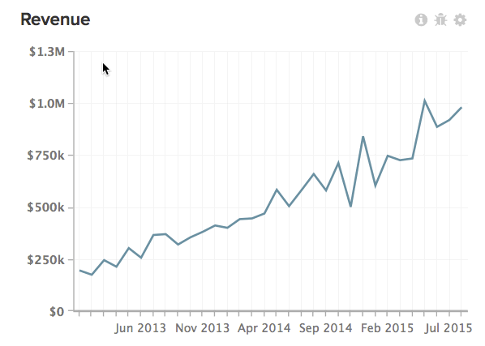
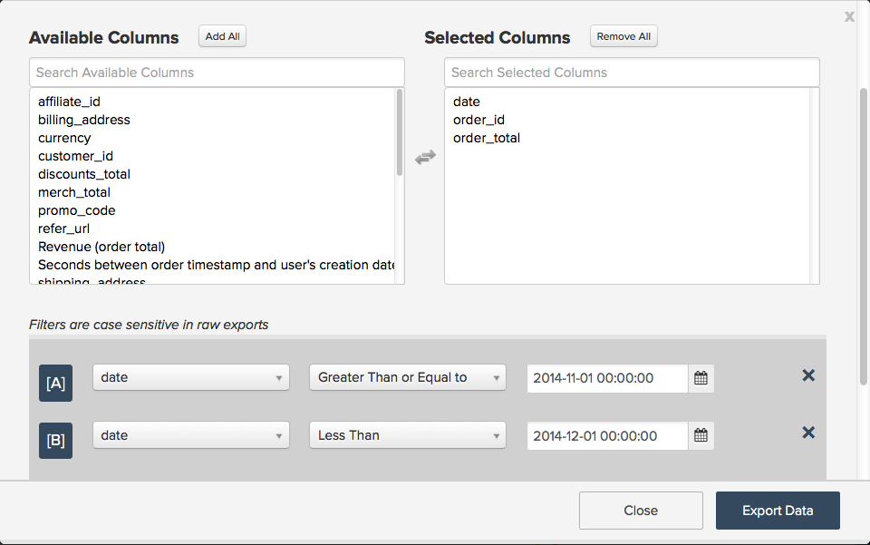
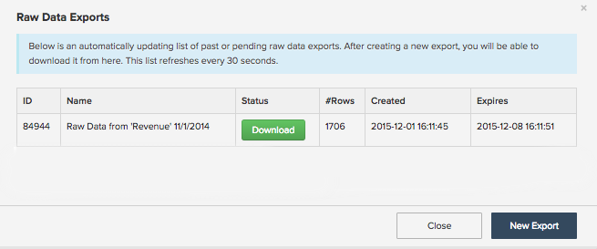
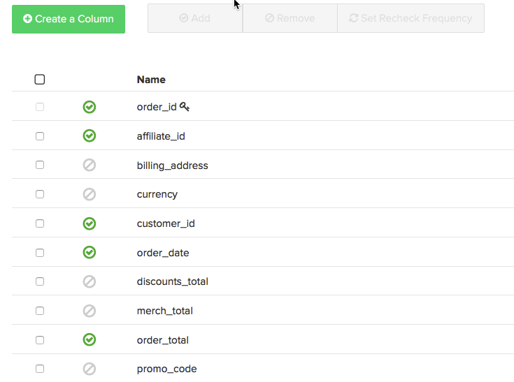
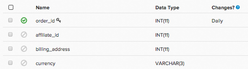

# Utilisation des exportations de données pour identifier les incohérences

Cet article fournit des solutions pour résoudre les problèmes d’incohérence dans vos données Magento BI. Les exportations de données sont un outil utile pour comparer vos données Magento BI à vos données sources afin d’identifier les incohérences de données dans vos rapports, en particulier si la [liste de contrôle pour le diagnostic des incohérences de données](https://experienceleague.adobe.com/en/docs/commerce-knowledge-base/kb/troubleshooting/miscellaneous/diagnosing-a-data-discrepancy) ne vous a pas aidé à identifier le problème. Cet article vous présente un exemple réel de la manière dont les écarts de données peuvent être identifiés à l’aide des exportations de données.

Prenons cette analyse, par exemple :

Il y a eu une baisse suspecte en novembre 2014. 500 780,94 $ de revenus ? Ça ne me semble pas juste. Vous avez confirmé que votre base de données source affiche davantage de chiffres d’affaires pour le mois de novembre 2014 et vous avez vérifié que la mesure **Chiffre d’affaires** utilisée dans ce rapport est correctement définie. Il semble que les données de l’entrepôt de données Magento BI soient incomplètes, ce qui peut être confirmé à l’aide d’une exportation de données.

## Exporter les données {#export}

Pour commencer, cliquez sur l’engrenage dans le coin supérieur droit du graphique, puis sur l’option Exportation brute dans le menu déroulant. Vous obtiendrez ainsi une exportation brute des données situées derrière le graphique.

Dans le menu **Exportation des données brutes**, vous pouvez sélectionner le tableau à partir duquel effectuer l’exportation, ainsi que les colonnes à inclure dans l’exportation. Des filtres peuvent également être appliqués au jeu de résultats.

Dans notre exemple, la mesure **Chiffre d’affaires** utilisée dans cet état utilise le champ **order\_total** défini dans la table **`orders`**, avec l’horodatage **date**. Dans notre exportation, nous voulons inclure toutes les valeurs **order\_id** pour novembre 2014 et leur **order\_total** . La mesure **Revenu** n’utilise aucun filtre, mais nous ajouterons un filtre à l’exportation pour limiter le jeu de résultats à novembre 2014.

Voici à quoi ressemble le menu Exportation des données brutes pour cet exemple :

Cliquez sur Exporter les données pour commencer l’exportation. Une fenêtre contenant les détails de l’exportation, y compris le statut, s’affiche. La préparation de l’exportation prend quelques minutes, ce qui est maintenant un bon moment pour effectuer un extrait analogue de nos données source pour novembre 2014, y compris **date, order\_id** et le **order\_total** . Nous allons ouvrir ce fichier dans Excel et le laisser ouvert, car nous y reviendrons sous peu.

Lorsque le bouton Télécharger s’affiche dans la fenêtre Exportations de données brutes , cliquez dessus pour télécharger le fichier zip contenant le fichier CSV.

À ce stade, nous devons rassembler toutes les données dans une seule feuille pour identifier le problème. Nous importerons le fichier CSV (l’exportation à partir de Magento BI) dans une autre feuille du fichier Excel contenant nos données sources.

## Identifier le problème {#pinpoint}

Maintenant que toutes les données se trouvent au même endroit, nous pouvons chercher la source de l’écart. La comparaison du nombre de lignes dans chaque feuille nous aidera à identifier le problème. Regardons de plus près chaque situation.

### Les deux feuilles contiennent le même nombre de lignes

Si les deux systèmes ont le même nombre de lignes et que la mesure **Chiffre d’affaires** ne correspond pas aux données source, la valeur de la **commande\_total** doit être désactivée quelque part. Il est possible que le champ **order\_total** ait été mis à jour dans votre base de données source et que Magento BI ne récupère pas ces modifications.

Pour le confirmer, vérifiez si la colonne **order\_total** est en cours de nouvelle vérification ou non. Accédez au gestionnaire Data Warehouse et cliquez sur le tableau **`orders`** . La [fréquence de revérification](https://experienceleague.adobe.com/docs/commerce-business-intelligence/mbi/analyze/warehouse-manager/cfg-data-rechecks.html) répertoriée dans la colonne « Modifications » s’affiche. Le champ **order\_total** doit être défini pour une nouvelle vérification aussi souvent que prévu ; si ce n’est pas le cas, continuez et définissez-le à la fréquence de nouvelle vérification de votre choix.

### 

Si la fréquence de revérification est déjà définie correctement, quelque chose d’autre ne fonctionne pas. Reportez-vous à la section [Contacter l’assistance](#support) à la fin de cet article pour connaître les étapes suivantes.

## La base de données source contient PLUS de lignes que Magento BI {#morerows}

Si la base de données source comporte plus de lignes que Magento BI et que l’écart est supérieur au nombre de commandes que vous pouvez vous attendre à recevoir pendant la durée d’un cycle de mise à jour, un problème de connexion peut se produire. Cela signifie que Magento BI n’est pas en mesure d’extraire de nouvelles données de la base de données source, ce qui peut se produire pour plusieurs raisons.

Accédez à la page Connexions et jetez un coup d’œil au statut de la source de données contenant la table `order` :

1. **Si le statut est Réauthentification** , la connexion n’utilise pas les informations d’identification correctes. Cliquez dans la connexion, saisissez les informations d’identification correctes, puis réessayez.
1. **Si le statut est En échec** , la connexion peut ne pas être correctement configurée côté serveur. Les échecs de connexion sont généralement dus à un nom d&#39;hôte incorrect ou au fait que le serveur cible n&#39;accepte pas les connexions sur le port spécifié.Cliquez dans la connexion et vérifiez à nouveau l’orthographe du nom d’hôte et que le port correct est saisi. Côté serveur, assurez-vous que le port peut accepter des connexions et que votre pare-feu dispose de l’adresse IP Magento BI (54.88.76.97/32) autorisée. **Si la connexion continue d’échouer** , reportez-vous à la [section Contacter l’assistance](#support) à la fin de cet article pour connaître les étapes suivantes.
1. **Si l’état est Réussi** , alors la connexion n’est pas le problème et la prise en charge de RJ doit être impliquée. Reportez-vous à la section [Contacter l’assistance](#support) à la fin de cet article pour connaître les étapes suivantes.

## La base de données source contient MOINS de lignes que Magento BI {#lessrows}

Si la base de données source comporte moins de lignes que Magento BI, il est possible que des lignes soient supprimées de la base de données source et que Magento BI ne récupère pas ces suppressions. **&#x200B; [la suppression de données](https://experienceleague.adobe.com/docs/commerce-business-intelligence/mbi/best-practices/data/opt-db-analysis.html) peut entraîner des incohérences, des temps de mise à jour plus longs et un grand nombre de problèmes logistiques** . Nous vous recommandons donc vivement de ne jamais supprimer de données, sauf si elles sont vraiment nécessaires.

Toutefois, si des lignes sont supprimées du tableau, examinez la fréquence de vérification à nouveau sur la clé primaire. La revérification de la clé primaire signifie que la table sera vérifiée pour les lignes supprimées.

Dans Data Warehouse Manager, les colonnes de clés primaires sont marquées d’un symbole clé. Dans notre exemple, la clé primaire est la colonne **order\_id** :

Si la clé primaire est déjà définie pour être vérifiée à nouveau ou si des lignes ne sont jamais supprimées de cette table, vous aurez besoin de la prise en charge RJ pour identifier le problème. Reportez-vous à la section suivante pour connaître les étapes suivantes.

## Contacter l’assistance {#support}

Si vous ne parvenez pas à localiser la source du problème, vous devrez effectuer une boucle dans le support RJ. Avant de soumettre un ticket, procédez comme suit :

* **Si votre base de données source et Magento BI ont le même nombre de lignes** et que les fréquences de vérification sont correctement définies, effectuez une RECHERCHE dans votre feuille de calcul **pour identifier les valeurs order\_id ayant une valeur order\_total différente entre Magento BI et votre base de données source.** Incluez ces valeurs lors de l’envoi du ticket.
* **Si votre base de données source comporte PLUS de lignes que Magento BI** et que la connexion est indiquée comme réussie ou qu’elle continue d’échouer, nous devrons connaître le nom de la connexion et le message d’erreur que vous voyez, le cas échéant.
* **Si votre base de données source comporte MOINS de lignes que Magento BI,** les lignes ne sont pas supprimées de la table et que les fréquences de vérification sont correctement définies, effectuez une recherche dans votre feuille de calcul **pour identifier les valeurs order\_id qui se trouvent dans Magento BI** mais pas dans votre base de données source. Incluez ces valeurs lors de l’envoi du ticket.

## Lecture connexe

* [Liste de contrôle pour le diagnostic des incohérences de données](https://experienceleague.adobe.com/en/docs/commerce-knowledge-base/kb/troubleshooting/miscellaneous/diagnosing-a-data-discrepancy)
* [Politiques de service Adobe Commerce Intelligence](https://experienceleague.adobe.com/en/docs/commerce-knowledge-base/kb/troubleshooting/miscellaneous/mbi-service-policies)
* [Recommandations relatives à la modification des tables de base de données](https://experienceleague.adobe.com/en/docs/commerce-operations/implementation-playbook/best-practices/development/modifying-core-and-third-party-tables#why-adobe-recommends-avoiding-modifications) dans le manuel Commerce Implementation Playbook

