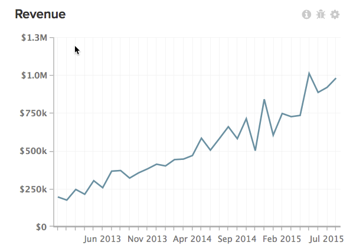
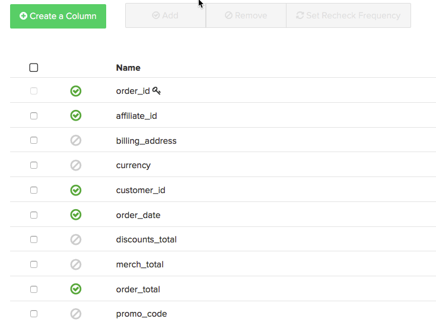

# Utilisation des exportations de données pour identifier les disparités

Cet article fournit des solutions pour résoudre les problèmes liés aux incohérences entre les données de la BI du Magento. Les exportations de données sont un outil utile pour comparer vos données de Magento BI à vos données source afin de mettre en évidence les incohérences de données dans vos rapports, en particulier si la [liste de contrôle de diagnostic d’incohérence de données](https://experienceleague.adobe.com/en/docs/commerce-knowledge-base/kb/troubleshooting/miscellaneous/diagnosing-a-data-discrepancy) ne vous a pas aidé à identifier le problème. Cet article vous présente un exemple concret de la manière dont les écarts de données peuvent être identifiés à l’aide des exportations de données.

Prenez cette analyse, par exemple :

Il y a une baisse suspecte en novembre 2014. 500 780,94 $ en recettes ? Ça ne semble pas correct. Vous avez confirmé qu’il y a plus de recettes affichées pour le mois de novembre 2014 dans votre base de données source et vous avez double-vérifié que la mesure **Recettes** utilisée dans ce rapport est correctement définie. Il semble que les données de l’entrepôt de données Magento BI soient incomplètes et peuvent être confirmées à l’aide d’une exportation de données.

## Exporter les données {#export}

Pour commencer, cliquez sur l’engrenage dans le coin supérieur droit du graphique, puis sur l’option Exportation brute dans le menu déroulant. Vous obtiendrez ainsi une exportation brute des données derrière le graphique.

Dans le menu **Exportation de données brutes**, vous pouvez sélectionner la table à exporter avec les colonnes à inclure dans l’exportation. Les filtres peuvent également être appliqués au jeu de résultats.

Dans notre exemple, la mesure **Recettes** utilisée sur ce rapport utilise le champ **order\_total** défini sur la table **`orders`**, en utilisant la **date** comme horodatage. Dans notre exportation, nous voulons inclure toutes les valeurs **order\_id** pour novembre 2014 et leur **order\_total** . La mesure **Recettes** n’utilise aucun filtre, mais nous allons ajouter un filtre à l’exportation pour limiter le jeu de résultats à seulement novembre 2014.

Voici à quoi ressemble le menu Exportation de données brutes pour cet exemple :

Cliquez sur Exporter les données pour lancer l’exportation. Une fenêtre contenant les détails de l&#39;export, y compris le statut, s&#39;affiche. La préparation de l’exportation prend quelques minutes, ce qui permet désormais d’effectuer un extrait analogue de nos données source pour novembre 2014, y compris **date, order\_id** et le **order\_total** . Nous allons ouvrir ce fichier dans Excel et le laisser tel quel, comme nous y reviendrons bientôt.

Lorsque le bouton Télécharger s’affiche dans la fenêtre Exports de données brutes, cliquez dessus pour télécharger le fichier zip contenant le fichier CSV.

A ce stade, nous devons rassembler toutes les données dans une feuille pour trouver le problème. Nous allons importer le fichier CSV (exportation à partir de Magento BI) dans une autre feuille du fichier Excel contenant nos données source.

## Identifier le problème {#pinpoint}

Maintenant que toutes les données sont à un seul endroit, nous pouvons chercher la source de l&#39;incohérence. La comparaison du nombre de lignes dans chaque feuille nous aidera à déterminer le problème. Regardons de plus près chaque situation.

### Les deux feuilles contiennent le même nombre de lignes

Si les deux systèmes ont le même nombre de lignes et que la mesure **Recettes** ne correspond pas aux données source, la **commande\_total** doit être décalée d’un emplacement. Il est possible que le champ **order\_total** ait été mis à jour dans votre base de données source et que Magento BI ne sélectionne pas ces modifications.

Pour confirmer cela, vérifiez si la colonne **order\_total** est réactivée ou non. Accédez au Gestionnaire de Data Warehouse et cliquez sur la table **`orders`**. Vous verrez la [fréquence de nouveau-contrôle](https://experienceleague.adobe.com/docs/commerce-business-intelligence/mbi/analyze/warehouse-manager/cfg-data-rechecks.html) répertoriée dans &quot;Modifications ?&quot; colonne . Le champ **order\_total** doit être défini pour une nouvelle vérification aussi souvent qu’il est prévu de changer. S’il ne l’est pas, continuez et définissez-le sur la fréquence de nouveau contrôle souhaitée.

### 

Si la fréquence de nouveau contrôle est déjà définie correctement, alors quelque chose d&#39;autre ne va pas. Pour connaître les étapes suivantes, reportez-vous à la [section Contacter l’assistance](#support) à la fin de cet article.

## La base de données source contient PLUS de lignes que Magento BI {#morerows}

Si la base de données source contient plus de lignes que Magento BI et que l’écart est supérieur au nombre de commandes que vous pouvez vous attendre à recevoir pendant la durée d’un cycle de mise à jour, un problème de connexion peut se produire. Cela signifie que Magento BI ne peut pas extraire de nouvelles données de la base de données source, ce qui peut se produire pour plusieurs raisons.

Accédez à la page Connexions et examinez l’état de la source de données contenant la table `order` :

1. **Si l’état est Re-auth** , la connexion n’utilise pas les informations d’identification correctes. Cliquez sur la connexion, saisissez les informations d’identification correctes, puis réessayez.
1. **Si l’état est En échec** , la connexion peut ne pas être configurée correctement du côté serveur. Les connexions en échec proviennent généralement d’un nom d’hôte incorrect ou du serveur cible qui n’accepte pas les connexions sur le port spécifié. Cliquez sur dans la connexion et vérifiez l’orthographe du nom d’hôte et que le port correct est saisi. Côté serveur, assurez-vous que le port peut accepter les connexions et que votre pare-feu dispose de l’adresse IP Magento BI (54.88.76.97/32) comme autorisé. **Si la connexion continue à échouer** , reportez-vous à la [section de contact du support](#support) à la fin de cet article pour les étapes suivantes.
1. **Si l’état est réussi** , la connexion n’est pas le problème et la prise en charge de RJ doit être impliquée. Pour connaître les étapes suivantes, reportez-vous à la [section Contacter l’assistance](#support) à la fin de cet article.

## La base de données source contient MOINS de lignes que Magento BI {#lessrows}

Si la base de données source contient moins de lignes que Magento BI, il est possible que les lignes soient supprimées de la base de données source et que Magento BI ne sélectionne pas ces suppressions. ** [La suppression de données](https://experienceleague.adobe.com/docs/commerce-business-intelligence/mbi/best-practices/data/opt-db-analysis.html) peut entraîner des incohérences, des temps de mise à jour plus longs et un grand nombre de problèmes logistiques**. Nous vous recommandons donc vivement de ne jamais supprimer de données, à moins qu’elles ne soient vraiment nécessaires.

Toutefois, si des lignes sont supprimées du tableau, observez la fréquence de vérification sur la clé primaire. Le nouveau contrôle de la clé primaire permet de rechercher les lignes supprimées dans la table.

Dans le Gestionnaire de Data Warehouse, les colonnes de clé primaire sont marquées d’un symbole de clé. Dans notre exemple, la clé primaire est la colonne **order\_id** :

Si la clé primaire est déjà paramétrée pour être vérifiée ou si les lignes ne sont jamais supprimées de cette table, vous aurez besoin de la prise en charge de RJ pour identifier le problème. Reportez-vous à la section suivante pour connaître les étapes suivantes.

## Contacter l’assistance {#support}

Si vous ne parvenez pas à déterminer la source du problème, vous devrez effectuer une boucle dans le support RJ. Avant d’envoyer un ticket, procédez comme suit :

* **Si votre base de données source et votre Magento BI ont le même nombre de lignes** et que les fréquences de vérification sont correctement définies, effectuez une VLOOKUP dans votre feuille de calcul **pour trouver les valeurs order\_id ayant une valeur order\_total différente entre Magento BI et votre base de données source.** Incluez ces valeurs lorsque vous envoyez votre ticket.
* **Si votre base de données source contient PLUS de lignes que Magento BI** et que la connexion s’affiche comme réussie ou continue d’échouer, nous devrons connaître le nom de la connexion et le message d’erreur que vous voyez, le cas échéant.
* **Si votre base de données source contient MOINS de lignes que Magento BI,** lignes ne sont pas supprimées de la table et les fréquences de vérification sont correctement définies, effectuez une VLOOKUP dans votre feuille de calcul **pour trouver les valeurs order\_id qui se trouvent dans Magento BI** mais pas dans votre base de données source. Incluez ces valeurs lorsque vous envoyez votre ticket.

## Lecture connexe

* [ Liste de contrôle de diagnostic d’incohérence des données](https://experienceleague.adobe.com/en/docs/commerce-knowledge-base/kb/troubleshooting/miscellaneous/diagnosing-a-data-discrepancy)
* [Stratégies de service Adobe Commerce Intelligence](https://experienceleague.adobe.com/en/docs/commerce-knowledge-base/kb/troubleshooting/miscellaneous/mbi-service-policies)
* [ Bonnes pratiques pour la modification des tables de base de données](https://experienceleague.adobe.com/en/docs/commerce-operations/implementation-playbook/best-practices/development/modifying-core-and-third-party-tables#why-adobe-recommends-avoiding-modifications) dans le manuel de mise en oeuvre de Commerce

