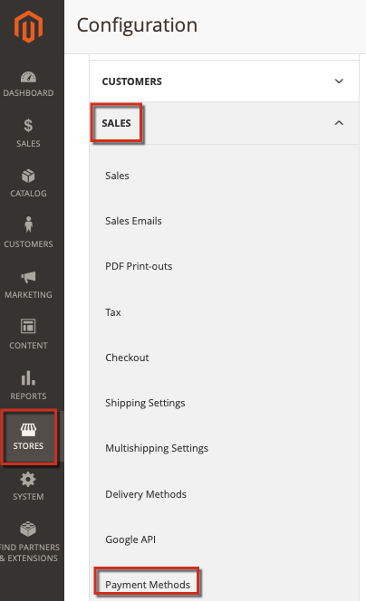

# Résolution des problèmes PayPal sur Adobe Commerce

Cet article fournit des solutions aux problèmes de traitement des paiements via PayPal, en particulier la solution PayFlow Pro. Certaines recommandations de cet article peuvent sembler évidentes. Nous vous demandons d&#39;essayer les options de dépannage répertoriées dans cette base de connaissances et d&#39;inclure toutes les informations dans les tickets que vous entrez. Les ingénieurs de l’assistance Adobe Commerce ou PayPal vous demanderont d’effectuer ces étapes lors du diagnostic de vos problèmes.

## Problèmes courants

La plupart des problèmes avec les paiements PayPal ont des symptômes similaires : après avoir spécifié les détails de la carte de paiement et procédé au passage en caisse, le paiement n&#39;est pas en cours de traitement. À la place, il peut y avoir un message d’erreur, un échec de traitement du paiement ou même une page vierge.

## Vérifier vos informations d’identification, clés de chiffrement et licences

Problèmes possibles : erreurs d’impression dans les détails du compte (noms d’utilisateur, mots de passe), comptes non valides, licences expirées ou non spécifiées, clés publiques et personnelles non valides, et de nombreux autres aspects. Pour identifier ces problèmes, vous devrez peut-être également vérifier vos paramètres de configuration des paiements.

## Application de paramètres cohérents dans Adobe Commerce et PayPal

Vérifiez que vous avez appliqué les mêmes paramètres et activé les mêmes fonctionnalités dans les paramètres de compte Commerce Admin et PayPal.

### Exemple de problème de paramètres

Lors de l&#39;application de la solution PayPal Express Checkout, les transactions basées sur les réponses AVS/CSC doivent être refusées dans **PayPal Manager** (Paramètres de service > Configuration > Options de sécurité) et dans **Commerce Admin** ( **Magasins** > Configuration > **Ventes** > **Modes de paiement** ...).

Pour plus d’informations, consultez la documentation : [PayPal](https://www.paypalobjects.com/en_US/vhelp/paypalmanager_help/setup.htm) et [Adobe Commerce](https://experienceleague.adobe.com/docs/commerce-admin/stores-sales/payments/paypal/paypal-express-checkout.html?lang=fr) dans notre guide d’utilisation.

## Autoriser les transactions de référence

Si votre mode de paiement PayPal implique une API avec des accords de facturation et des transactions de référence, assurez-vous qu&#39;ils sont activés et configurés correctement dans vos paramètres.

### Dépannage supplémentaire

Consultez les articles suivants :

* [Demande rejetée par la passerelle PayPal - problème de facture en double](https://experienceleague.adobe.com/fr/docs/experience-cloud-kcs/kbarticles/ka-26838) dans notre base de connaissances d&#39;assistance.
* [Modifier l’ID d’incrément pour la nouvelle entité de magasin](/help/how-to/general/change-increment-id-for-a-db-entity-order-invoice-credit-memo-etc-on-particular-store.md) dans notre base de connaissances d’assistance.

## Contactez l’assistance pour collecter les journaux de paiement avancés

Pour résoudre les problèmes de paiement complexes, l’équipe d’assistance Adobe Commerce peut vous demander d’appliquer un correctif dédié pour activer la journalisation avancée des paiements. Dans ce cas, les étapes doivent être les suivantes :

[Envoyez un ticket d’assistance](https://experienceleague.adobe.com/fr/docs/support-resources/adobe-support-tools-guide/adobe-commerce-support/adobe-commerce-help-center-user-guide#submit-ticket) avec les détails suivants :

* Spécifiez votre problème avec autant de détails que possible.
* Répertoriez les étapes que vous avez tentées à partir de cet article, de la base de connaissances et d’autres ressources. Inclure tous les résultats.
* Demandez un patch de consignation des paiements anticipés (numéro de référence MDVA-4352) et des instructions sur l&#39;application du patch.

Si vous recevez le correctif de consignation des paiements avancés :

* Appliquez le correctif.
* Collectez les journaux et joignez-les à votre [ticket d’assistance](https://experienceleague.adobe.com/fr/docs/support-resources/adobe-support-tools-guide/adobe-commerce-support/adobe-commerce-help-center-user-guide#submit-ticket).
* Attendez les recommandations supplémentaires de l’équipe d’assistance d’Adobe Commerce.
