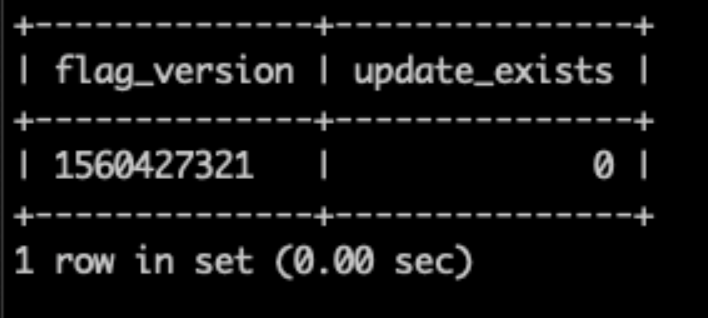

# Erreur 404 sur toutes les pages en raison d’un problème d’évaluation du contenu

Cet article fournit un correctif pour le problème d’infrastructure de cloud d’Adobe Commerce on-premise et d’Adobe Commerce où vous obtenez une erreur 404 lors de l’accès à une page de storefront ou à l’administrateur Commerce.

## Produits et versions concernés

* Adobe Commerce on-premise 2.2.x, 2.3.x
* Adobe Commerce sur l’infrastructure cloud 2.2.x, 2.3.x

## Problème

>[!NOTE]
>
>Cet article ne s’applique pas à la situation dans laquelle vous obtenez une erreur 404 lorsque vous essayez de [prévisualiser la mise à jour d’évaluation](https://docs.magento.com/user-guide/cms/content-staging-scheduled-update.html#preview-the-scheduled-change). Si vous rencontrez ce problème, ouvrez un [ticket de support](/help/help-center-guide/help-center/magento-help-center-user-guide.md#submit-ticket).

L’accès à n’importe quelle page de storefront ou à l’administrateur génère l’erreur 404 (la page &quot;Oups, our bad..&quot;) après avoir effectué des opérations avec des mises à jour planifiées pour stocker des ressources de contenu à l’aide de [Content Staging](https://experienceleague.adobe.com/docs/commerce-admin/content-design/staging/content-staging.html) (mises à jour pour stocker des ressources de contenu planifiées à l’aide du [module Magento\_Staging](https://developer.adobe.com/commerce/php/module-reference/)). Par exemple, vous avez peut-être supprimé un produit avec une mise à jour planifiée ou supprimé la date de fin de la mise à jour planifiée.

Une ressource de contenu de magasin comprend :

* Produit
* Catégorie
* Règle de prix du catalogue
* Règle de prix du panier
* Page CMS
* Bloc CMS
* Widget

Certains scénarios sont abordés dans la section Cause ci-dessous.

## Cause

La table `flag` de la base de données (DB) contient des liens non valides vers la table `staging_update`.

Le problème est lié à l’évaluation de contenu. Vous trouverez ci-dessous deux scénarios particuliers. Notez qu’il peut y avoir d’autres situations qui déclenchent le problème.

**Scénario 1 :** Suppression d’une ressource de contenu de magasin qui :

* a une mise à jour planifiée avec l’évaluation de contenu
* la mise à jour a une date de fin (c’est-à-dire la date d’expiration à laquelle la ressource mise à jour revient à sa version précédente).
* la date de fin de la mise à jour se situe dans le passé.

En même temps, le problème peut ne pas se produire si une ressource supprimée n’a pas de date de fin pour la mise à jour planifiée.

**Scénario 2 :** Suppression de la date/de l’heure de fin d’une mise à jour planifiée.

### Déterminer si votre problème est lié

Pour déterminer si le problème que vous rencontrez est celui décrit dans cet article, exécutez la requête DB suivante :

```sql
   SELECT f.flag_data >'$.current_version' as flag_version, (su.id IS NOT NULL) as update_exists
   -> FROM flag f
   -> LEFT JOIN staging_update su
   -> ON su.id = f.flag_data >'$.current_version'
   -> WHERE flag_code = 'staging';
```

Si la requête renvoie une table dont la valeur `update_exists` est &quot;0&quot;, un lien non valide vers la table `staging_update` existe dans votre base de données et les étapes décrites dans la [section Solution](#solution) aideront à résoudre le problème. Voici un exemple du résultat de la requête avec la valeur `update_exists` égale à &quot;0&quot; :



Si la requête renvoie une table dont la valeur `update_exists` est &quot;1&quot; ou un résultat vide, cela signifie que votre problème n’est pas lié aux mises à jour intermédiaires. Voici un exemple du résultat de la requête avec la valeur `update_exists` égale à &quot;1&quot; :


Dans ce cas, vous pouvez vous reporter à l’[outil de dépannage de Site Down](/help/troubleshooting/site-down-or-unresponsive/magento-site-down-troubleshooter.md) pour obtenir des idées de dépannage.

## Solution

1. Exécutez la requête suivante pour supprimer le lien non valide vers la table `staging_update` :

   ```sql
   DELETE FROM flag WHERE flag_code = 'staging';
   ```

1. Attendez que la tâche cron s’exécute (jusqu’à cinq minutes si correctement configurée) ou exécutez-la manuellement si vous n’avez pas configuré cron.

Le problème doit être résolu immédiatement après avoir corrigé le lien non valide. Si le problème persiste, [soumettez un ticket d&#39;assistance](/help/help-center-guide/help-center/magento-help-center-user-guide.md#submit-ticket).
