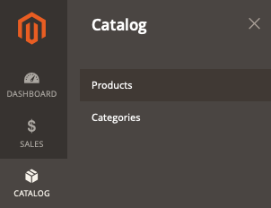

# Le produit ne s’affiche pas sur le storefront

Cet article fournit des solutions pour les cas où les produits ne sont pas affichés sur le storefront.

## Produits et versions concernés

* Adobe Commerce On-Premise X.X.X
* Adobe Commerce sur l’infrastructure cloud X.X.X

## Problème

<u>Procédure à suivre </u> :

1. Connectez-vous à l’administration Commerce.
1. Accédez à **Catalogue** > **Produits**.

   

1. Cliquez sur **Ajouter un produit** et passez par le processus de création de produit. Ou importez des produits à partir d’un fichier CSV.

<u>Résultat attendu </u> :

Le produit s’affiche sur le storefront.

<u>Résultat réel</u> :

Le produit ne s’affiche pas.

## Cause

Cela peut être dû à plusieurs raisons. Suivez les étapes ci-dessous pour vérifier les principaux points qui pourraient aider à identifier et résoudre le problème.

## Solution

Chacun des points suivants peut résoudre le problème.

* Vérifiez les paramètres du produit dans Admin. Accédez à **Catalogue** > **Produits**, ouvrez la page produit et vérifiez que les champs suivants sont correctement configurés :
  * **Activer le produit** = *Oui.*
  * **Statut des stocks** : *En stock*. Si la valeur *En rupture de stock* est correcte, assurez-vous que **Afficher les produits en rupture de stock** (**MAGASINS** > **Paramètres** > **Configuration** > **CATALOG** > **Inventory** > **Stock Options** > **Afficher les produits en rupture de stock**) est défini sur *Yes* (configuré au niveau global).
  * **Catégories** : si vous essayez de trouver le produit sur une page de catégorie, vérifiez que le produit est affecté à la catégorie. Pour simplifier la résolution des problèmes, créez une catégorie à partir de la page active et affectez-lui un produit.
  * **Visibilité** = *Catalogue, Recherche.*
  * Dans la section **Produit sur les sites web** , assurez-vous que le produit est attribué au site web approprié.
  * Basculez le sélecteur de l’étendue sur la vue du magasin où vous essayez de trouver votre produit sur le storefront, puis vérifiez les mêmes paramètres.
* Effectuez la réindexation complète en exécutant `bin/magento indexer:reindex` à partir de la console et videz tout le cache dans Admin, sous **Système** > **Outils** > **Gestion du cache**, ou à partir de la console en exécutant `bin/magento cache:clean`.
* Si ce qui précède ne vous aide pas, vous pouvez lancer une enquête plus approfondie en consultant les journaux dans le répertoire `var/log`.

